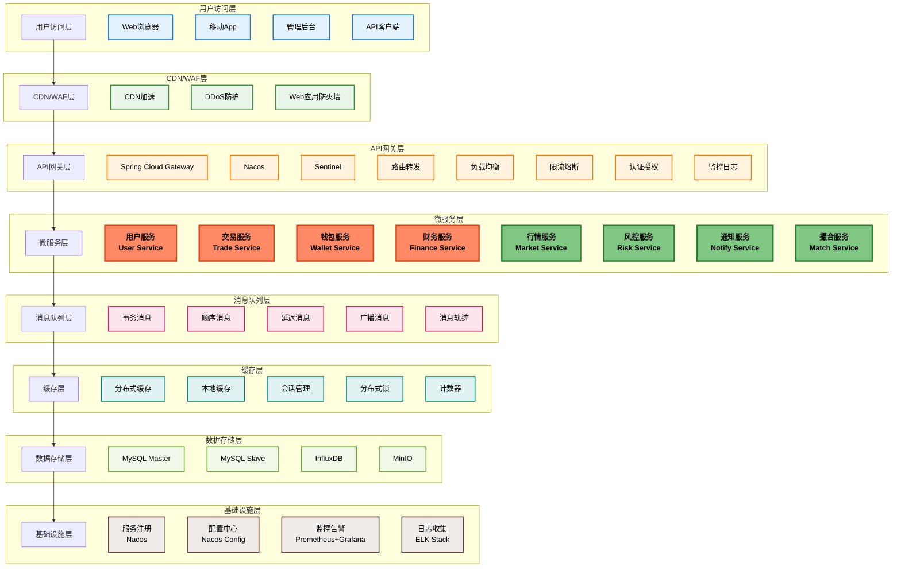

# Web3 CEX 系统架构设计

## 1. 项目概述

### 1.1 项目背景
本项目是一个基于Web3技术的中心化数字资产交易所(CEX)学习项目，旨在帮助开发者深入理解CEX系统的核心架构设计、业务流程实现和技术选型。项目采用现代化的微服务架构，集成了区块链技术，为用户提供安全、高效的数字资产交易服务。

### 1.2 项目目标
- **技术学习**: 掌握CEX系统的核心架构设计和技术实现
- **业务理解**: 深入理解数字资产交易的业务流程和商业模式
- **实践应用**: 通过实际项目经验提升开发和架构能力
- **合规安全**: 学习金融系统的安全设计和合规要求

### 1.3 核心特色
- **完整架构**: 从前端到后端的完整技术栈
- **真实业务**: 基于真实CEX业务场景设计
- **微服务**: 采用Spring Cloud Alibaba微服务架构
- **区块链集成**: 集成Web3.js支持区块链交互
- **高可用**: 金融级高可用和容灾设计

## 2. 架构设计原则

### 2.1 设计目标
- **高可用性**: 99.9%系统可用性
- **高性能**: 订单处理延迟<100ms，支持10,000+并发用户
- **高扩展性**: 微服务架构，支持水平扩展
- **安全性**: 金融级安全保障，资产零丢失
- **一致性**: 分布式事务保证数据一致性

### 2.2 架构原则
- **微服务化**: 按业务边界划分服务
- **无状态设计**: 服务实例无状态，支持弹性扩展
- **异步通信**: 基于RocketMQ的异步消息处理
- **读写分离**: 数据库读写分离，提升查询性能
- **缓存优先**: 多级缓存策略，提升响应速度

## 3. 系统架构图

### 3.1 整体架构



## 4. 微服务拆分设计

### 4.1 服务划分原则
- **业务边界**: 按照业务领域进行服务划分
- **高内聚**: 单一服务内部功能高度内聚
- **低耦合**: 服务间通过API和消息队列松耦合
- **独立部署**: 每个服务可独立开发、测试、部署
- **弹性扩展**: 根据业务负载独立扩展

### 4.2 核心服务清单

| 服务名称 | 端口 | 职责描述 | 核心技术 | 依赖服务 |
|---------|------|---------|----------|----------|
| user-service | 8001 | 用户管理、认证授权、KYC认证 | Spring Security, JWT | Redis, MySQL |
| trade-service | 8002 | 交易管理、订单处理、撮合 | RocketMQ, Redis | user-service, wallet-service |
| wallet-service | 8003 | 钱包管理、资产变动、充值提现 | Web3.js, Redis | user-service, trade-service |
| finance-service | 8004 | 财务管理、统计报表、风控 | RocketMQ, Excel | trade-service, wallet-service |
| market-service | 8005 | 行情数据、K线图、实时推送 | WebSocket, Redis | 外部数据源 |
| risk-service | 8006 | 风控管理、规则引擎、异常监控 | Rule Engine, Redis | 所有业务服务 |
| notify-service | 8007 | 消息通知、推送服务、邮件短信 | SMS, Email, WebSocket | 所有业务服务 |
| match-service | 8008 | 撮合引擎、订单匹配、价格计算 | 内存计算, Redis | trade-service, market-service |
| gateway-service | 9000 | API网关、路由转发、限流熔断 | Spring Cloud Gateway | Nacos, Sentinel |

### 4.3 服务间通信

#### 4.3.1 同步通信
- **HTTP/REST**: 服务间API调用
- **OpenFeign**: 声明式HTTP客户端
- **负载均衡**: Ribbon + Nacos

#### 4.3.2 异步通信
- **RocketMQ**: 核心业务消息
- **消息 Topic 规划**:
  - `order-topic`: 订单相关消息
  - `asset-topic`: 资产变动消息
  - `trade-topic`: 交易相关消息
  - `notify-topic`: 通知消息
  - `risk-topic`: 风控消息

## 5. 技术栈选型

### 5.1 后端技术栈
- **微服务框架**: Spring Boot 3.x + Spring Cloud Alibaba 2022.x
- **服务治理**: Nacos 2.2.x (服务注册发现 + 配置中心)
- **服务网关**: Spring Cloud Gateway
- **熔断限流**: Sentinel
- **分布式事务**: Seata
- **消息队列**: RocketMQ 4.9.x
- **数据库**: MySQL 8.0 (主从复制)
- **缓存**: Redis 7.x (集群模式)
- **ORM框架**: MyBatis Plus
- **安全框架**: Spring Security + JWT
- **监控**: Micrometer + Prometheus + Grafana

### 5.2 前端技术栈
- **前端框架**: Next.js 15 + TypeScript
- **UI框架**: Ant Design + Tailwind CSS
- **状态管理**: Zustand
- **图表库**: ECharts
- **实时通信**: WebSocket
- **区块链集成**: wagmi + viem
- **构建工具**: Vite

### 5.3 基础设施
- **容器化**: Docker + Docker Compose
- **编排**: Kubernetes (可选)
- **监控**: Prometheus + Grafana + AlertManager
- **日志**: ELK Stack (Elasticsearch + Logstash + Kibana)
- **链路追踪**: SkyWalking
- **CI/CD**: GitHub Actions / GitLab CI

## 6. 核心技术组件

### 6.1 服务治理
- **服务注册发现**: Nacos 2.2.x
- **配置管理**: Nacos Config
- **服务网关**: Spring Cloud Gateway
- **熔断限流**: Sentinel
- **分布式事务**: Seata

### 6.2 消息队列
- **消息中间件**: RocketMQ 4.9.x
- **消息模式**: 集群模式
- **消息可靠性**: 同步刷盘 + 消息持久化
- **消息顺序**: 顺序消息保证
- **事务消息**: 分布式事务支持

### 6.3 数据存储
- **主数据库**: MySQL 8.0 Master
- **从数据库**: MySQL 8.0 Slave (读写分离)
- **缓存**: Redis 7.x Cluster
- **时序数据**: InfluxDB (行情数据)
- **文件存储**: MinIO (用户文件、日志)

### 6.4 监控运维
- **监控**: Prometheus + Grafana
- **日志**: ELK Stack (Elasticsearch + Logstash + Kibana)
- **链路追踪**: SkyWalking
- **告警**: AlertManager

## 7. 核心业务流程

### 7.1 用户生命周期流程
```
用户注册 → 邮箱验证 → 设置密码 → KYC认证 → 资产管理 → 交易操作
```

### 7.2 资产交易流程
```
充值入账 → 创建订单 → 撮合匹配 → 成交结算 → 资产变动 → 提现出账
```

### 7.3 消息流转流程
```
业务事件 → 消息发送 → 消息路由 → 消息处理 → 状态更新 → 通知推送
```

## 8. 关键技术设计

### 8.1 高并发设计
- **无状态服务**: 服务实例无状态，支持水平扩展
- **连接池**: 数据库连接池、HTTP连接池
- **异步处理**: RocketMQ异步消息处理
- **缓存策略**: 多级缓存 + 缓存预热

### 8.2 数据一致性
- **分布式事务**: Seata AT模式 + RocketMQ事务消息
- **最终一致性**: 异步消息保证数据最终一致
- **幂等性设计**: 防止重复处理
- **数据校验**: 应用层 + 数据层双重校验

### 8.3 安全设计
- **认证授权**: JWT + OAuth2
- **数据加密**: 传输加密 + 存储加密
- **访问控制**: RBAC权限控制
- **安全审计**: 操作日志记录

## 9. 系统特性

### 9.1 高可用性
- **微服务架构**: 服务独立部署，故障隔离
- **负载均衡**: 多实例部署，负载均衡
- **数据备份**: 主从复制，定时备份
- **容灾设计**: 跨机房部署，异地容灾

### 9.2 高性能
- **缓存策略**: 多级缓存，提升响应速度
- **异步处理**: 消息队列异步处理
- **数据库优化**: 读写分离，索引优化
- **连接池**: 合理配置连接池

### 9.3 高安全性
- **认证授权**: JWT + OAuth2认证
- **数据加密**: 传输加密 + 存储加密
- **风控体系**: 多层次风控策略
- **安全审计**: 完整操作日志

### 9.4 高扩展性
- **水平扩展**: 支持服务水平扩展
- **垂直扩展**: 支持功能模块扩展
- **插件化**: 功能模块插件化设计
- **配置化**: 业务规则配置化

## 10. 性能指标

### 10.1 系统性能指标
- **响应时间**: API平均响应时间 < 200ms
- **并发能力**: 支持10,000+并发用户
- **可用性**: 99.9%系统可用性
- **消息处理**: 单机10万+ TPS

### 10.2 业务性能指标
- **订单处理**: 订单处理延迟 < 100ms
- **撮合性能**: 撮合引擎处理能力 50,000+ TPS
- **资产变动**: 资产变动处理延迟 < 50ms
- **通知推送**: 实时通知延迟 < 1s

### 10.3 业务容量指标
- **日交易量**: 100万笔
- **消息吞吐量**: 单机10万+ TPS
- **缓存命中率**: > 90%
- **数据库QPS**: 主库5000，从库10000

## 11. 扩展性设计

### 11.1 水平扩展
- **服务扩展**: 微服务支持独立扩展
- **数据库扩展**: 读写分离 + 分库分表
- **缓存扩展**: Redis Cluster
- **消息队列扩展**: Broker集群

### 11.2 垂直扩展
- **硬件升级**: 服务器配置升级
- **性能优化**: JVM调优、SQL优化
- **架构优化**: 缓存策略、异步处理

## 12. 容灾设计

### 12.1 故障恢复
- **服务容错**: 熔断降级 + 重试机制
- **数据备份**: 定时备份 + 实时同步
- **故障转移**: 自动故障转移 + 手动干预

### 12.2 灾难恢复
- **多活部署**: 跨机房部署
- **数据容灾**: 异地备份
- **业务容灾**: 核心业务降级方案

## 13. 部署架构

### 13.1 开发环境
```
本地开发 → Docker容器 → 本地测试 → 集成测试
```

### 13.2 生产环境
```
负载均衡 → API网关 → 微服务集群 → 数据库集群 → 缓存集群
```

### 13.3 容灾方案
- **同城双活**: 主备机房部署
- **异地备份**: 异地数据备份
- **故障转移**: 自动故障转移
- **数据恢复**: 快速数据恢复

## 14. 后续阅读指南

### 14.1 架构师视角
1. 系统架构设计 (本文档)
2. 数据库设计
3. API接口设计
4. 安全设计方案

### 14.2 开发者视角
1. 对应服务的设计文档
2. API接口设计
3. 安全设计方案
4. 部署运维设计

### 14.3 运维视角
1. 部署运维设计
2. 监控告警设计
3. 容灾备份方案
4. 性能优化指南

---

通过本文档，读者可以快速了解整个系统的架构设计和技术选型，为后续深入学习和实践奠定基础。