# Web3 CEX 核心业务流程设计

## 1. 概述

本文档详细描述Web3中心化交易所(CEX)的核心业务流程，包括用户注册、交易撮合、资产管理等关键流程。每个流程都配有Mermaid格式的流程图和时序图，以便更好地理解系统各组件之间的交互关系。

## 2. 用户注册与KYC认证流程

### 2.1 业务概述
用户注册是CEX系统的首要入口，包括基本信息注册、邮箱验证、KYC认证等环节，确保用户身份真实性和合规性。

### 2.2 流程图

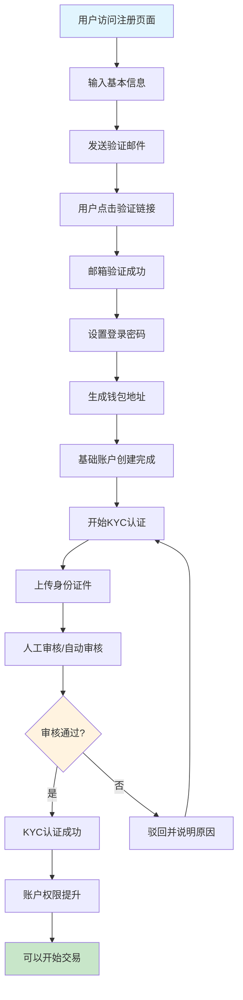

### 2.3 时序图

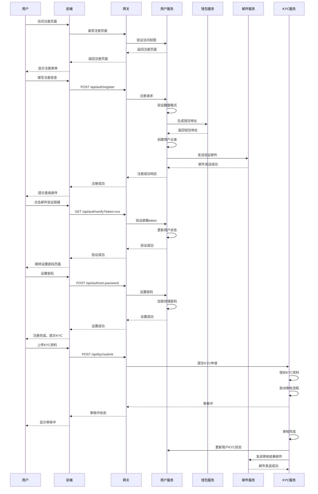

### 2.4 关键设计要点
- **钱包生成**: 使用分层确定性钱包(HD Wallet)为每个用户生成独立的钱包地址
- **安全存储**: 用户密码使用BCrypt加密存储，私钥使用硬件安全模块(HSM)保护
- **KYC流程**: 支持自动审核和人工审核双重机制
- **风控策略**: 在关键节点进行风控检查，防止恶意注册

## 3. 数字资产充值流程

### 3.1 业务概述
用户可以将数字资产充值到CEX平台，包括生成充值地址、区块链确认、资产入账等环节。

### 3.2 流程图

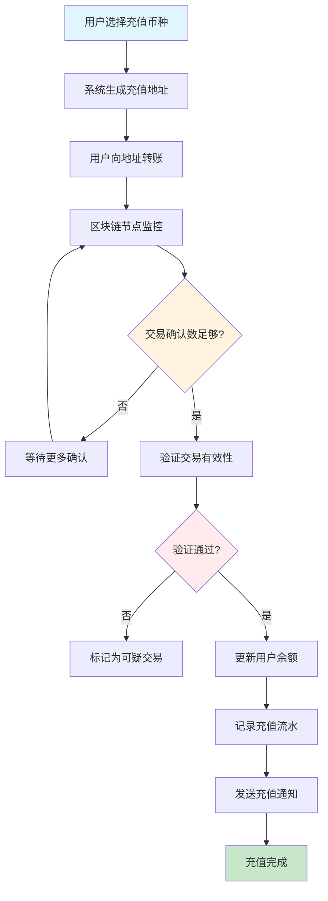

### 3.3 时序图

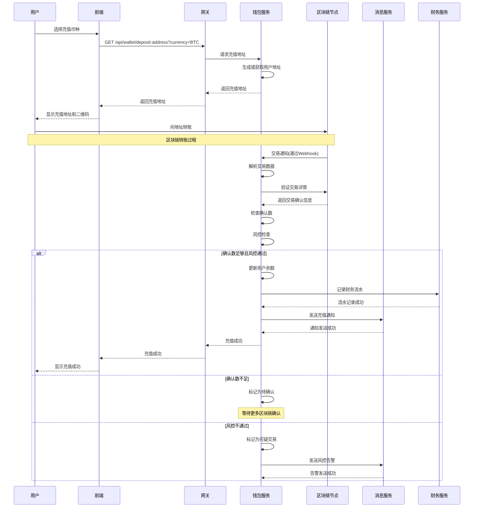

### 3.4 关键设计要点
- **地址管理**: 为每个用户和币种生成独立的充值地址
- **监控策略**: 根据币种特性设置不同的确认数要求
- **风控检查**: 实时监控大额充值、频繁充值等异常行为
- **通知机制**: 多渠道通知用户充值状态

## 4. 币币交易撮合流程

### 4.1 业务概述
币币交易是CEX的核心功能，包括订单创建、撮合引擎匹配、交易执行、资产结算等环节。

### 4.2 流程图

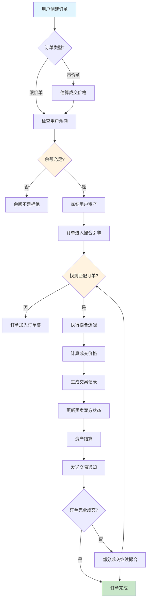

### 4.3 时序图

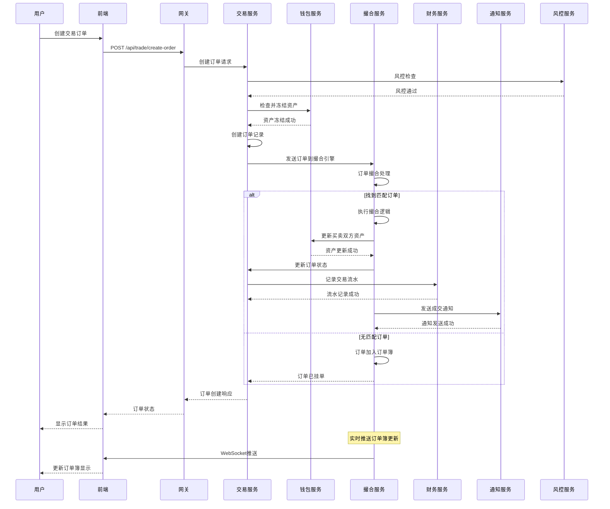

### 4.4 关键设计要点
- **撮合算法**: 采用价格优先、时间优先的原则进行撮合
- **资产冻结**: 下单时立即冻结相应资产，防止余额不足
- **性能优化**: 使用内存数据库和并发队列提升撮合性能
- **实时推送**: 通过WebSocket实时推送订单簿和成交信息

## 5. 资产提现流程

### 5.1 业务概述
用户可以将平台资产提现到外部钱包，包括提现申请、风控审核、区块链转账等环节。

### 5.2 流程图

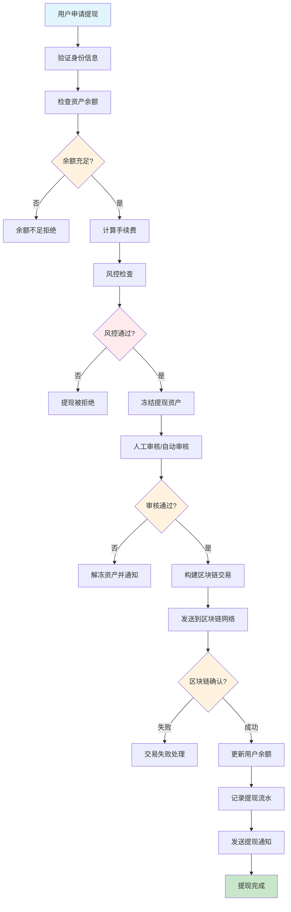

### 5.3 时序图

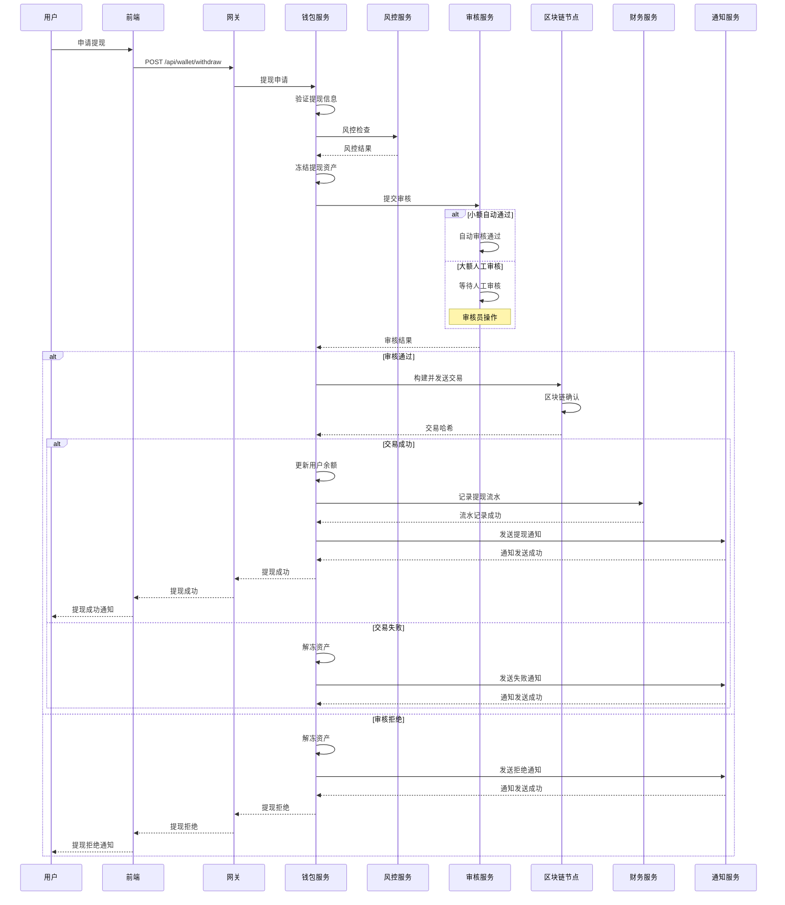

### 5.4 关键设计要点
- **审核机制**: 根据提现金额设置不同的审核等级
- **手续费策略**: 动态调整手续费，鼓励区块链网络空闲期提现
- **安全控制**: 多重签名、冷热钱包分离确保资产安全
- **异常处理**: 完善的失败重试和回滚机制

## 6. 订单管理与查询流程

### 6.1 业务概述
用户可以查询历史订单、当前订单，进行订单撤销等操作，系统提供实时订单状态更新。

### 6.2 流程图

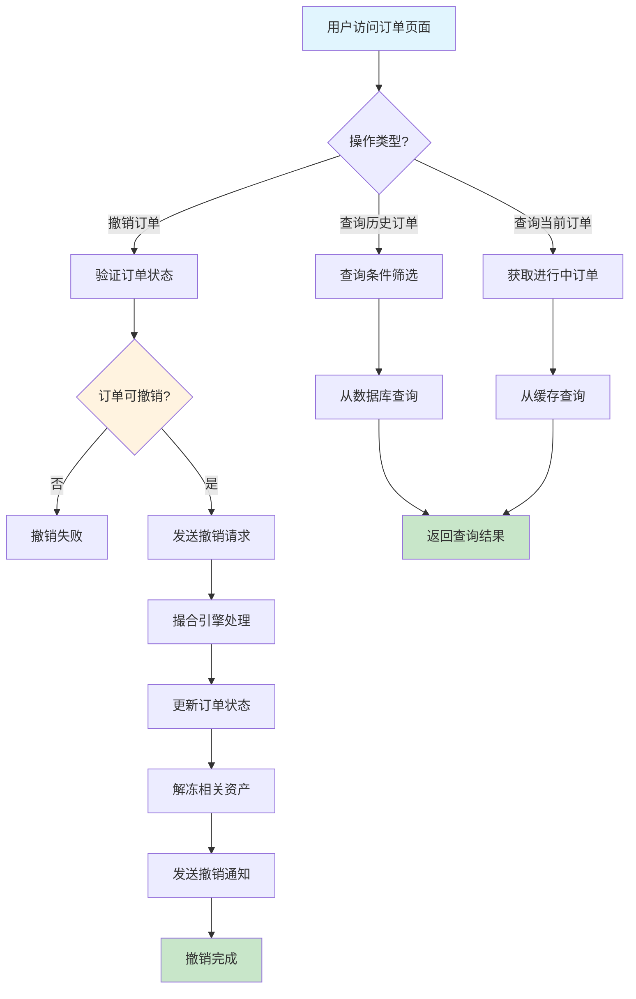

### 6.3 时序图

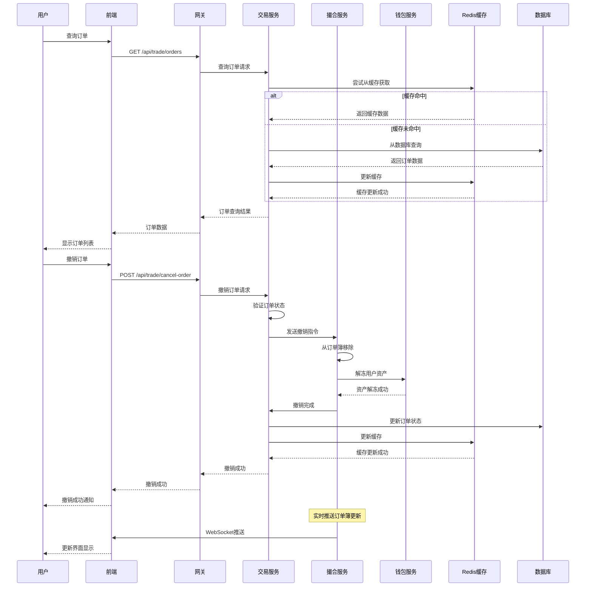

### 6.4 关键设计要点
- **缓存策略**: 热点数据缓存，提升查询性能
- **实时更新**: WebSocket实时推送订单状态变化
- **权限控制**: 严格的权限验证，防止越权操作
- **数据一致性**: 确保缓存和数据库数据一致性

## 7. 系统集成与消息流程

### 7.1 业务概述
CEX系统各微服务之间通过RocketMQ进行异步通信，确保系统的高可用性和数据一致性。

### 7.2 消息流程图

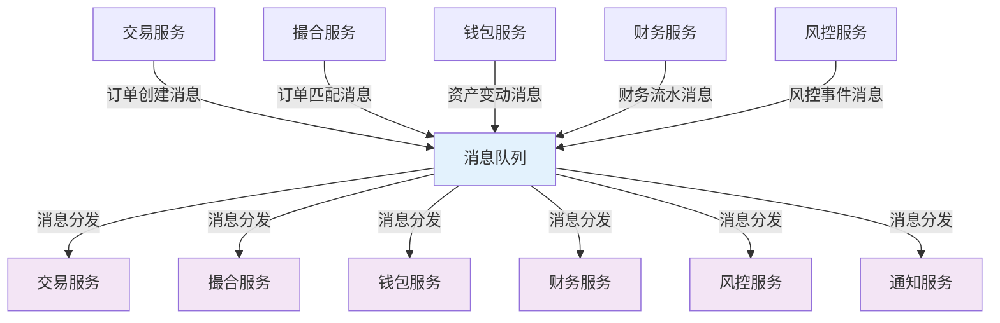

### 7.3 消息时序图

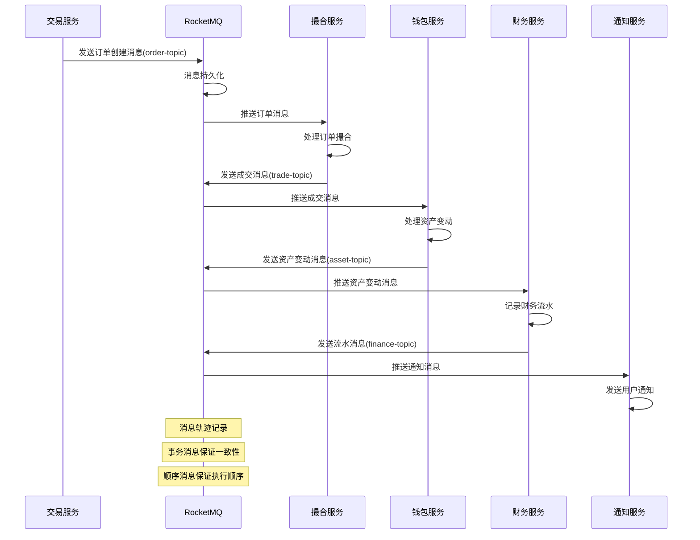

### 7.4 关键设计要点
- **消息可靠性**: 使用事务消息确保消息不丢失
- **顺序保证**: 关键业务消息使用顺序消息
- **消息轨迹**: 完整的消息轨迹追踪和监控
- **幂等性**: 消费者实现幂等性处理，防止重复消费

## 8. 性能监控与告警流程

### 8.1 业务概述
系统通过Prometheus + Grafana实现全方位的性能监控，实时监控系统运行状态并及时告警。

### 8.2 监控流程图

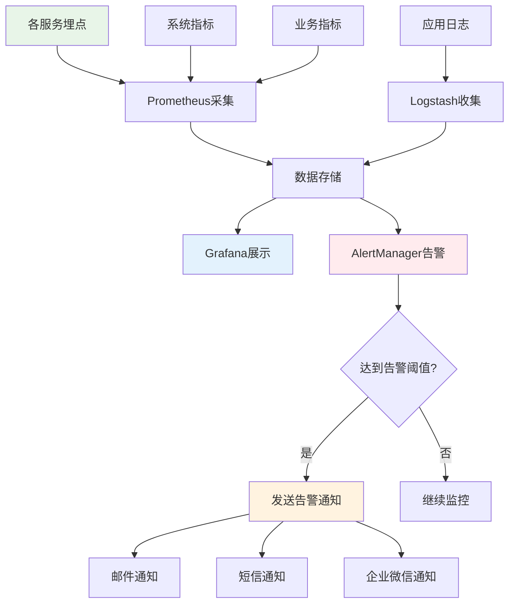

### 8.3 关键监控指标

#### 8.3.1 系统指标
- **CPU使用率**: < 80%
- **内存使用率**: < 85%
- **磁盘使用率**: < 80%
- **网络延迟**: < 100ms

#### 8.3.2 应用指标
- **API响应时间**: < 200ms
- **错误率**: < 1%
- **消息处理延迟**: < 10ms
- **数据库查询时间**: < 50ms

#### 8.3.3 业务指标
- **订单处理量**: 实时监控
- **充值成功率**: > 99%
- **提现处理时间**: < 30分钟
- **用户活跃度**: 实时监控

## 9. 总结

本文档详细描述了Web3 CEX系统的核心业务流程，包括用户注册、资产管理、交易撮合等关键环节。通过Mermaid图表直观展示了各流程的业务逻辑和系统交互，为系统开发和维护提供了清晰的指导。

### 9.1 核心优势
- **高可用性**: 微服务架构支持服务独立扩展和故障隔离
- **高性能**: 撮合引擎内存化处理，支持高并发交易
- **安全性**: 多重安全防护，确保用户资产安全
- **可扩展性**: 模块化设计，支持业务快速迭代

### 9.2 技术特色
- **分布式架构**: 基于Spring Cloud Alibaba的微服务架构
- **消息队列**: RocketMQ保证系统间可靠通信
- **缓存策略**: Redis多级缓存提升系统性能
- **监控告警**: 完善的监控体系确保系统稳定运行

### 9.3 业务特色
- **全流程覆盖**: 从用户注册到资产提现的完整业务闭环
- **实时处理**: 撮合引擎实时处理，保证交易体验
- **风控体系**: 多层次风控确保交易安全
- **用户体验**: 简洁直观的操作流程

通过这些核心流程的设计，系统为用户提供了安全、高效、便捷的数字资产交易服务。