# Web3 CEX 整体业务流程

## 1. 业务流程概述

### 1.1 核心业务模块

本系统包含以下核心业务模块，各模块之间通过RocketMQ消息队列进行异步通信，保证系统的高可用性和数据一致性：

- **用户服务**: 负责用户注册、登录、KYC认证等用户相关功能
- **交易服务**: 负责订单管理、撮合引擎、行情数据等交易核心功能
- **钱包服务**: 负责用户资产管理、充值提现、资金流水等钱包功能
- **财务服务**: 负责财务管理、风控监控、报表统计等财务功能
- **撮合服务**: 负责订单撮合、成交确认、清算结算等撮合功能

### 1.2 技术架构特点

- **微服务架构**: 基于Spring Cloud Alibaba的微服务架构
- **消息驱动**: 基于RocketMQ的异步消息处理
- **分布式事务**: 通过Seata和RocketMQ事务消息保证数据一致性
- **高可用设计**: 多级缓存、读写分离、熔断降级等高可用策略

## 2. 整体业务流程图

### 2.1 用户注册登录流程

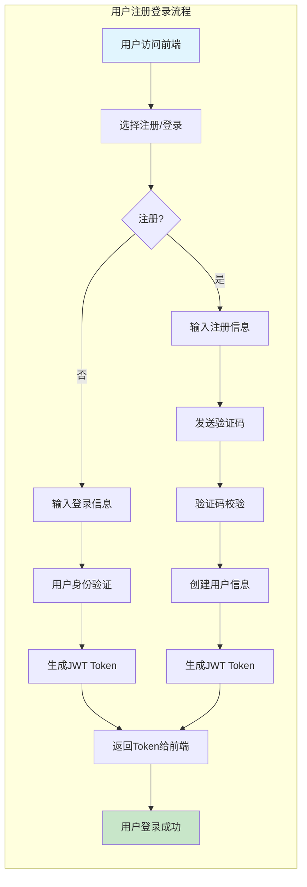

### 2.2 完整业务流程架构

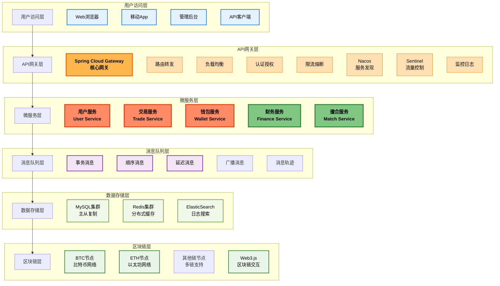

## 3. 核心业务时序图

### 3.1 用户注册时序图

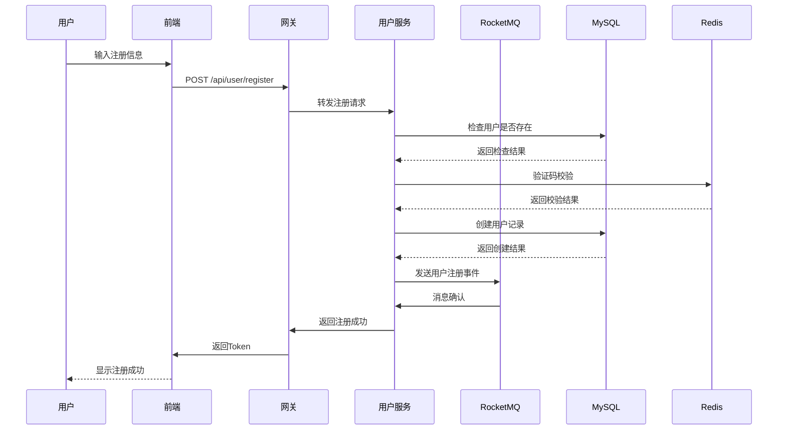

### 3.2 充值流程时序图

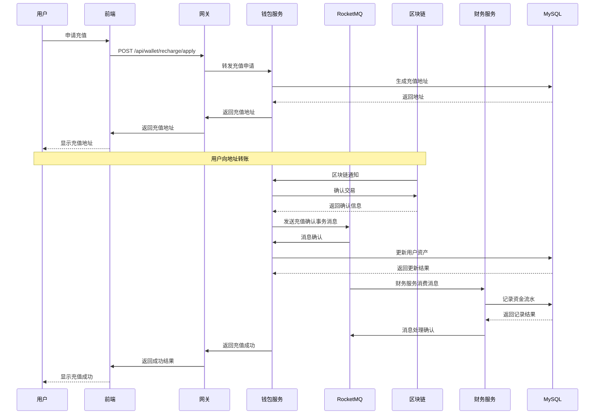

### 3.3 交易下单时序图

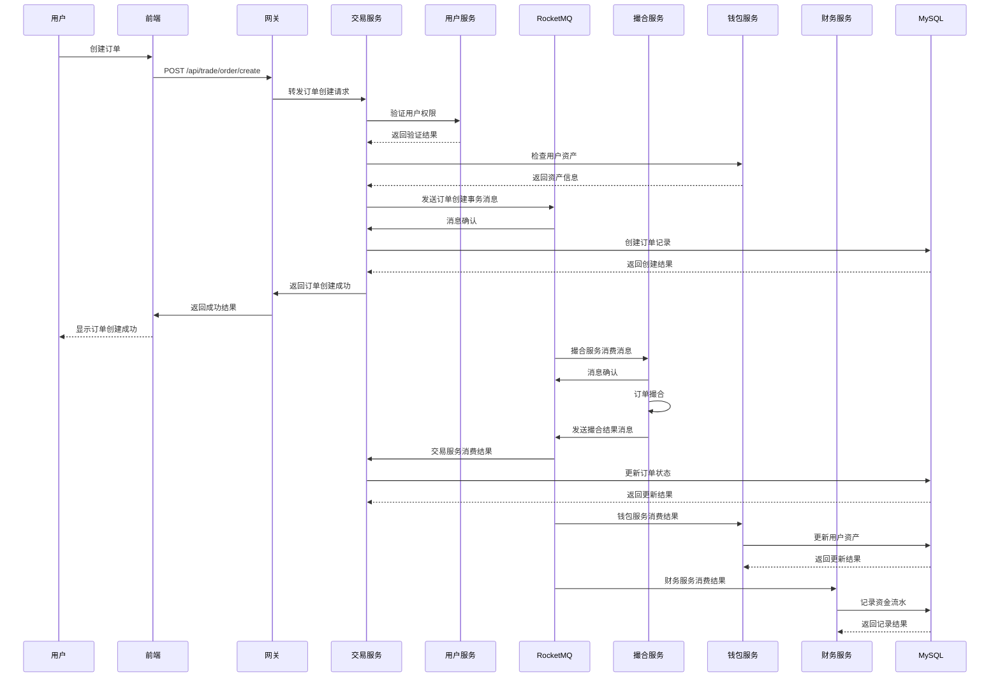

### 3.4 提现流程时序图

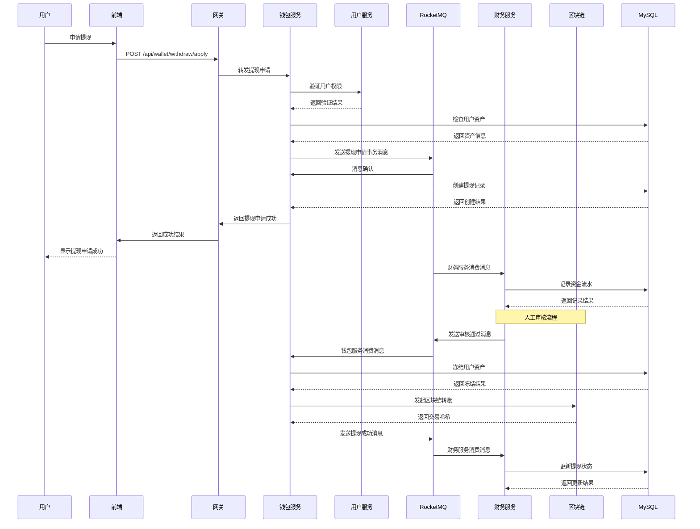

## 4. 跨服务通信流程

### 4.1 服务间通信架构

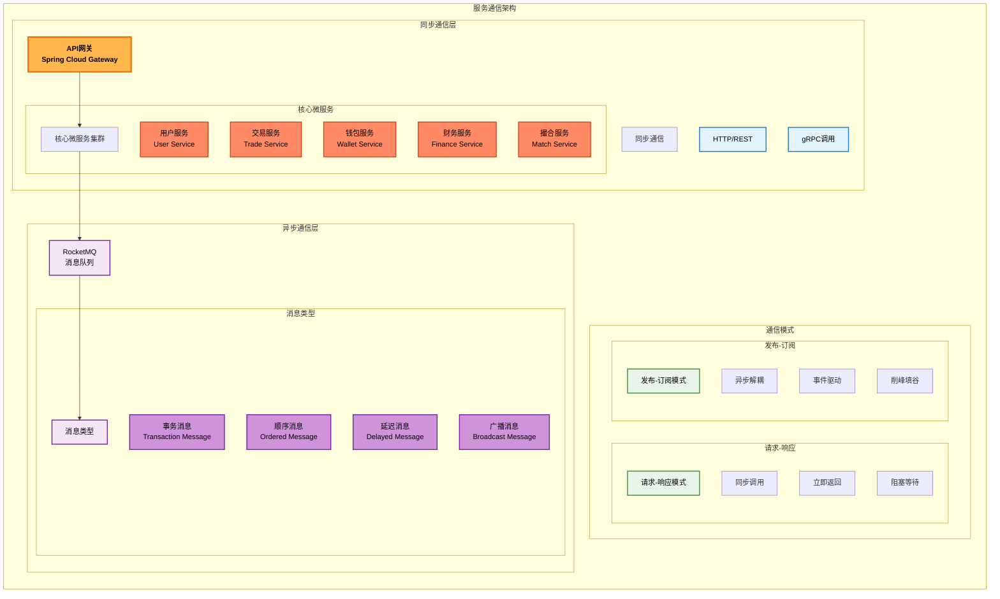

### 4.2 事件驱动架构

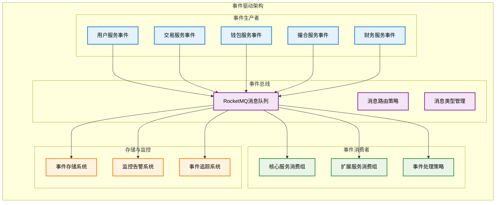

#### 4.2.1 详细事件类型说明

**用户服务事件**
- 用户注册事件 (UserRegistered)
- 用户登录事件 (UserLoggedIn)
- KYC认证事件 (KYCApproved)
- 用户状态变更 (UserStatusChanged)
- 安全设置变更 (SecurityUpdated)

**交易服务事件**
- 订单创建事件 (OrderCreated)
- 订单成交事件 (OrderFilled)
- 订单取消事件 (OrderCancelled)
- 部分成交事件 (OrderPartiallyFilled)
- 交易手续费事件 (TradeFeeCalculated)

**钱包服务事件**
- 充值确认事件 (DepositConfirmed)
- 提现申请事件 (WithdrawRequested)
- 提现完成事件 (WithdrawCompleted)
- 资产变动事件 (AssetChanged)
- 钱包冻结事件 (WalletFrozen)

**撮合服务事件**
- 撮合成功事件 (MatchSuccess)
- 撮合失败事件 (MatchFailed)
- 深度更新事件 (DepthUpdated)
- 成交价格事件 (TradePriceUpdated)

**财务服务事件**
- 风控触发事件 (RiskTriggered)
- 财务统计事件 (FinanceCalculated)
- 资金流水事件 (FlowRecorded)
- 审计日志事件 (AuditLogged)

#### 4.2.2 事件总线配置

**消息队列管理**
- 用户事件队列 (user-events)
- 交易事件队列 (trade-events)
- 钱包事件队列 (wallet-events)
- 撮合事件队列 (match-events)
- 财务事件队列 (finance-events)
- 系统事件队列 (system-events)

**RocketMQ核心特性**
- 事务消息 (Transactional)
- 顺序消息 (Ordered)
- 延迟消息 (Delayed)
- 广播消息 (Broadcast)

**事件路由策略**
- 广播路由 (Broadcast)
- 定向路由 (Direct)
- 主题路由 (Topic)
- 延迟路由 (Delayed)

#### 4.2.3 事件消费配置

**核心服务消费组**
- 用户服务组 (user-service-group)
- 交易服务组 (trade-service-group)
- 钱包服务组 (wallet-service-group)
- 撮合服务组 (match-service-group)
- 财务服务组 (finance-service-group)

**扩展服务消费组**
- 通知服务组 (notify-service-group)
- 风控服务组 (risk-service-group)
- 报表服务组 (report-service-group)
- 日志服务组 (log-service-group)

**事件处理策略**
- 顺序处理 (Sequential)
- 并行处理 (Parallel)
- 重试机制 (Retry)
- 死信队列 (DLQ)

#### 4.2.4 存储与监控配置

**事件存储**
- 事件数据库 (Event Database)
- 事件日志 (Event Logs)
- 事件快照 (Event Snapshots)

**监控告警**
- 消息堆积监控 (Message Backlog)
- 消费延迟监控 (Consumer Lag)
- 错误率监控 (Error Rate)
- 性能监控 (Performance)

**事件追踪**
- 消息轨迹 (Message Trace)
- 链路追踪 (Link Trace)
- 性能分析 (Performance Analysis)

## 5. 数据一致性保障

### 5.1 分布式事务处理

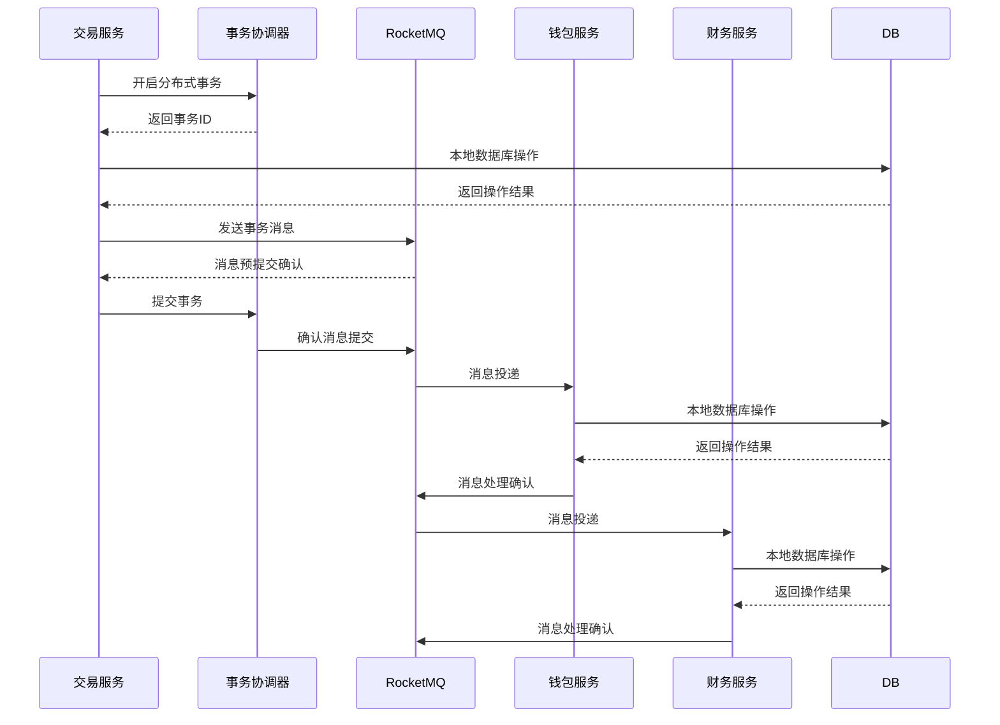

### 5.2 最终一致性保障

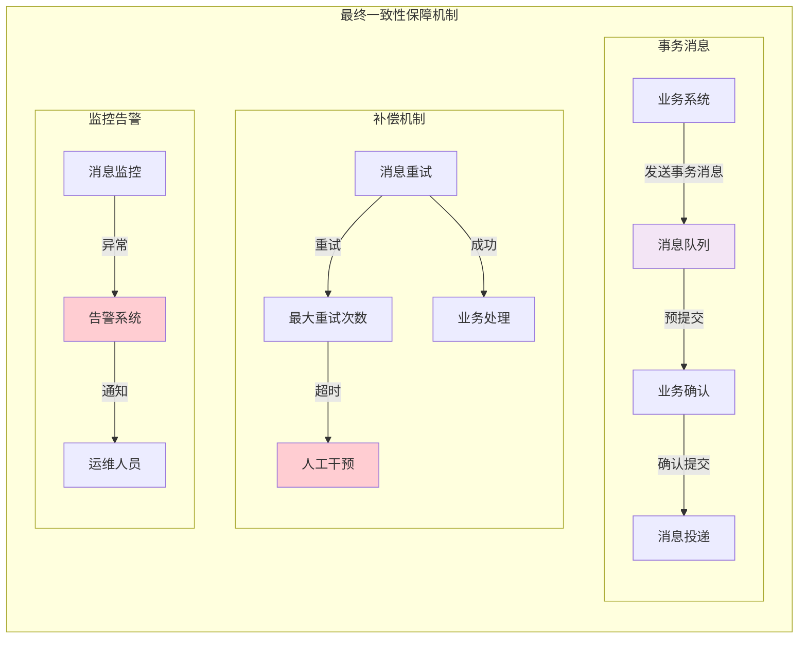

## 6. 容错与降级策略

### 6.1 服务容错机制

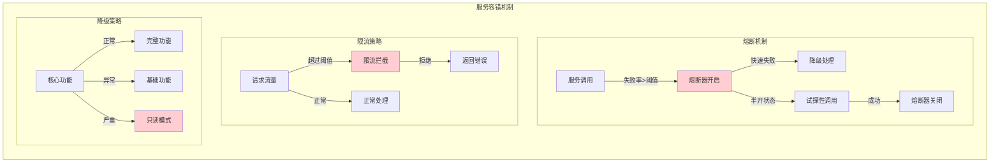

## 7. 监控与告警

### 7.1 系统监控架构

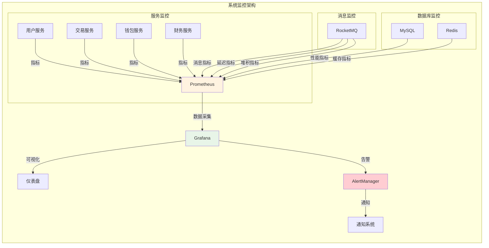

## 8. 总结

### 8.1 核心特点

1. **高可用性**: 通过微服务架构、熔断降级、多级缓存等机制保证系统高可用
2. **高性能**: 采用异步消息处理、读写分离、缓存策略等提升系统性能
3. **一致性**: 通过分布式事务、事务消息、补偿机制等保证数据一致性
4. **可扩展性**: 微服务架构支持水平扩展，消息队列支持异步处理
5. **安全性**: 多重安全机制，包括身份认证、权限控制、数据加密等

### 8.2 技术选型理由

1. **Spring Cloud Alibaba**: 成熟的微服务框架，提供服务注册、配置管理、熔断限流等功能
2. **RocketMQ**: 金融级消息队列，支持事务消息、顺序消息、延迟消息等特性
3. **Redis**: 高性能缓存，提供会话管理、热点数据缓存等功能
4. **MySQL**: 成熟的关系型数据库，支持事务、索引、主从复制等特性
5. **区块链集成**: 支持多链接入，提供真实的数字资产交易体验

### 8.3 业务流程优化

1. **异步处理**: 通过消息队列实现业务解耦，提升系统吞吐量
2. **最终一致性**: 采用最终一致性模型，在保证数据一致性的同时提升系统性能
3. **容错设计**: 通过熔断降级、重试机制等保证系统稳定性
4. **监控告警**: 完善的监控体系，及时发现和处理系统异常

通过以上整体流程设计，系统可以实现高效、稳定、安全的数字资产交易服务，为用户提供优质的交易体验。