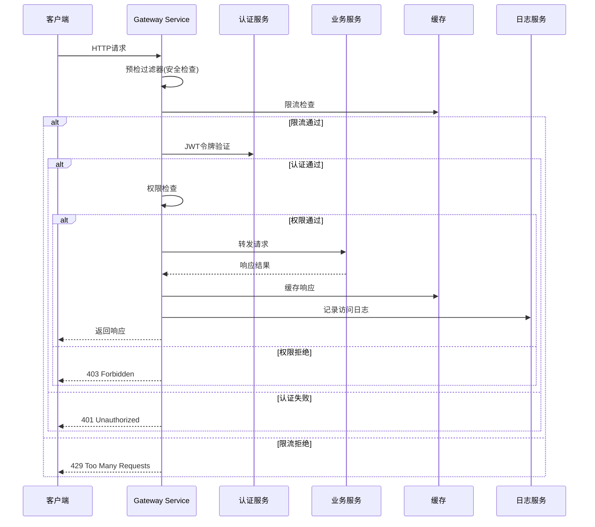
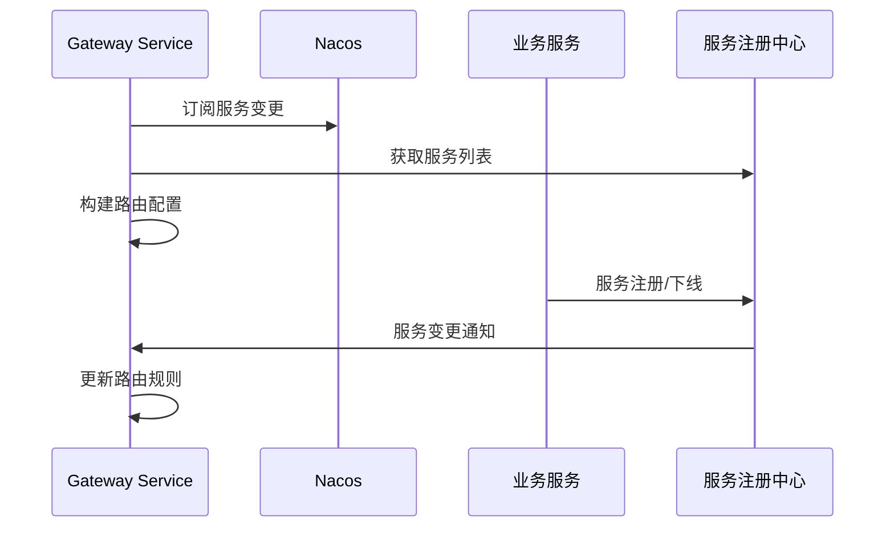
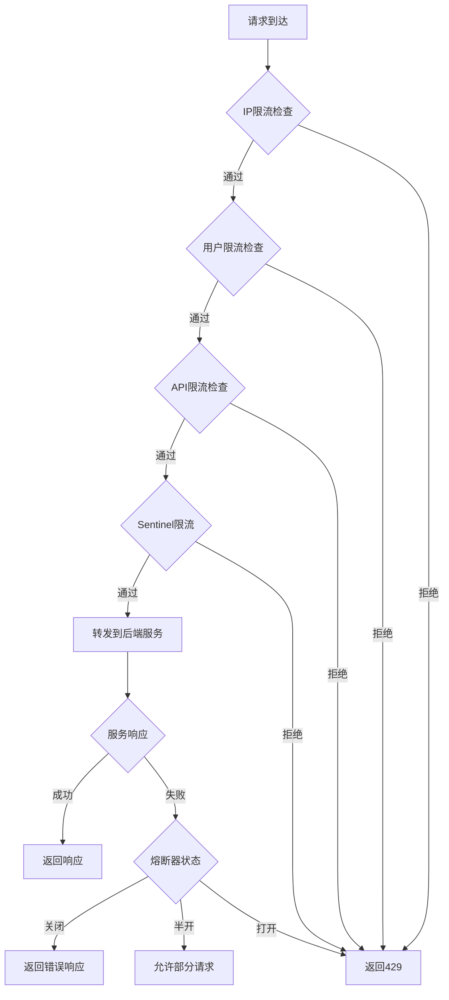

# Gateway Service 技术设计文档

## 1. 服务概述

### 1.1 服务定位
Gateway Service是PPCEX系统的统一API网关，作为所有外部请求的统一入口，提供路由转发、负载均衡、认证授权、限流熔断、监控日志等核心功能。

### 1.2 核心职责
- **路由管理**: 动态路由配置和转发
- **认证授权**: JWT令牌验证和权限控制
- **流量控制**: 请求限流和熔断降级
- **安全防护**: XSS/CSRF防护、IP黑白名单
- **监控日志**: 请求链路追踪和性能监控
- **缓存加速**: API响应缓存和CDN集成

## 2. 技术架构

### 2.1 整体架构
```
┌─────────────────────────────────────────────────────────────────┐
│                      客户端请求层                              │
│  Web前端 │ 移动App │ 管理后台 │ API客户端 │ 第三方集成        │
└─────────────────────────────────────────────────────────────────┘
                                │
┌─────────────────────────────────────────────────────────────────┐
│                      Gateway Service                           │
│  ┌─────────────┐ ┌─────────────┐ ┌─────────────┐ ┌─────────────┐ │
│  │  路由模块   │ │ 认证模块   │ │ 限流模块   │ │ 监控模块   │ │
│  │ Route Filter│ │Auth Filter │ │Rate Limit   │ │Monitor     │ │
│  └─────────────┘ └─────────────┘ └─────────────┘ └─────────────┘ │
│  ┌─────────────┐ ┌─────────────┐ ┌─────────────┐ ┌─────────────┐ │
│  │  负载均衡   │ │ 熔断降级   │ │ 缓存模块   │ │ 日志模块   │ │
│  │Load Balance │ │Circuit Break│ │Cache        │ │Log Collector│ │
│  └─────────────┘ └─────────────┘ └─────────────┘ └─────────────┘ │
└─────────────────────────────────────────────────────────────────┘
                                │
┌─────────────────────────────────────────────────────────────────┐
│                      微服务集群                                │
│ user-service │ trade-service │ wallet-service │ finance-service │
└─────────────────────────────────────────────────────────────────┘
```

### 2.2 核心组件

#### 2.2.1 路由管理组件
```java
@Component
public class DynamicRouteManager {

    @Autowired
    private RouteDefinitionLocator routeDefinitionLocator;

    @Autowired
    private NacosConfigService nacosConfigService;

    /**
     * 动态路由配置
     */
    @NacosConfigListener(dataId = "gateway-routes.yaml", groupId = "gateway-service")
    public void updateRoutes(String configContent) {
        List<RouteDefinition> routes = parseRouteConfig(configContent);
        updateRouteDefinitions(routes);
    }

    /**
     * 服务发现路由
     */
    public RouteDefinition buildServiceRoute(ServiceInstance instance) {
        return RouteDefinition.builder()
            .id(instance.getServiceId() + "-" + instance.getInstanceId())
            .uri("lb://" + instance.getServiceId())
            .predicate(PathPredicate("/" + instance.getServiceId() + "/**"))
            .filter(FilterDefinition.stripPrefix(1))
            .order(getOrder(instance.getServiceId()))
            .build();
    }
}
```

#### 2.2.2 认证授权组件
```java
@Component
public class AuthenticationFilter implements GlobalFilter, Ordered {

    @Autowired
    private JwtTokenProvider jwtTokenProvider;

    @Autowired
    private PermissionService permissionService;

    @Override
    public Mono<Void> filter(ServerWebExchange exchange, GatewayFilterChain chain) {
        ServerHttpRequest request = exchange.getRequest();

        // 1. 检查是否需要认证
        if (isPublicPath(request.getPath().value())) {
            return chain.filter(exchange);
        }

        // 2. 提取JWT令牌
        String token = extractToken(request);
        if (token == null) {
            return unauthorized(exchange);
        }

        // 3. 验证令牌
        if (!jwtTokenProvider.validateToken(token)) {
            return unauthorized(exchange);
        }

        // 4. 获取用户信息
        String username = jwtTokenProvider.getUsernameFromToken(token);
        UserDetails userDetails = userService.loadUserByUsername(username);

        // 5. 检查权限
        if (!hasPermission(userDetails, request)) {
            return forbidden(exchange);
        }

        // 6. 添加用户信息到请求头
        addUserInfoToHeader(exchange, userDetails);

        return chain.filter(exchange);
    }
}
```

#### 2.2.3 限流熔断组件
```java
@Component
public class RateLimitFilter implements GlobalFilter, Ordered {

    @Autowired
    private RedisRateLimiter redisRateLimiter;

    @Autowired
    private SentinelGatewayFilter sentinelGatewayFilter;

    @Override
    public Mono<Void> filter(ServerWebExchange exchange, GatewayFilterChain chain) {
        ServerHttpRequest request = exchange.getRequest();
        String clientId = getClientId(request);
        String path = request.getPath().value();

        // 1. 检查IP限流
        if (isIpRateLimited(request.getRemoteAddress())) {
            return tooManyRequests(exchange);
        }

        // 2. 检查用户限流
        if (isUserRateLimited(clientId)) {
            return tooManyRequests(exchange);
        }

        // 3. 检查API限流
        if (isApiRateLimited(path)) {
            return tooManyRequests(exchange);
        }

        // 4. Sentinel限流检查
        return sentinelGatewayFilter.filter(exchange, chain);
    }
}
```

### 2.3 数据模型设计

#### 2.3.1 路由配置模型
```java
@Data
public class GatewayRoute {

    /** 路由ID */
    private String id;

    /** 路由路径 */
    private String path;

    /** 目标服务 */
    private String uri;

    /** 路由顺序 */
    private Integer order;

    /** 启用状态 */
    private Boolean enabled;

    /** 过滤器配置 */
    private List<FilterConfig> filters;

    /** 断言配置 */
    private List<PredicateConfig> predicates;

    /** 元数据 */
    private Map<String, String> metadata;

    /** 创建时间 */
    private LocalDateTime createTime;

    /** 更新时间 */
    private LocalDateTime updateTime;
}

@Data
public class FilterConfig {

    /** 过滤器名称 */
    private String name;

    /** 过滤器参数 */
    private Map<String, String> args;
}

@Data
public class PredicateConfig {

    /** 断言名称 */
    private String name;

    /** 断言参数 */
    private Map<String, String> args;
}
```

#### 2.3.2 限流配置模型
```java
@Data
public class RateLimitConfig {

    /** 配置ID */
    private String id;

    /** 限流类型 (IP/USER/API) */
    private String type;

    /** 限流标识 */
    private String key;

    /** 时间窗口（秒） */
    private Long windowSeconds;

    /** 最大请求数 */
    private Integer maxRequests;

    /** 启用状态 */
    private Boolean enabled;

    /** 创建时间 */
    private LocalDateTime createTime;
}

@Data
public class CircuitBreakerConfig {

    /** 配置ID */
    private String id;

    /** 服务名称 */
    private String serviceName;

    /** 熔断阈值 */
    private Integer failureRateThreshold;

    /** 熔断时间窗口 */
    private Long waitDurationInOpenState;

    /** 半开状态最大请求数 */
    private Integer permittedNumberOfCallsInHalfOpenState;

    /** 最小请求数 */
    private Integer minimumNumberOfCalls;

    /** 滑动窗口大小 */
    private Integer slidingWindowSize;

    /** 滑动窗口类型 */
    private String slidingWindowType;
}
```

#### 2.3.3 访问日志模型
```java
@Data
public class AccessLog {

    /** 日志ID */
    private String id;

    /** 请求ID */
    private String requestId;

    /** 追踪ID */
    private String traceId;

    /** 用户ID */
    private String userId;

    /** 客户端IP */
    private String clientIp;

    /** 请求方法 */
    private String method;

    /** 请求路径 */
    private String path;

    /** 请求协议 */
    private String protocol;

    /** 请求头 */
    private Map<String, String> headers;

    /** 请求参数 */
    private Map<String, String> parameters;

    /** 请求体（摘要） */
    private String requestBody;

    /** 响应状态码 */
    private Integer responseStatus;

    /** 响应时间（毫秒） */
    private Long responseTime;

    /** 响应大小（字节） */
    private Long responseSize;

    /** 用户代理 */
    private String userAgent;

    /** 请求时间 */
    private LocalDateTime requestTime;

    /** 响应时间 */
    private LocalDateTime responseTime;

    /** 服务名称 */
    private String serviceName;

    /** 错误信息 */
    private String errorMessage;

    /** 创建时间 */
    private LocalDateTime createTime;
}
```

## 3. 业务流程设计

### 3.1 请求处理流程


### 3.2 路由发现流程


### 3.3 限流熔断流程


## 4. 配置设计

### 4.1 Nacos配置结构
```
gateway-service/
├── gateway-routes.yaml          # 路由配置
├── gateway-security.yaml        # 安全配置
├── gateway-rate-limit.yaml      # 限流配置
├── gateway-circuit-breaker.yaml  # 熔断配置
├── gateway-cache.yaml           # 缓存配置
├── gateway-monitor.yaml         # 监控配置
├── gateway-log.yaml             # 日志配置
└── common-config.yaml           # 通用配置
```

### 4.2 路由配置示例
```yaml
# gateway-routes.yaml
routes:
  - id: user-service
    uri: lb://user-service
    predicates:
      - Path=/api/v1/user/**
    filters:
      - StripPrefix=2
      - name: RequestRateLimiter
        args:
          key-resolver: "#{@userKeyResolver}"
          replenish-rate: 100
          burst-capacity: 200
    metadata:
      service-name: user-service
      version: 1.0.0
      description: 用户服务路由

  - id: trade-service
    uri: lb://trade-service
    predicates:
      - Path=/api/v1/trade/**
    filters:
      - StripPrefix=2
      - name: CircuitBreaker
        args:
          name: tradeServiceCircuitBreaker
          fallbackUri: forward:/fallback/trade
    metadata:
      service-name: trade-service
      version: 1.0.0
      description: 交易服务路由

  - id: wallet-service
    uri: lb://wallet-service
    predicates:
      - Path=/api/v1/wallet/**
    filters:
      - StripPrefix=2
      - name: Authentication
    metadata:
      service-name: wallet-service
      version: 1.0.0
      description: 钱包服务路由
```

### 4.3 安全配置示例
```yaml
# gateway-security.yaml
security:
  # JWT配置
  jwt:
    secret: ${JWT_SECRET:gateway-jwt-secret-key}
    expiration: 86400000  # 24小时
    refresh-expiration: 604800000  # 7天
    issuer: PPCEX-Gateway

  # 认证配置
  auth:
    enabled: true
    header-name: Authorization
    token-prefix: Bearer
    public-paths:
      - /api/v1/auth/login
      - /api/v1/auth/register
      - /api/v1/public/**
      - /actuator/**
      - /doc.html
      - /swagger-ui/**

  # 权限配置
  permission:
    enabled: true
    cache-enabled: true
    cache-ttl: 300  # 5分钟

  # IP白名单配置
  ip-whitelist:
    enabled: true
    whitelist:
      - 127.0.0.1
      - 192.168.1.0/24
    blacklist:
      - 10.0.0.0/8

  # CORS配置
  cors:
    enabled: true
    allowed-origins:
      - "https://www.ppcex.com"
      - "https://admin.ppcex.com"
    allowed-methods:
      - GET
      - POST
      - PUT
      - DELETE
      - OPTIONS
    allowed-headers:
      - "*"
    exposed-headers:
      - Authorization
      - Content-Type
    allow-credentials: true
    max-age: 3600
```

### 4.4 限流配置示例
```yaml
# gateway-rate-limit.yaml
rate-limit:
  enabled: true

  # IP限流配置
  ip-limits:
    - key: "default"
      window-seconds: 60
      max-requests: 1000
      enabled: true
    - key: "192.168.1.100"
      window-seconds: 60
      max-requests: 5000
      enabled: true

  # 用户限流配置
  user-limits:
    - key: "default"
      window-seconds: 60
      max-requests: 500
      enabled: true
    - key: "vip_user"
      window-seconds: 60
      max-requests: 2000
      enabled: true

  # API限流配置
  api-limits:
    - path: "/api/v1/trade/order/create"
      window-seconds: 60
      max-requests: 100
      enabled: true
    - path: "/api/v1/user/login"
      window-seconds: 60
      max-requests: 50
      enabled: true
    - path: "/api/v1/market/**"
      window-seconds: 60
      max-requests: 5000
      enabled: true

  # Sentinel限流配置
  sentinel:
    enabled: true
    dashboard: localhost:8858
    flow-rules:
      - resource: "user-service"
        count: 1000
        grade: 1
        limit-app: default
        strategy: 0
        control-behavior: 0
```

## 5. 接口设计

### 5.1 健康检查接口
```http
GET /actuator/gateway/health
GET /actuator/gateway/info
GET /actuator/gateway/metrics
```

### 5.2 路由管理接口
```http
# 获取所有路由
GET /actuator/gateway/routes

# 获取指定路由
GET /actuator/gateway/routes/{id}

# 刷新路由
POST /actuator/gateway/refresh

# 添加路由
POST /actuator/gateway/routes/{id}

# 删除路由
DELETE /actuator/gateway/routes/{id}
```

### 5.3 限流配置接口
```http
# 获取限流配置
GET /api/v1/gateway/rate-limit/config

# 更新限流配置
PUT /api/v1/gateway/rate-limit/config

# 获取实时限流状态
GET /api/v1/gateway/rate-limit/status

# 重置限流计数器
POST /api/v1/gateway/rate-limit/reset
```

### 5.4 日志查询接口
```http
# 查询访问日志
GET /api/v1/gateway/logs?page=1&size=20&startTime=&endTime=&userId=&path=

# 获取日志统计
GET /api/v1/gateway/logs/statistics?startTime=&endTime=&groupBy=hour

# 导出日志
GET /api/v1/gateway/logs/export?format=csv&startTime=&endTime=
```

## 6. 监控设计

### 6.1 性能指标
- **请求量**: 总请求数、成功请求数、失败请求数
- **响应时间**: 平均响应时间、P95响应时间、P99响应时间
- **错误率**: HTTP错误率、业务错误率
- **吞吐量**: QPS、TPS
- **并发数**: 当前并发连接数、最大并发连接数

### 6.2 业务指标
- **用户活跃度**: 活跃用户数、新增用户数
- **API使用统计**: 各API调用次数、热门API
- **服务可用性**: 服务健康状态、服务响应时间
- **异常监控**: 异常次数、异常类型分布

### 6.3 告警配置
```yaml
# 告警规则
alerts:
  # 错误率告警
  error-rate:
    enabled: true
    threshold: 0.05  # 5%
    duration: 5m
    channels: [email, sms]

  # 响应时间告警
  response-time:
    enabled: true
    threshold: 1000  # 1秒
    duration: 5m
    channels: [email]

  # 请求量告警
  request-volume:
    enabled: true
    threshold: 10000  # 1万QPS
    duration: 1m
    channels: [email, webhook]

  # 服务可用性告警
  service-availability:
    enabled: true
    threshold: 0.99  # 99%
    duration: 5m
    channels: [email, sms, webhook]
```

## 7. 部署设计

### 7.1 容器化部署
```dockerfile
FROM openjdk:17-jre-slim

WORKDIR /app

COPY target/gateway-service.jar gateway-service.jar

EXPOSE 9000

ENV JAVA_OPTS="-Xmx2g -Xms1g -XX:+UseG1GC"

CMD ["java", "-jar", "gateway-service.jar"]
```

### 7.2 Kubernetes部署
```yaml
apiVersion: apps/v1
kind: Deployment
metadata:
  name: gateway-service
  labels:
    app: gateway-service
spec:
  replicas: 3
  selector:
    matchLabels:
      app: gateway-service
  template:
    metadata:
      labels:
        app: gateway-service
    spec:
      containers:
      - name: gateway-service
        image: ppcex/gateway-service:1.0.0
        ports:
        - containerPort: 9000
        env:
        - name: SPRING_PROFILES_ACTIVE
          value: "prod"
        - name: NACOS_SERVER_ADDR
          value: "nacos-server:8848"
        resources:
          requests:
            memory: "1Gi"
            cpu: "500m"
          limits:
            memory: "2Gi"
            cpu: "1000m"
        livenessProbe:
          httpGet:
            path: /actuator/health
            port: 9000
          initialDelaySeconds: 30
          periodSeconds: 10
        readinessProbe:
          httpGet:
            path: /actuator/health
            port: 9000
          initialDelaySeconds: 5
          periodSeconds: 5
---
apiVersion: v1
kind: Service
metadata:
  name: gateway-service
spec:
  selector:
    app: gateway-service
  ports:
  - protocol: TCP
    port: 80
    targetPort: 9000
  type: LoadBalancer
```

## 8. 安全设计

### 8.1 认证授权
- **JWT认证**: 基于JWT令牌的身份验证
- **权限控制**: 基于角色的访问控制(RBAC)
- **API签名**: 内部服务间调用的签名验证
- **会话管理**: 分布式会话管理

### 8.2 安全防护
- **XSS防护**: 输入输出过滤和转义
- **CSRF防护**: CSRF令牌验证
- **SQL注入防护**: 参数化查询和输入验证
- **限流防护**: 防止DDoS攻击和恶意请求

### 8.3 数据安全
- **敏感数据**: 敏感信息脱敏和加密
- **传输安全**: HTTPS加密传输
- **存储安全**: 数据库加密存储
- **审计日志**: 完整的操作审计记录

## 9. 性能优化

### 9.1 缓存策略
- **路由缓存**: 路由配置本地缓存
- **认证缓存**: JWT令牌解析结果缓存
- **权限缓存**: 用户权限信息缓存
- **响应缓存**: API响应结果缓存

### 9.2 连接池优化
- **HTTP连接池**: 优化HTTP客户端连接池
- **Redis连接池**: 优化Redis连接池配置
- **数据库连接池**: 优化数据库连接池配置

### 9.3 线程池优化
- **事件循环线程**: Netty事件循环线程优化
- **业务线程池**: 业务处理线程池配置
- **定时任务线程**: 定时任务线程池配置

## 10. 测试策略

### 10.1 单元测试
- **过滤器测试**: 各个过滤器的功能测试
- **配置测试**: 配置加载和解析测试
- **工具类测试**: 工具类方法的单元测试

### 10.2 集成测试
- **路由测试**: 路由转发和负载均衡测试
- **认证测试**: 认证授权流程测试
- **限流测试**: 限流熔断功能测试

### 10.3 性能测试
- **压力测试**: 高并发请求测试
- **负载测试**: 不同负载下的性能测试
- **稳定性测试**: 长时间运行的稳定性测试

## 11. 运维指南

### 11.1 监控配置
- **应用监控**: Spring Boot Actuator + Prometheus
- **日志监控**: ELK Stack
- **链路追踪**: SkyWalking
- **业务监控**: 自定义业务指标

### 11.2 故障排查
- **日志分析**: 通过日志分析问题
- **性能分析**: 通过监控指标分析性能问题
- **链路追踪**: 通过链路追踪定位问题
- **告警处理**: 告警信息的处理流程

### 11.3 扩容策略
- **水平扩容**: 增加网关实例数量
- **垂直扩容**: 提升单实例配置
- **自动扩容**: 基于指标的自动扩容
- **负载均衡**: 流量负载均衡配置

## 12. 总结

Gateway Service作为PPCEX系统的统一入口，承担着路由转发、认证授权、限流熔断、监控日志等重要职责。通过采用Spring Cloud Gateway框架，结合Nacos、Sentinel、Redis等中间件，构建了一个高性能、高可用、高扩展的API网关服务。

本设计涵盖了技术架构、数据模型、业务流程、配置管理、接口设计、监控告警、安全防护、性能优化、测试策略和运维指南等各个方面，为Gateway Service的开发和运维提供了完整的技术方案。