# Risk Service 业务流程设计

## 1. 风控系统概述

风控服务是Web3 CEX系统的核心安全组件，负责实时监控和防范各类风险，包括用户行为风控、交易风控、资产风控和系统风控。

### 1.1 核心功能
- **实时风控**: 实时分析用户行为，识别异常模式
- **规则引擎**: 基于配置化的风控规则进行风险识别
- **策略管理**: 灵活的风控策略配置和管理
- **风险评分**: 动态风险评分和等级划分
- **自动处置**: 自动化的风险处置和人工审核流程
- **统计分析**: 风控数据统计和趋势分析

### 1.2 技术特点
- **高性能**: 基于内存计算，支持毫秒级风控响应
- **高可用**: 微服务架构，支持集群部署
- **可扩展**: 规则引擎支持动态配置和扩展
- **实时性**: 基于RocketMQ实时消息处理
- **智能化**: 支持机器学习算法集成

## 2. 实时风控流程

### 2.1 整体流程图

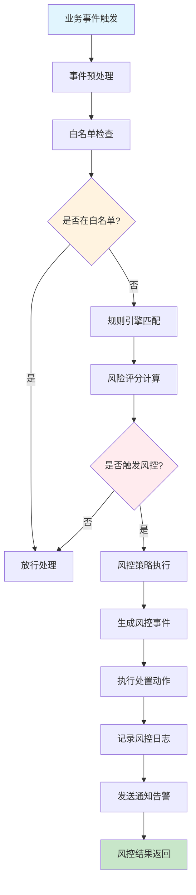

### 2.2 详细时序图

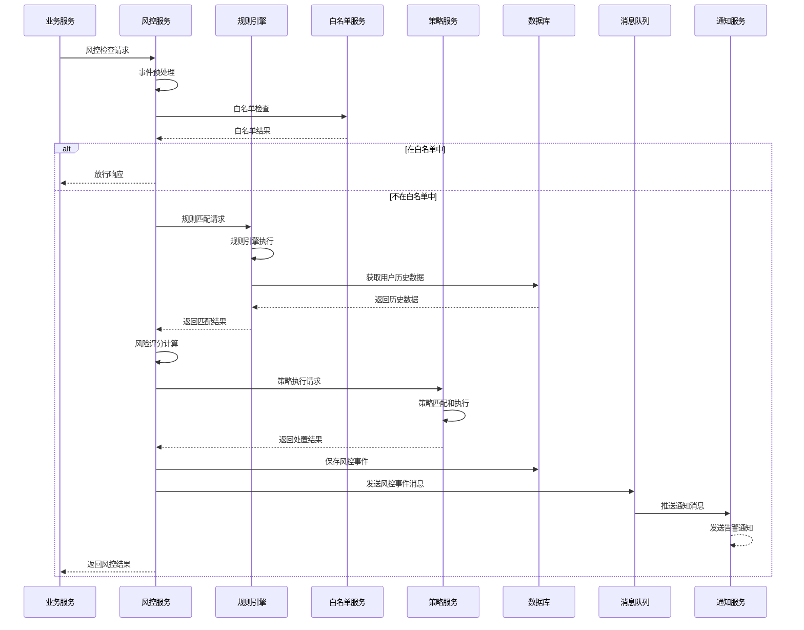

## 3. 风控规则引擎

### 3.1 规则引擎架构

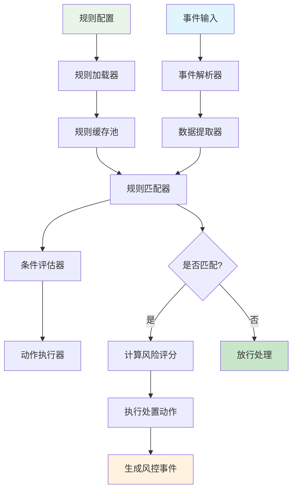

### 3.2 规则类型

#### 3.2.1 用户风控规则
- **登录异常**: 异常IP、异常设备、频繁登录
- **行为异常**: 异常操作模式、异常时间访问
- **信用风险**: KYC状态、历史违规记录
- **账户风险**: 新用户、 dormant账户、异常活动

#### 3.2.2 交易风控规则
- **价格异常**: 价格偏离阈值、异常交易对
- **数量异常**: 大额交易、频繁交易、异常数量
- **模式异常**: 刷单、洗钱、市场操纵
- **时间异常**: 异常时间交易、高频交易

#### 3.2.3 资产风控规则
- **充值异常**: 大额充值、频繁充值、异常来源
- **提现异常**: 大额提现、频繁提现、异常地址
- **余额异常**: 余额突增、余额归零、异常变动
- **地址异常**: 黑名单地址、高风险地址、新地址

#### 3.2.4 系统风控规则
- **性能异常**: 系统负载、响应时间、错误率
- **安全异常**: 恶意攻击、异常请求、安全漏洞
- **业务异常**: 异常流量、异常模式、异常指标

## 4. 风控策略管理

### 4.1 策略配置流程

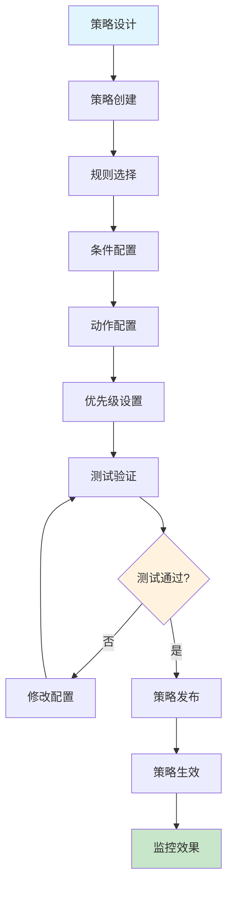

### 4.2 策略执行流程

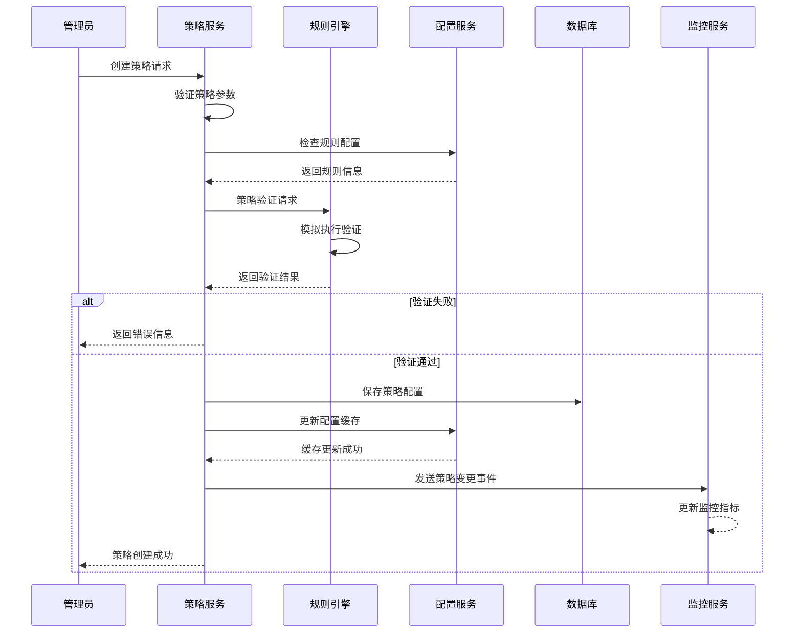

## 5. 风险评分系统

### 5.1 评分计算流程

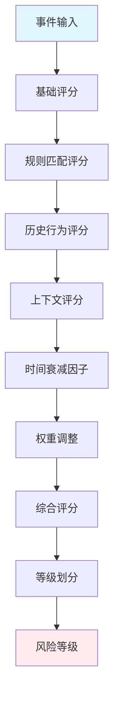

### 5.2 评分维度

#### 5.2.1 基础评分 (40%)
- 用户类型权重
- KYC完成度
- 账户年龄
- 历史违规记录

#### 5.2.2 行为评分 (30%)
- 登录频率
- 交易频率
- 操作模式
- 设备多样性

#### 5.2.3 上下文评分 (20%)
- IP地理位置
- 设备指纹
- 时间模式
- 网络环境

#### 5.2.4 历史评分 (10%)
- 历史风控事件
- 用户反馈
- 风险处置结果

### 5.3 风险等级划分

| 风险评分 | 风险等级 | 处置措施 |
|---------|---------|---------|
| 0-20 | 低风险 | 正常处理 |
| 21-50 | 中风险 | 增强验证 |
| 51-80 | 高风险 | 限制功能 |
| 81-100 | 严重风险 | 冻结账户 |

## 6. 消息处理流程

### 6.1 消息订阅流程

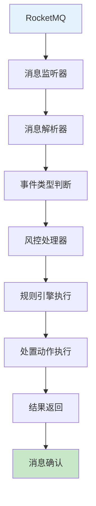

### 6.2 消息类型

#### 6.2.1 用户相关消息
- 用户注册事件
- 用户登录事件
- 用户信息变更事件
- KYC认证事件

#### 6.2.2 交易相关消息
- 订单创建事件
- 订单成交事件
- 订单取消事件
- 交易异常事件

#### 6.2.3 资产相关消息
- 充值事件
- 提现事件
- 资产变动事件
- 余额异常事件

#### 6.2.4 系统相关消息
- 系统异常事件
- 性能告警事件
- 安全威胁事件
- 业务异常事件

## 7. 异常处理流程

### 7.1 异常处理架构

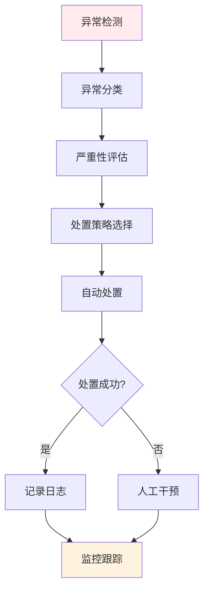

### 7.2 异常类型处理

#### 7.2.1 系统异常
- 规则引擎故障
- 数据库连接异常
- 消息队列异常
- 缓存服务异常

#### 7.2.2 业务异常
- 规则配置错误
- 策略执行失败
- 数据格式异常
- 权限验证失败

#### 7.2.3 性能异常
- 响应时间过长
- 并发处理超限
- 内存使用过高
- CPU使用率过高

## 8. 监控告警流程

### 8.1 监控指标体系

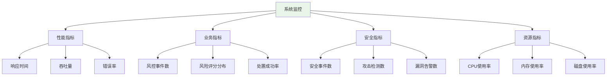

### 8.2 告警处理流程

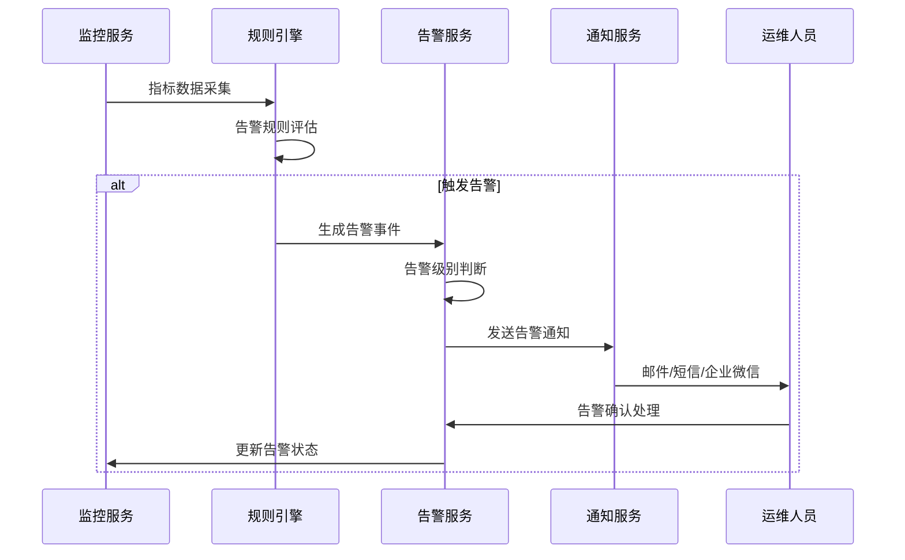

## 9. 数据统计与分析

### 9.1 统计维度

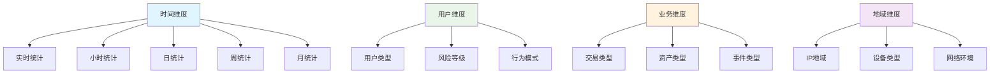

### 9.2 分析报告

- **风险趋势报告**: 风险事件趋势分析
- **用户画像报告**: 用户风险画像分析
- **规则效果报告**: 风控规则效果评估
- **业务影响报告**: 风控对业务影响分析

## 10. 总结

Risk Service作为Web3 CEX系统的核心安全组件，通过实时风控、规则引擎、策略管理等核心功能，为系统提供全方位的安全保障。系统采用微服务架构，支持高并发、高可用的风控服务，确保平台和用户资产的安全。

### 10.1 技术优势
- **实时性**: 毫秒级风控响应
- **准确性**: 多维度风险评分
- **灵活性**: 可配置的规则引擎
- **智能化**: 支持机器学习算法

### 10.2 业务价值
- **安全保障**: 全方位风险防护
- **合规要求**: 满足监管合规要求
- **用户体验**: 智能风控减少误伤
- **运营效率**: 自动化风控处理