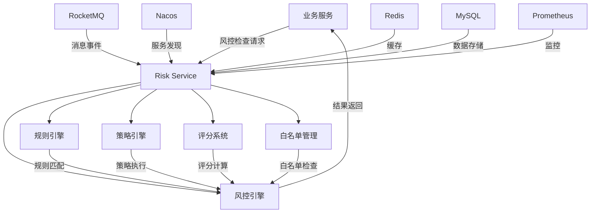
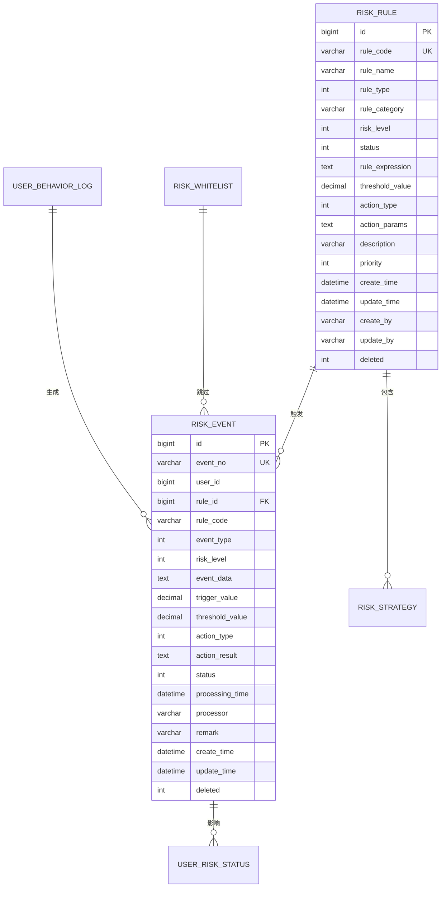
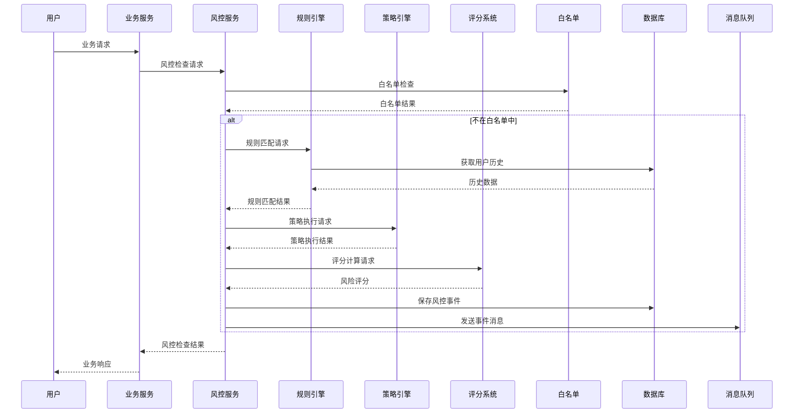
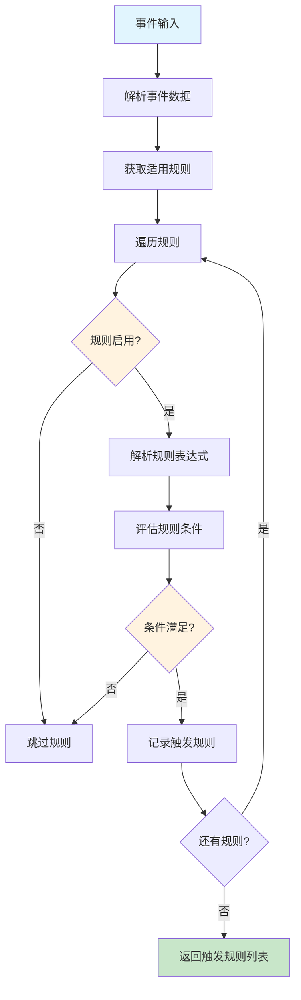
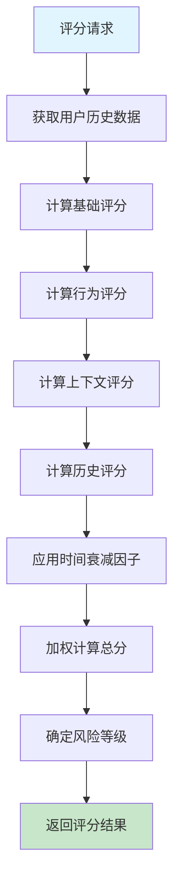

# Risk Service 技术设计文档

## 1. 项目概述

### 1.1 项目背景
Risk Service（风控服务）是PPCEX中心化交易所的核心安全组件，负责实时监控和防范各类风险，包括用户行为风控、交易风控、资产风控和系统风控。该服务基于Spring Cloud Alibaba微服务架构，采用规则引擎和策略引擎进行风险识别和处置。

### 1.2 设计目标
- **高可用性**: 99.9%系统可用性，支持集群部署
- **高性能**: 毫秒级风控响应，支持10,000+ TPS
- **实时性**: 实时风控检查，支持事件驱动架构
- **可扩展性**: 支持水平扩展和动态配置
- **安全性**: 金融级安全保障，防止风控系统被绕过

### 1.3 技术栈
- **框架**: Spring Boot 3.x + Spring Cloud Alibaba 2022.x
- **服务治理**: Nacos 2.2.x + Sentinel 1.8.6
- **消息队列**: RocketMQ 4.9.x
- **数据库**: MySQL 8.0 + MyBatis Plus 3.5.4
- **缓存**: Redis 7.x + Caffeine
- **监控**: Prometheus + Grafana
- **文档**: Knife4j 4.4.0

## 2. 系统架构

### 2.1 整体架构



### 2.2 核心组件

#### 2.2.1 风控引擎（RiskEngine）
- **职责**: 风控检查的核心执行引擎
- **功能**: 规则匹配、策略执行、评分计算
- **特点**: 高性能、可扩展、实时性

#### 2.2.2 规则引擎（RuleEngine）
- **职责**: 执行风控规则匹配
- **功能**: 条件评估、阈值判断、结果返回
- **支持**: 数值比较、频率检查、模式匹配

#### 2.2.3 策略引擎（StrategyEngine）
- **职责**: 执行风控策略决策
- **功能**: 策略匹配、动作执行、结果聚合
- **支持**: 任意匹配、全部匹配、加权匹配

#### 2.2.4 评分系统（RiskScoreCalculator）
- **职责**: 计算用户风险评分
- **功能**: 多维度评分、时间衰减、权重计算
- **维度**: 基础评分、行为评分、上下文评分、历史评分

#### 2.2.5 白名单管理（WhitelistManager）
- **职责**: 管理风控白名单
- **功能**: 白名单检查、缓存管理、过期处理
- **类型**: 用户白名单、IP白名单、设备白名单、地址白名单

## 3. 数据模型设计

### 3.1 核心数据表

#### 3.1.1 风控规则表（risk_rule）
```sql
CREATE TABLE `risk_rule` (
  `id` bigint(20) NOT NULL AUTO_INCREMENT COMMENT '风控规则ID',
  `rule_code` varchar(50) NOT NULL COMMENT '规则编码',
  `rule_name` varchar(100) NOT NULL COMMENT '规则名称',
  `rule_type` tinyint(1) NOT NULL COMMENT '规则类型',
  `rule_category` varchar(50) NOT NULL COMMENT '规则分类',
  `risk_level` tinyint(1) NOT NULL DEFAULT '1' COMMENT '风险等级',
  `status` tinyint(1) NOT NULL DEFAULT '1' COMMENT '状态',
  `rule_expression` text NOT NULL COMMENT '规则表达式',
  `threshold_value` decimal(20,8) DEFAULT NULL COMMENT '阈值',
  `action_type` tinyint(1) NOT NULL COMMENT '动作类型',
  `action_params` text DEFAULT NULL COMMENT '动作参数',
  `description` varchar(500) DEFAULT NULL COMMENT '规则描述',
  `priority` int(11) NOT NULL DEFAULT '0' COMMENT '优先级',
  `create_time` datetime NOT NULL DEFAULT CURRENT_TIMESTAMP COMMENT '创建时间',
  `update_time` datetime NOT NULL DEFAULT CURRENT_TIMESTAMP ON UPDATE CURRENT_TIMESTAMP COMMENT '更新时间',
  `create_by` varchar(32) DEFAULT NULL COMMENT '创建人',
  `update_by` varchar(32) DEFAULT NULL COMMENT '更新人',
  `deleted` tinyint(1) NOT NULL DEFAULT '0' COMMENT '删除标记',
  PRIMARY KEY (`id`),
  UNIQUE KEY `uk_rule_code` (`rule_code`)
) ENGINE=InnoDB DEFAULT CHARSET=utf8mb4 COMMENT='风控规则表';
```

#### 3.1.2 风控事件表（risk_event）
```sql
CREATE TABLE `risk_event` (
  `id` bigint(20) NOT NULL AUTO_INCREMENT COMMENT '风控事件ID',
  `event_no` varchar(32) NOT NULL COMMENT '事件编号',
  `user_id` bigint(20) DEFAULT NULL COMMENT '用户ID',
  `rule_id` bigint(20) NOT NULL COMMENT '规则ID',
  `rule_code` varchar(50) NOT NULL COMMENT '规则编码',
  `event_type` tinyint(1) NOT NULL COMMENT '事件类型',
  `risk_level` tinyint(1) NOT NULL COMMENT '风险等级',
  `event_data` text NOT NULL COMMENT '事件数据',
  `trigger_value` decimal(20,8) DEFAULT NULL COMMENT '触发值',
  `threshold_value` decimal(20,8) DEFAULT NULL COMMENT '阈值',
  `action_type` tinyint(1) NOT NULL COMMENT '动作类型',
  `action_result` text DEFAULT NULL COMMENT '动作结果',
  `status` tinyint(1) NOT NULL DEFAULT '1' COMMENT '状态',
  `processing_time` datetime DEFAULT NULL COMMENT '处理时间',
  `processor` varchar(32) DEFAULT NULL COMMENT '处理人',
  `remark` varchar(500) DEFAULT NULL COMMENT '备注',
  `create_time` datetime NOT NULL DEFAULT CURRENT_TIMESTAMP COMMENT '创建时间',
  `update_time` datetime NOT NULL DEFAULT CURRENT_TIMESTAMP ON UPDATE CURRENT_TIMESTAMP COMMENT '更新时间',
  `deleted` tinyint(1) NOT NULL DEFAULT '0' COMMENT '删除标记',
  PRIMARY KEY (`id`),
  UNIQUE KEY `uk_event_no` (`event_no`)
) ENGINE=InnoDB DEFAULT CHARSET=utf8mb4 COMMENT='风控事件表';
```

### 3.2 数据关系



## 4. 业务流程设计

### 4.1 实时风控流程



### 4.2 风控规则匹配流程



### 4.3 风险评分计算流程



## 5. 核心功能实现

### 5.1 风控引擎实现

#### 5.1.1 核心接口
```java
public interface RiskEngine {
    RiskCheckResponse execute(RiskCheckRequest request);
    void initialize();
    void refreshRules();
    void refreshStrategies();
    EngineStatus getStatus();
}
```

#### 5.1.2 实现要点
- **并发处理**: 使用ConcurrentHashMap进行缓存管理
- **性能优化**: 规则和策略预加载，避免重复查询
- **异常处理**: 完善的异常处理和降级机制
- **幂等性**: 支持请求幂等性，避免重复处理

### 5.2 规则引擎实现

#### 5.2.1 规则表达式
```json
{
  "condition": "AMOUNT_GT",
  "currency": "USDT",
  "amount": 10000,
  "timeRange": "1h"
}
```

#### 5.2.2 条件类型
- **数值比较**: AMOUNT_GT, AMOUNT_LT, AMOUNT_EQ
- **频率检查**: FREQUENCY_GT, FREQUENCY_LT
- **模式匹配**: IP_BLACKLIST, DEVICE_PATTERN
- **时间范围**: TIME_RANGE, TIME_NOT_IN_RANGE

### 5.3 策略引擎实现

#### 5.3.1 策略匹配类型
- **任意匹配**: 匹配任意一个规则即可
- **全部匹配**: 需要匹配所有规则
- **加权匹配**: 基于权重计算匹配度

#### 5.3.2 策略执行
```java
public boolean evaluateStrategy(RiskStrategy strategy, List<RiskRule> triggeredRules, RiskCheckRequest request) {
    List<Long> ruleIds = JSON.parseArray(strategy.getRuleIds(), Long.class);

    switch (strategy.getMatchType()) {
        case ANY:
            return triggeredRules.stream().anyMatch(rule -> ruleIds.contains(rule.getId()));
        case ALL:
            return triggeredRules.stream().allMatch(rule -> ruleIds.contains(rule.getId()));
        case WEIGHTED:
            return evaluateWeightedMatch(strategy, triggeredRules);
        default:
            return false;
    }
}
```

### 5.4 评分系统实现

#### 5.4.1 评分维度
- **基础评分**: 用户类型、KYC状态、历史记录
- **行为评分**: 事件类型、触发规则、异常行为
- **上下文评分**: 时间、位置、设备、网络
- **历史评分**: 失败次数、可疑IP、风控历史

#### 5.4.2 评分算法
```java
public int calculate(RiskCheckRequest request, List<RiskRule> triggeredRules, UserRiskStatus userRiskStatus) {
    double baseScore = calculateBaseScore(request, userRiskStatus);
    double behaviorScore = calculateBehaviorScore(request, triggeredRules);
    double contextScore = calculateContextScore(request);
    double historyScore = calculateHistoryScore(userRiskStatus);
    double timeDecayFactor = calculateTimeDecayFactor(userRiskStatus);

    double totalScore = baseScore * BASE_WEIGHT +
                       behaviorScore * BEHAVIOR_WEIGHT +
                       contextScore * CONTEXT_WEIGHT +
                       historyScore * HISTORY_WEIGHT;

    return (int) Math.round(totalScore * timeDecayFactor);
}
```

## 6. 消息处理设计

### 6.1 消息主题

| 主题名称 | 用途 | 标签 |
|---------|------|------|
| risk-topic | 风控事件 | RISK_EVENT, RULE_UPDATE, STRATEGY_UPDATE |
| user-topic | 用户事件 | USER_REGISTER, USER_LOGIN, USER_KYC, USER_UPDATE |
| trade-topic | 交易事件 | ORDER_CREATE, ORDER_TRADE, ORDER_CANCEL, ORDER_FAILED |
| asset-topic | 资产事件 | ASSET_RECHARGE, ASSET_WITHDRAW, ASSET_TRANSFER, ASSET_FREEZE |

### 6.2 消息监听器

```java
@StreamListener("riskTopic-in-0")
public void handleRiskTopic(Message<String> message) {
    Map<String, Object> event = JSON.parseObject(message.getPayload(), Map.class);
    String eventType = (String) event.get("eventType");

    switch (eventType) {
        case "RISK_EVENT":
            handleRiskEvent(event);
            break;
        case "RULE_UPDATE":
            handleRuleUpdate(event);
            break;
        case "STRATEGY_UPDATE":
            handleStrategyUpdate(event);
            break;
    }
}
```

## 7. 缓存设计

### 7.1 缓存策略

| 缓存类型 | TTL | 大小 | 用途 |
|---------|-----|------|------|
| 风控规则 | 5分钟 | 1000 | 存储启用的风控规则 |
| 风控策略 | 10分钟 | 500 | 存储启用的风控策略 |
| 白名单 | 15分钟 | 2000 | 存储白名单数据 |
| 用户评分 | 30分钟 | 5000 | 存储用户风险评分 |
| 用户状态 | 10分钟 | 5000 | 存储用户风控状态 |

### 7.2 缓存实现

```java
@Bean
public RedisCacheManager cacheManager(RedisConnectionFactory connectionFactory) {
    RedisCacheConfiguration defaultConfig = RedisCacheConfiguration.defaultCacheConfig()
            .entryTtl(Duration.ofHours(1))
            .disableCachingNullValues();

    Map<String, RedisCacheConfiguration> cacheConfigs = new HashMap<>();
    cacheConfigs.put("risk-rules", defaultConfig.entryTtl(Duration.ofMinutes(5)));
    cacheConfigs.put("risk-strategies", defaultConfig.entryTtl(Duration.ofMinutes(10)));

    return RedisCacheManager.builder(connectionFactory)
            .cacheDefaults(defaultConfig)
            .withInitialCacheConfigurations(cacheConfigs)
            .build();
}
```

## 8. 性能优化

### 8.1 数据库优化

#### 8.1.1 索引设计
```sql
-- 复合索引
CREATE INDEX idx_risk_event_composite ON risk_event(user_id, event_type, create_time);
CREATE INDEX idx_user_behavior_composite ON user_behavior_log(user_id, behavior_type, create_time);

-- 分区表
CREATE TABLE user_behavior_log_2024_01 PARTITION OF user_behavior_log
    FOR VALUES FROM ('2024-01-01') TO ('2024-02-01');
```

#### 8.1.2 查询优化
```sql
-- 使用覆盖索引
EXPLAIN SELECT user_id, risk_level, status FROM risk_event
WHERE user_id = ? AND event_type = ? AND create_time > ?;

-- 使用分页查询
SELECT * FROM risk_event
WHERE user_id = ?
ORDER BY create_time DESC
LIMIT 20 OFFSET 0;
```

### 8.2 应用优化

#### 8.2.1 线程池配置
```yaml
thread-pool:
  core:
    core-size: 16
    max-size: 50
    queue-capacity: 1000
    keep-alive-seconds: 60
  risk:
    core-size: 10
    max-size: 30
    queue-capacity: 1000
    keep-alive-seconds: 60
```

#### 8.2.2 连接池配置
```yaml
spring:
  datasource:
    hikari:
      maximum-pool-size: 20
      minimum-idle: 5
      connection-timeout: 30000
      idle-timeout: 600000
      max-lifetime: 1800000
```

## 9. 监控告警

### 9.1 监控指标

#### 9.1.1 系统指标
- **CPU使用率**: < 80%
- **内存使用率**: < 85%
- **GC频率**: < 10次/分钟
- **线程数**: < 500

#### 9.1.2 业务指标
- **风控检查延迟**: < 100ms
- **规则匹配延迟**: < 50ms
- **消息处理延迟**: < 10ms
- **缓存命中率**: > 90%

#### 9.1.3 风控指标
- **风控事件数量**: 实时监控
- **风险评分分布**: 0-100分分布
- **处置成功率**: > 95%
- **误报率**: < 5%

### 9.2 告警规则

```yaml
alert:
  rules:
    - name: "风控检查延迟过高"
      expression: "histogram_quantile(0.95, rate(risk_check_duration_seconds_bucket[5m])) > 0.1"
      duration: "5m"
      severity: "warning"

    - name: "风控事件数量异常"
      expression: "rate(risk_events_total[5m]) > 100"
      duration: "2m"
      severity: "critical"

    - name: "缓存命中率过低"
      expression: "rate(cache_hits_total[5m]) / rate(cache_requests_total[5m]) < 0.8"
      duration: "5m"
      severity: "warning"
```

## 10. 安全设计

### 10.1 访问控制

#### 10.1.1 接口权限
```java
@PreAuthorize("hasRole('RISK_ADMIN') or hasRole('RISK_OPERATOR')")
public Result<RiskCheckResponse> checkRisk(@RequestBody RiskCheckRequest request) {
    // 风控检查实现
}
```

#### 10.1.2 数据权限
```java
@PostFilter("hasPermission(filterObject, 'READ')")
public List<RiskEvent> getRiskEvents() {
    // 返回用户有权限访问的风控事件
}
```

### 10.2 数据安全

#### 10.2.1 敏感数据加密
```java
@Component
public class DataEncryptor {
    public String encrypt(String data) {
        // 使用AES加密敏感数据
    }

    public String decrypt(String encryptedData) {
        // 解密敏感数据
    }
}
```

#### 10.2.2 审计日志
```java
@AuditLog(operation = "RISK_CHECK", description = "风控检查")
public Result<RiskCheckResponse> checkRisk(@RequestBody RiskCheckRequest request) {
    // 风控检查实现
}
```

## 11. 部署设计

### 11.1 容器化部署

#### 11.1.1 Dockerfile
```dockerfile
FROM openjdk:17-jdk-slim

WORKDIR /app
COPY target/risk-service-1.0.0.jar app.jar

EXPOSE 8006

ENV JAVA_OPTS="-Xms2g -Xmx2g -XX:+UseG1GC"
ENTRYPOINT ["sh", "-c", "java $JAVA_OPTS -jar app.jar"]
```

#### 11.1.2 docker-compose.yml
```yaml
version: '3.8'
services:
  risk-service:
    image: ppcex/risk-service:1.0.0
    ports:
      - "8006:8006"
    environment:
      - SPRING_PROFILES_ACTIVE=prod
      - JAVA_OPTS=-Xms2g -Xmx2g
    depends_on:
      - mysql
      - redis
      - rocketmq
```

### 11.2 Kubernetes部署

#### 11.2.1 Deployment
```yaml
apiVersion: apps/v1
kind: Deployment
metadata:
  name: risk-service
  labels:
    app: risk-service
spec:
  replicas: 3
  selector:
    matchLabels:
      app: risk-service
  template:
    metadata:
      labels:
        app: risk-service
    spec:
      containers:
      - name: risk-service
        image: ppcex/risk-service:1.0.0
        ports:
        - containerPort: 8006
        env:
        - name: SPRING_PROFILES_ACTIVE
          value: "prod"
        resources:
          requests:
            memory: "2Gi"
            cpu: "1"
          limits:
            memory: "4Gi"
            cpu: "2"
```

## 12. 测试策略

### 12.1 单元测试

#### 12.1.1 测试覆盖
- **规则引擎测试**: 规则匹配、条件评估
- **策略引擎测试**: 策略匹配、动作执行
- **评分系统测试**: 评分计算、等级划分
- **缓存测试**: 缓存命中、缓存过期

#### 12.1.2 测试示例
```java
@Test
public void testRiskRuleMatching() {
    RiskCheckRequest request = new RiskCheckRequest();
    request.setUserId(10001L);
    request.setEventType(RiskConstants.EventType.TRADE);

    RiskCheckResponse response = riskService.checkRisk(request);
    assertNotNull(response);
    assertTrue(response.getRiskScore() >= 0);
}
```

### 12.2 集成测试

#### 12.2.1 测试场景
- **端到端测试**: 完整的风控检查流程
- **消息处理测试**: RocketMQ消息消费
- **缓存测试**: Redis缓存一致性
- **数据库测试**: 数据读写一致性

### 12.3 性能测试

#### 12.3.1 测试指标
- **并发处理**: 支持1000+并发请求
- **响应时间**: 平均响应时间<100ms
- **吞吐量**: 支持10000+ TPS
- **资源使用**: CPU<80%, 内存<85%

## 13. 运维手册

### 13.1 启动停止

#### 13.1.1 服务启动
```bash
# 启动服务
java -jar risk-service-1.0.0.jar --spring.profiles.active=prod

# 健康检查
curl http://localhost:8006/risk/api/v1/health
```

#### 13.1.2 服务停止
```bash
# 优雅停止
curl -X POST http://localhost:8006/risk/actuator/shutdown

# 强制停止
kill -9 <pid>
```

### 13.2 配置管理

#### 13.2.1 Nacos配置
```bash
# 推送配置到Nacos
curl -X POST "http://nacos-server:8848/nacos/v1/cs/configs" \
  -d "dataId=common-config.yaml" \
  -d "group=risk-service" \
  -d "content=$(cat common-config.yaml)"
```

#### 13.2.2 环境变量
```bash
export RISK_JWT_SECRET="your-secret-key"
export RISK_DB_HOST="mysql-host"
export RISK_REDIS_HOST="redis-host"
export RISK_ROCKETMQ_HOST="rocketmq-host"
```

### 13.3 监控告警

#### 13.3.1 Prometheus监控
```yaml
# prometheus.yml
scrape_configs:
  - job_name: 'risk-service'
    static_configs:
      - targets: ['risk-service:8006']
    metrics_path: '/risk/actuator/prometheus'
```

#### 13.3.2 Grafana仪表板
- **系统监控**: CPU、内存、磁盘、网络
- **业务监控**: 风控事件、评分分布、处置成功率
- **性能监控**: 响应时间、吞吐量、错误率

## 14. 总结

Risk Service作为PPCEX系统的核心安全组件，通过完善的架构设计和实现，为平台提供了全方位的风控保障。系统采用微服务架构，支持高并发、高可用的风控服务，确保平台和用户资产的安全。

### 14.1 技术特色
- **高性能**: 毫秒级风控响应，支持高并发
- **实时性**: 基于事件驱动的实时风控
- **可扩展**: 支持水平扩展和动态配置
- **智能化**: 多维度风险评分和智能决策

### 14.2 业务价值
- **安全保障**: 全方位风险防护
- **合规要求**: 满足监管合规要求
- **用户体验**: 智能风控减少误伤
- **运营效率**: 自动化风控处理

### 14.3 发展规划
- **机器学习**: 引入ML算法提升风控准确性
- **实时分析**: 增强实时风控分析能力
- **多租户**: 支持多租户风控策略
- **国际化**: 支持多地区风控规则