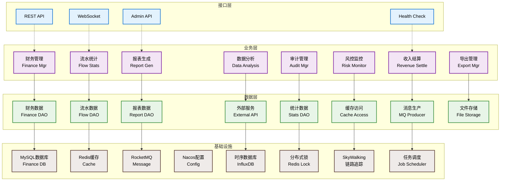
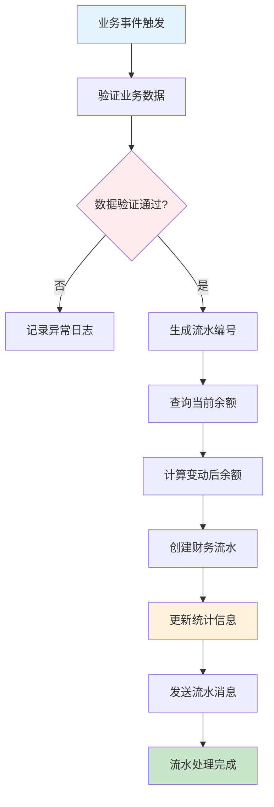
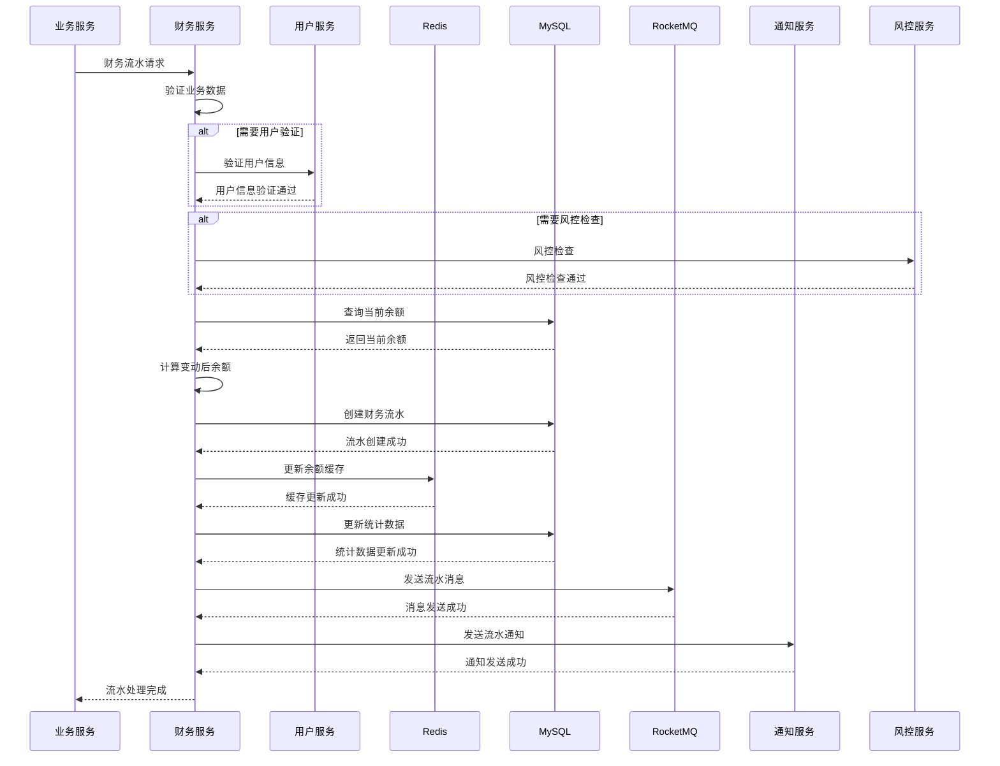
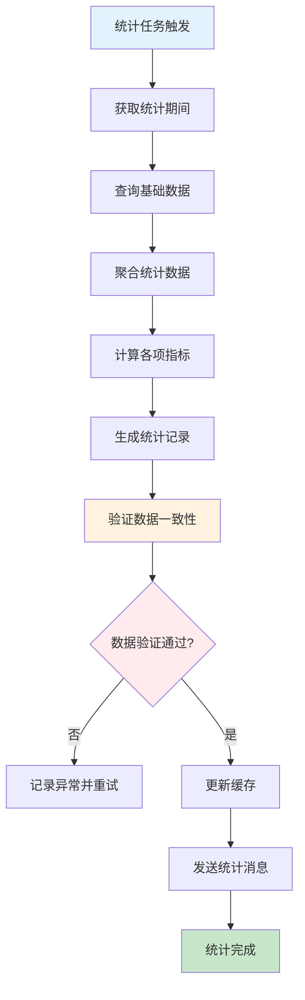
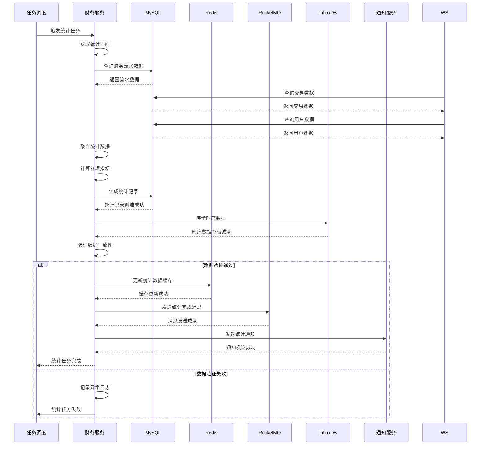
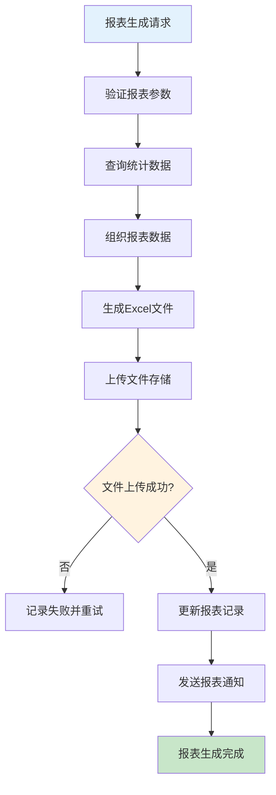
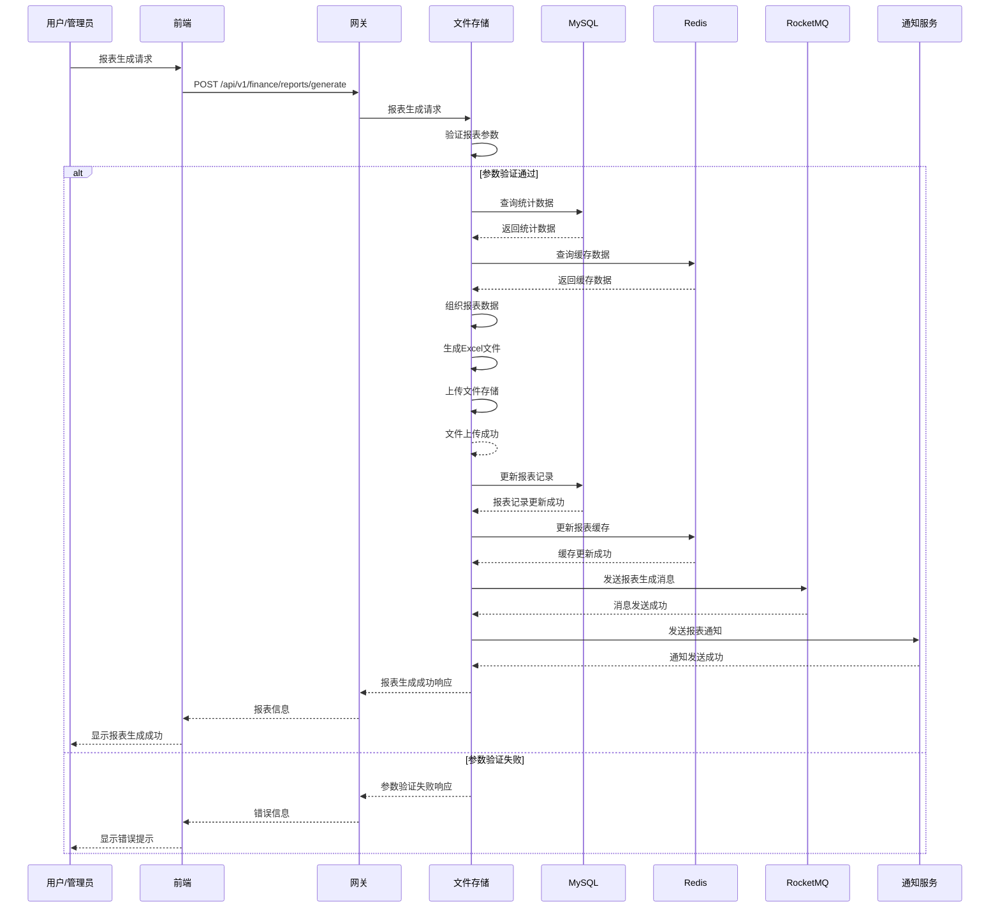
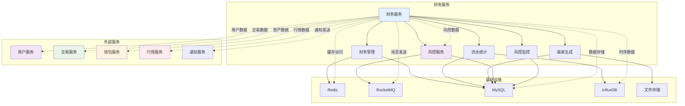
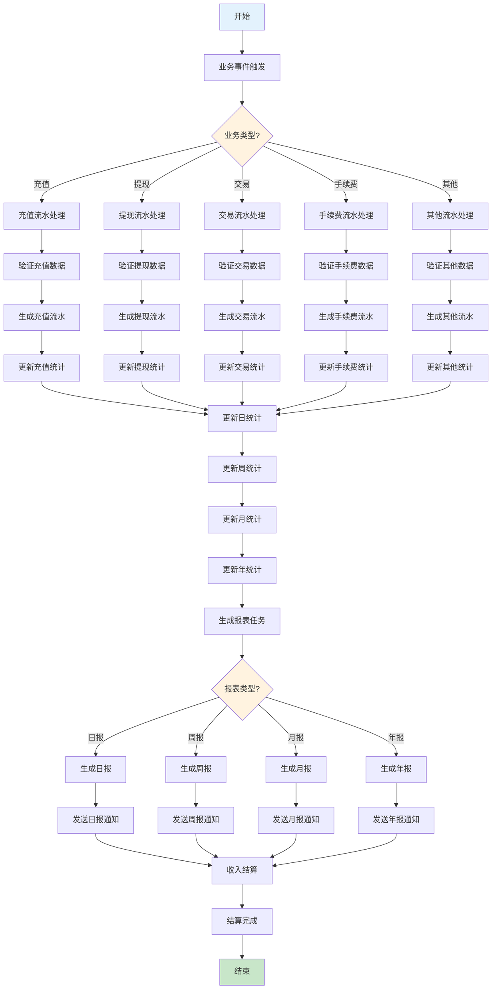

# 财务服务 (Finance Service) 技术设计文档

## 1. 服务概述

### 1.1 服务定位
财务服务是Web3 CEX系统的核心管理服务，负责平台财务管理、资金流水统计、财务报表生成、收入结算等核心功能。作为系统的财务中心，为运营决策提供数据支持和风险监控。

### 1.2 核心职责
- **财务管理**: 平台收入、支出、利润管理
- **资金流水**: 完整的资金流水记录和统计
- **财务报表**: 多维度财务报表生成和分析
- **收入结算**: 手续费收入结算和分配
- **风控监控**: 财务风险监控和预警

### 1.3 服务指标
- **数据准确性**: 100%
- **报表生成时间**: < 5分钟
- **统计延迟**: < 1分钟
- **并发处理**: 支持100+并发报表查询
- **数据一致性**: 强一致性保证

## 2. 技术架构

### 2.1 整体架构


### 2.2 技术栈
- **框架**: Spring Boot 3.2.x
- **数据库**: MySQL 8.0 + MyBatis Plus
- **缓存**: Redis 7.x
- **消息队列**: RocketMQ 4.9.x
- **时序数据库**: InfluxDB
- **报表工具**: Apache POI + EasyExcel
- **服务治理**: Nacos 2.2.x
- **任务调度**: XXL-Job

### 2.3 依赖关系
```
finance-service
├── Nacos (服务注册发现)
├── Redis (缓存)
├── MySQL (数据存储)
├── RocketMQ (消息队列)
├── InfluxDB (时序数据)
├── user-service (用户信息)
├── trade-service (交易数据)
├── wallet-service (资产数据)
├── market-service (行情数据)
└── risk-service (风控数据)
```

## 3. 数据模型设计

### 3.1 核心数据表

#### 3.1.1 财务流水表 (finance_flow)
```sql
CREATE TABLE `finance_flow` (
  `id` bigint(20) NOT NULL AUTO_INCREMENT COMMENT '流水ID',
  `flow_no` varchar(32) NOT NULL COMMENT '流水编号',
  `user_id` bigint(20) DEFAULT NULL COMMENT '用户ID',
  `business_type` tinyint(1) NOT NULL COMMENT '业务类型 1-充值 2-提现 3-交易 4-手续费 5-其他',
  `flow_type` tinyint(1) NOT NULL COMMENT '流水类型 1-收入 2-支出',
  `coin_id` varchar(32) NOT NULL COMMENT '币种ID',
  `amount` decimal(20,8) NOT NULL COMMENT '金额',
  `balance_before` decimal(20,8) NOT NULL COMMENT '变动前余额',
  `balance_after` decimal(20,8) NOT NULL COMMENT '变动后余额',
  `fee` decimal(20,8) NOT NULL DEFAULT '0.00000000' COMMENT '手续费',
  `status` tinyint(1) NOT NULL DEFAULT '1' COMMENT '状态 1-处理中 2-已完成 3-失败',
  `reference_no` varchar(32) DEFAULT NULL COMMENT '关联单号',
  `reference_type` varchar(20) DEFAULT NULL COMMENT '关联类型',
  `remark` varchar(500) DEFAULT NULL COMMENT '备注',
  `create_time` datetime NOT NULL DEFAULT CURRENT_TIMESTAMP COMMENT '创建时间',
  `update_time` datetime NOT NULL DEFAULT CURRENT_TIMESTAMP ON UPDATE CURRENT_TIMESTAMP COMMENT '更新时间',
  `complete_time` datetime DEFAULT NULL COMMENT '完成时间',
  PRIMARY KEY (`id`),
  UNIQUE KEY `uk_flow_no` (`flow_no`),
  KEY `idx_user_id` (`user_id`),
  KEY `idx_business_type` (`business_type`),
  KEY `idx_flow_type` (`flow_type`),
  KEY `idx_coin_id` (`coin_id`),
  KEY `idx_status` (`status`),
  KEY `idx_reference_no` (`reference_no`),
  KEY `idx_create_time` (`create_time`)
) ENGINE=InnoDB DEFAULT CHARSET=utf8mb4 COMMENT='财务流水表';
```

#### 3.1.2 财务统计表 (finance_statistics)
```sql
CREATE TABLE `finance_statistics` (
  `id` bigint(20) NOT NULL AUTO_INCREMENT COMMENT '统计ID',
  `stat_date` date NOT NULL COMMENT '统计日期',
  `stat_type` tinyint(1) NOT NULL COMMENT '统计类型 1-日统计 2-周统计 3-月统计',
  `coin_id` varchar(32) NOT NULL COMMENT '币种ID',
  `total_deposit` decimal(20,8) NOT NULL DEFAULT '0.00000000' COMMENT '总充值',
  `total_withdraw` decimal(20,8) NOT NULL DEFAULT '0.00000000' COMMENT '总提现',
  `total_trade_volume` decimal(20,8) NOT NULL DEFAULT '0.00000000' COMMENT '总交易量',
  `total_fee` decimal(20,8) NOT NULL DEFAULT '0.00000000' COMMENT '总手续费',
  `net_income` decimal(20,8) NOT NULL DEFAULT '0.00000000' COMMENT '净收入',
  `active_users` int(11) NOT NULL DEFAULT '0' COMMENT '活跃用户数',
  `new_users` int(11) NOT NULL DEFAULT '0' COMMENT '新增用户数',
  `total_trades` int(11) NOT NULL DEFAULT '0' COMMENT '总交易次数',
  `create_time` datetime NOT NULL DEFAULT CURRENT_TIMESTAMP COMMENT '创建时间',
  `update_time` datetime NOT NULL DEFAULT CURRENT_TIMESTAMP ON UPDATE CURRENT_TIMESTAMP COMMENT '更新时间',
  PRIMARY KEY (`id`),
  UNIQUE KEY `uk_stat_date_type_coin` (`stat_date`, `stat_type`, `coin_id`),
  KEY `idx_stat_date` (`stat_date`),
  KEY `idx_stat_type` (`stat_type`),
  KEY `idx_coin_id` (`coin_id`),
  KEY `idx_create_time` (`create_time`)
) ENGINE=InnoDB DEFAULT CHARSET=utf8mb4 COMMENT='财务统计表';
```

#### 3.1.3 收入结算表 (revenue_settlement)
```sql
CREATE TABLE `revenue_settlement` (
  `id` bigint(20) NOT NULL AUTO_INCREMENT COMMENT '结算ID',
  `settlement_no` varchar(32) NOT NULL COMMENT '结算编号',
  `settlement_type` tinyint(1) NOT NULL COMMENT '结算类型 1-日结算 2-周结算 3-月结算',
  `settlement_date` date NOT NULL COMMENT '结算日期',
  `coin_id` varchar(32) NOT NULL COMMENT '币种ID',
  `trade_fee` decimal(20,8) NOT NULL DEFAULT '0.00000000' COMMENT '交易手续费',
  `withdraw_fee` decimal(20,8) NOT NULL DEFAULT '0.00000000' COMMENT '提现手续费',
  `other_fee` decimal(20,8) NOT NULL DEFAULT '0.00000000' COMMENT '其他费用',
  `total_revenue` decimal(20,8) NOT NULL DEFAULT '0.00000000' COMMENT '总收入',
  `platform_share` decimal(20,8) NOT NULL DEFAULT '0.00000000' COMMENT '平台分成',
  `status` tinyint(1) NOT NULL DEFAULT '1' COMMENT '状态 1-待结算 2-已结算 3-已取消',
  `settlement_time` datetime DEFAULT NULL COMMENT '结算时间',
  `create_time` datetime NOT NULL DEFAULT CURRENT_TIMESTAMP COMMENT '创建时间',
  `update_time` datetime NOT NULL DEFAULT CURRENT_TIMESTAMP ON UPDATE CURRENT_TIMESTAMP COMMENT '更新时间',
  PRIMARY KEY (`id`),
  UNIQUE KEY `uk_settlement_no` (`settlement_no`),
  KEY `idx_settlement_date` (`settlement_date`),
  KEY `idx_settlement_type` (`settlement_type`),
  KEY `idx_coin_id` (`coin_id`),
  KEY `idx_status` (`status`),
  KEY `idx_create_time` (`create_time`)
) ENGINE=InnoDB DEFAULT CHARSET=utf8mb4 COMMENT='收入结算表';
```

#### 3.1.4 财务报表表 (finance_report)
```sql
CREATE TABLE `finance_report` (
  `id` bigint(20) NOT NULL AUTO_INCREMENT COMMENT '报表ID',
  `report_no` varchar(32) NOT NULL COMMENT '报表编号',
  `report_type` tinyint(1) NOT NULL COMMENT '报表类型 1-日报 2-周报 3-月报 4-年报',
  `report_name` varchar(100) NOT NULL COMMENT '报表名称',
  `report_date` date NOT NULL COMMENT '报表日期',
  `period_start` date NOT NULL COMMENT '期间开始',
  `period_end` date NOT NULL COMMENT '期间结束',
  `total_deposit` decimal(20,8) NOT NULL DEFAULT '0.00000000' COMMENT '总充值',
  `total_withdraw` decimal(20,8) NOT NULL DEFAULT '0.00000000' COMMENT '总提现',
  `total_trade_volume` decimal(20,8) NOT NULL DEFAULT '0.00000000' COMMENT '总交易量',
  `total_fee` decimal(20,8) NOT NULL DEFAULT '0.00000000' COMMENT '总手续费',
  `net_income` decimal(20,8) NOT NULL DEFAULT '0.00000000' COMMENT '净收入',
  `active_users` int(11) NOT NULL DEFAULT '0' COMMENT '活跃用户数',
  `new_users` int(11) NOT NULL DEFAULT '0' COMMENT '新增用户数',
  `total_trades` int(11) NOT NULL DEFAULT '0' COMMENT '总交易次数',
  `file_path` varchar(255) DEFAULT NULL COMMENT '文件路径',
  `status` tinyint(1) NOT NULL DEFAULT '1' COMMENT '状态 1-生成中 2-已完成 3-失败',
  `create_time` datetime NOT NULL DEFAULT CURRENT_TIMESTAMP COMMENT '创建时间',
  `update_time` datetime NOT NULL DEFAULT CURRENT_TIMESTAMP ON UPDATE CURRENT_TIMESTAMP COMMENT '更新时间',
  `complete_time` datetime DEFAULT NULL COMMENT '完成时间',
  PRIMARY KEY (`id`),
  UNIQUE KEY `uk_report_no` (`report_no`),
  KEY `idx_report_type` (`report_type`),
  KEY `idx_report_date` (`report_date`),
  KEY `idx_period_start` (`period_start`),
  KEY `idx_period_end` (`period_end`),
  KEY `idx_status` (`status`),
  KEY `idx_create_time` (`create_time`)
) ENGINE=InnoDB DEFAULT CHARSET=utf8mb4 COMMENT='财务报表表';
```

### 3.2 数据关系
```
finance_flow (1) ←→ (N) finance_statistics
finance_flow (1) ←→ (N) revenue_settlement
finance_statistics (1) ←→ (N) finance_report
user_info (1) ←→ (N) finance_flow
trade_detail (1) ←→ (N) finance_flow
deposit_record (1) ←→ (N) finance_flow
withdraw_record (1) ←→ (N) finance_flow
```

## 4. 核心业务流程

### 4.1 财务流水处理流程

#### 4.1.1 流程图


#### 4.1.2 时序图


### 4.2 财务统计流程

#### 4.2.1 流程图


#### 4.2.2 财务统计时序图


### 4.3 报表生成流程

#### 4.3.1 流程图


#### 4.3.2 报表生成时序图


## 5. 统计分析设计

### 5.1 统计维度
- **时间维度**: 日统计、周统计、月统计、年统计
- **币种维度**: 按币种分别统计
- **业务维度**: 按业务类型统计
- **用户维度**: 按用户类型统计
- **渠道维度**: 按来源渠道统计

### 5.2 统计指标
- **收入指标**: 手续费收入、其他收入
- **支出指标**: 提现手续费、运营成本
- **交易指标**: 交易量、交易次数
- **用户指标**: 活跃用户、新增用户
- **资产指标**: 平台资产、用户资产

### 5.3 统计算法
```java
public class FinanceStatistics {
    public void calculateDailyStatistics(LocalDate date) {
        // 查询基础数据
        List<FinanceFlow> flows = flowMapper.findByDate(date);

        // 按币种聚合
        Map<String, StatisticsData> stats = flows.stream()
            .collect(Collectors.groupingBy(
                FinanceFlow::getCoinId,
                Collectors.reducing(
                    new StatisticsData(),
                    this::accumulateStatistics,
                    StatisticsData::merge
                )
            ));

        // 保存统计结果
        stats.forEach((coinId, data) -> {
            FinanceStatistics stat = new FinanceStatistics();
            stat.setStatDate(date);
            stat.setStatType(1); // 日统计
            stat.setCoinId(coinId);
            // 设置各项统计指标...
            statisticsMapper.insert(stat);
        });
    }
}
```

## 6. 接口设计

### 6.1 核心接口清单

| 接口路径 | 方法 | 描述 | 权限要求 |
|---------|------|------|----------|
| `/api/v1/finance/flow` | POST | 记录财务流水 | 内部调用 |
| `/api/v1/finance/flows` | GET | 获取流水列表 | 管理员 |
| `/api/v1/finance/statistics` | GET | 获取统计数据 | 管理员 |
| `/api/v1/finance/reports` | GET | 获取报表列表 | 管理员 |
| `/api/v1/finance/reports/{reportId}` | GET | 下载报表 | 管理员 |
| `/api/v1/finance/revenue` | GET | 获取收入统计 | 管理员 |
| `/api/v1/finance/settlement` | POST | 收入结算 | 管理员 |

### 6.2 接口详细设计

#### 6.2.1 获取流水列表接口
```http
GET /api/v1/finance/flows
Authorization: Bearer {admin_token}
Query Parameters:
- business_type: 业务类型 (可选)
- flow_type: 流水类型 (可选)
- coin_id: 币种 (可选)
- start_date: 开始日期 (可选)
- end_date: 结束日期 (可选)
- page: 页码 (默认1)
- size: 页大小 (默认20)

响应结果：
{
  "code": 200,
  "message": "成功",
  "data": {
    "total": 1000,
    "page": 1,
    "size": 20,
    "flows": [
      {
        "flow_id": 123456,
        "flow_no": "FL20240101001",
        "user_id": 789,
        "business_type": 3,
        "flow_type": 1,
        "coin_id": "BTC",
        "amount": "0.001",
        "balance_before": "1.00000000",
        "balance_after": "1.00100000",
        "fee": "0.00010000",
        "status": 2,
        "reference_no": "TD20240101001",
        "remark": "交易手续费收入",
        "create_time": "2024-01-01T00:00:00Z",
        "complete_time": "2024-01-01T00:00:05Z"
      }
    ]
  }
}
```

#### 6.2.2 获取统计数据接口
```http
GET /api/v1/finance/statistics
Authorization: Bearer {admin_token}
Query Parameters:
- stat_type: 统计类型 (1-日 2-周 3-月)
- coin_id: 币种 (可选)
- start_date: 开始日期 (可选)
- end_date: 结束日期 (可选)

响应结果：
{
  "code": 200,
  "message": "成功",
  "data": [
    {
      "stat_date": "2024-01-01",
      "stat_type": 1,
      "coin_id": "BTC",
      "total_deposit": "10.50000000",
      "total_withdraw": "5.20000000",
      "total_trade_volume": "150.30000000",
      "total_fee": "0.15030000",
      "net_income": "0.15030000",
      "active_users": 500,
      "new_users": 50,
      "total_trades": 1200
    }
  ]
}
```

#### 6.2.3 生成报表接口
```http
POST /api/v1/finance/reports/generate
Authorization: Bearer {admin_token}
Content-Type: application/json

请求参数：
{
  "report_type": 1,           // 报表类型 1-日报 2-周报 3-月报
  "report_date": "2024-01-01", // 报表日期
  "report_name": "2024年1月日报", // 报表名称
  "coin_ids": ["BTC", "ETH"]   // 币种列表
}

响应结果：
{
  "code": 200,
  "message": "报表生成任务已提交",
  "data": {
    "report_id": 123456,
    "report_no": "RP20240101001",
    "status": 1,
    "create_time": "2024-01-01T00:00:00Z"
  }
}
```

## 7. 缓存设计

### 7.1 缓存策略
- **统计数据缓存**: 缓存统计数据，TTL 1小时
- **流水缓存**: 缓存最近流水，TTL 30分钟
- **报表缓存**: 缓存生成的报表，TTL 24小时
- **余额缓存**: 缓存平台余额，TTL 5分钟

### 7.2 缓存键设计
```
finance:stats:{date}:{type}:{coin_id} - 统计数据
finance:flow:recent:{limit}       - 最近流水
finance:balance:{coin_id}        - 平台余额
finance:report:{report_id}       - 报表数据
finance:revenue:{date}:{type}    - 收入数据
finance:summary:{date}           - 汇总数据
```

### 7.3 缓存更新策略
- **主动更新**: 数据变更时主动更新缓存
- **定时更新**: 定时任务更新统计数据
- **被动失效**: 缓存过期自动失效

## 8. 消息队列设计

### 8.1 消息Topic
- **finance-topic**: 财务相关消息
- **statistics-topic**: 统计相关消息
- **report-topic**: 报表相关消息

### 8.2 消息类型
- **流水消息**: 新流水创建时发送
- **统计消息**: 统计数据更新时发送
- **报表消息**: 报表生成完成时发送
- **结算消息**: 收入结算完成时发送

### 8.3 消息格式
```json
{
  "header": {
    "message_id": "msg_123456789",
    "topic": "finance-topic",
    "tags": "FLOW_CREATE",
    "keys": "flow_123",
    "timestamp": 1640995200000,
    "producer_group": "finance-service-producer"
  },
  "body": {
    "flow_id": 123,
    "flow_no": "FL20240101001",
    "user_id": 456,
    "business_type": 3,
    "flow_type": 1,
    "coin_id": "BTC",
    "amount": "0.001",
    "status": 2,
    "create_time": 1640995200000
  }
}
```

## 9. 任务调度设计

### 9.1 定时任务
- **日统计任务**: 每天00:05执行
- **周统计任务**: 每周一01:00执行
- **月统计任务**: 每月1日02:00执行
- **报表生成任务**: 每天早上08:00执行
- **数据归档任务**: 每月15日执行

### 9.2 任务配置
```java
@XxlJob("dailyStatisticsJob")
public void dailyStatisticsJob() {
    LocalDate yesterday = LocalDate.now().minusDays(1);
    financeService.calculateDailyStatistics(yesterday);
}

@XxlJob("weeklyStatisticsJob")
public void weeklyStatisticsJob() {
    LocalDate weekEnd = LocalDate.now().minusDays(1);
    LocalDate weekStart = weekEnd.minusDays(6);
    financeService.calculateWeeklyStatistics(weekStart, weekEnd);
}

@XxlJob("monthlyStatisticsJob")
public void monthlyStatisticsJob() {
    YearMonth lastMonth = YearMonth.now().minusMonths(1);
    financeService.calculateMonthlyStatistics(lastMonth);
}
```

## 10. 监控设计

### 10.1 业务监控
- **流水监控**: 流水处理成功率监控
- **统计监控**: 统计数据准确性监控
- **报表监控**: 报表生成成功率监控
- **收入监控**: 收入数据异常监控

### 10.2 技术监控
- **数据库监控**: 数据库性能监控
- **缓存监控**: 缓存命中率监控
- **任务监控**: 定时任务执行监控
- **消息监控**: 消息处理监控

### 10.3 告警规则
- **流水异常**: 流水处理失败率超过1%
- **统计异常**: 统计数据计算失败
- **报表异常**: 报表生成失败
- **数据异常**: 财务数据不一致
- **任务异常**: 定时任务执行失败

## 11. 性能优化

### 11.1 查询优化
- **索引优化**: 合理设计数据库索引
- **分页查询**: 大数据量分页查询
- **异步处理**: 异步处理报表生成
- **缓存优化**: 多级缓存策略

### 11.2 存储优化
- **分表策略**: 按时间分表存储流水
- **数据归档**: 历史数据归档存储
- **压缩存储**: 报表文件压缩存储
- **清理策略**: 定期清理过期数据

### 11.3 并发优化
- **连接池**: 数据库连接池优化
- **异步处理**: 异步处理统计计算
- **批量处理**: 批量处理流水记录
- **读写分离**: 读写分离优化查询性能

### 4.4 财务服务系统交互流程图

#### 4.4.1 系统交互图


#### 4.4.2 完整财务处理生命周期流程图


通过以上详细设计，财务服务为整个CEX系统提供了完整、准确、高效的财务管理基础。