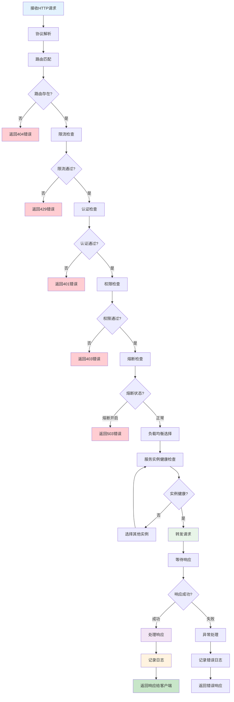
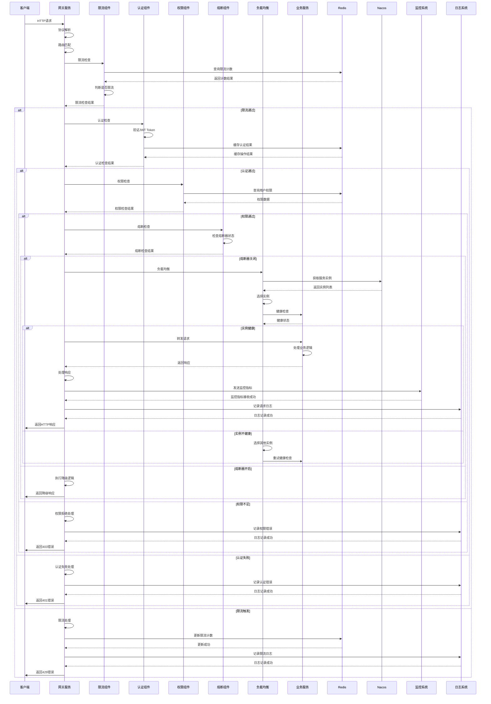
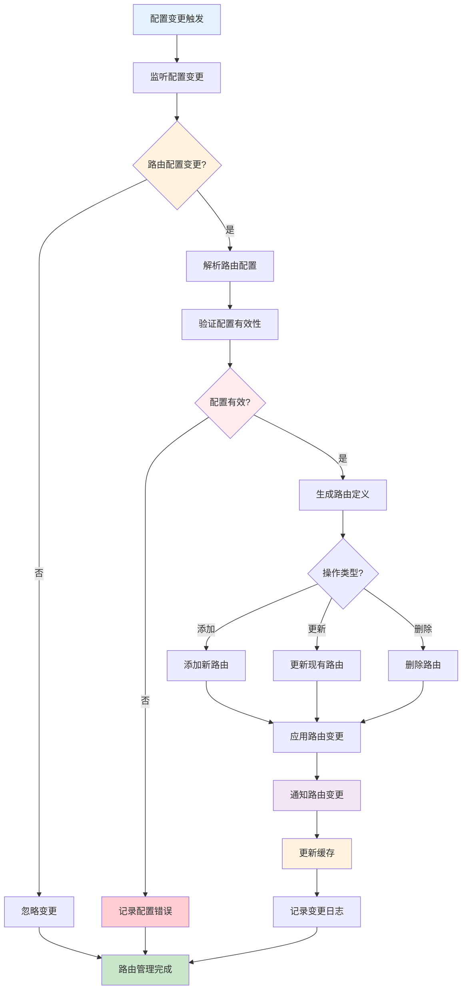
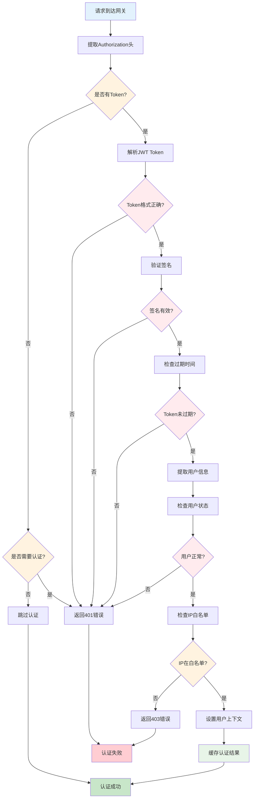
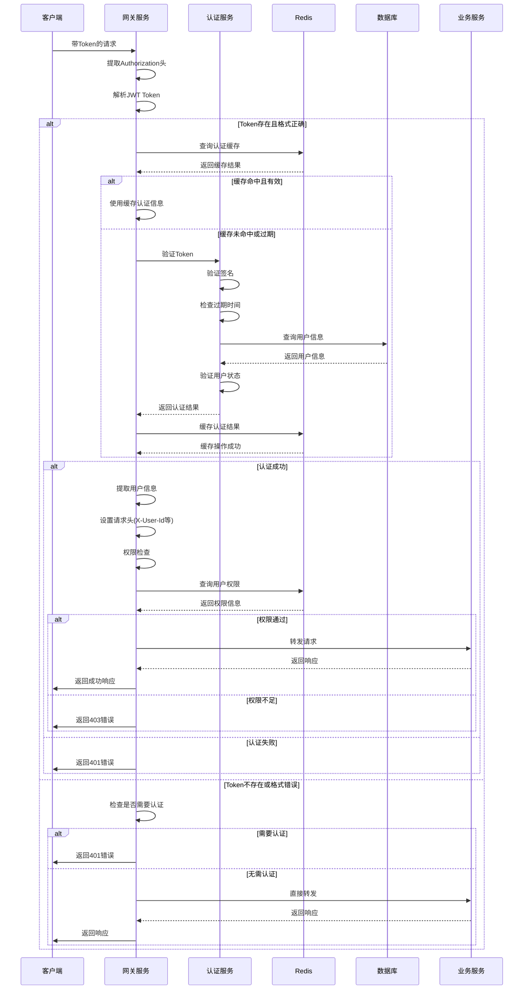
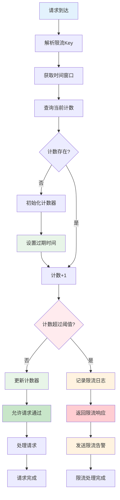
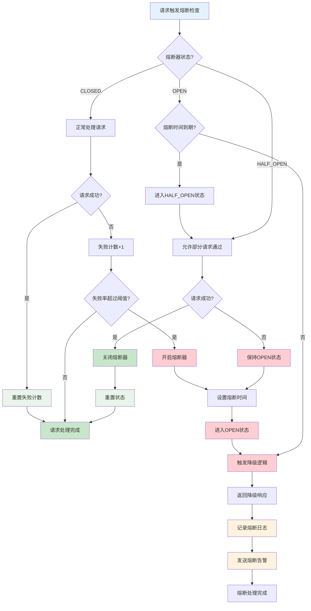
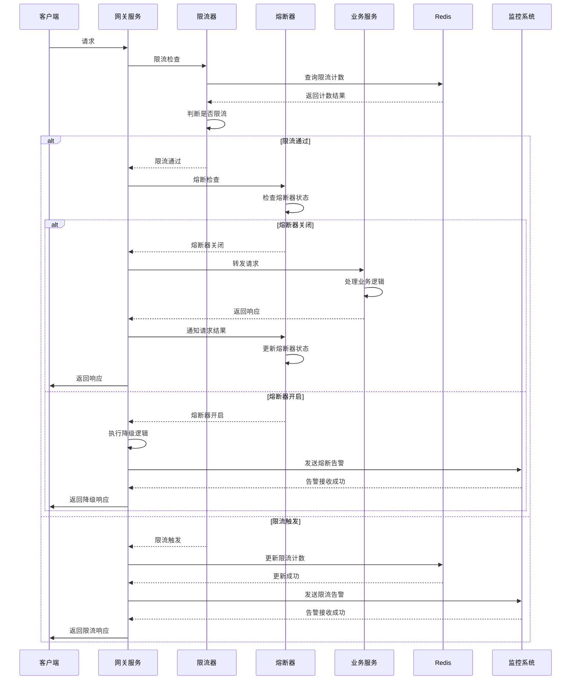
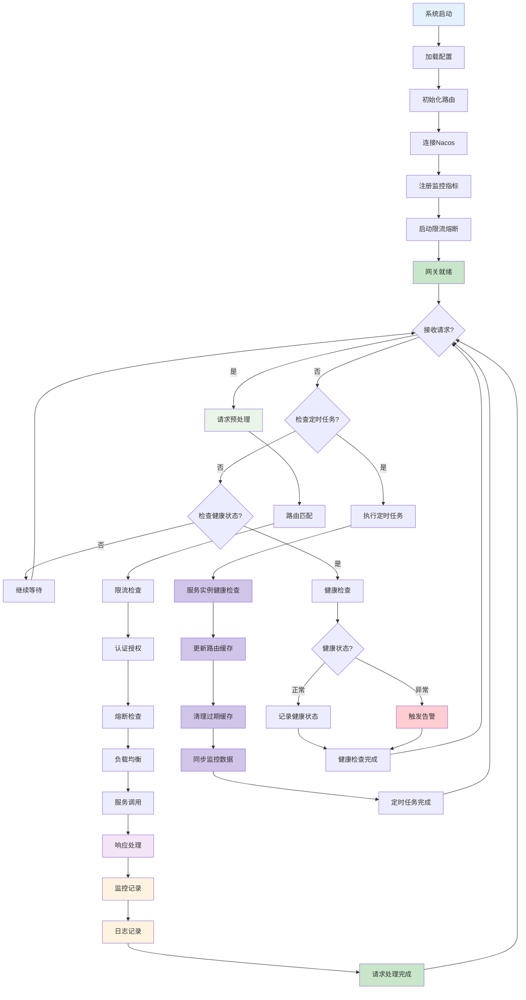

# 网关服务 (Gateway Service) 技术设计文档

## 1. 服务概述

### 1.1 服务定位
网关服务是Web3 CEX系统的统一入口，负责API路由、负载均衡、认证授权、限流熔断、监控日志等核心功能。作为系统的门卫，为所有外部请求提供统一的接入层和安全保障。

### 1.2 核心职责
- **API路由**: 统一的路由管理和转发
- **负载均衡**: 多实例负载均衡和健康检查
- **认证授权**: 统一的认证授权管理
- **限流熔断**: 请求限流和熔断降级
- **监控日志**: 请求监控和日志记录

### 1.3 服务指标
- **响应时间**: < 50ms
- **QPS**: 支持100,000+ QPS
- **并发连接**: 支持50,000+并发连接
- **可用性**: 99.99%
- **错误率**: < 0.1%

## 2. 技术架构

### 2.1 整体架构
```
┌─────────────────────────────────────────────────────────────────────────────────┐
│                              接入层                                              │
│  ┌─────────────┐  ┌─────────────┐  ┌─────────────┐  ┌─────────────┐             │
│  │  HTTP/HTTPS │  │ WebSocket   │  │  RPC接口    │ │ 健康检查     │             │
│  └─────────────┘  └─────────────┘  └─────────────┘  └─────────────┘             │
└─────────────────────────────────────────────────────────────────────────────────┘
                                        │
┌─────────────────────────────────────────────────────────────────────────────────┐
│                              网关层                                              │
│  ┌─────────────┐  ┌─────────────┐  ┌─────────────┐  ┌─────────────┐             │
│  │ 路由管理     │  │ 负载均衡     │  │ 认证授权     │  │ 限流熔断     │             │
│  │Route Manager│ │Load Balance │ │Auth Manager │ │Rate Limit   │             │
│  └─────────────┘  └─────────────┘  └─────────────┘  └─────────────┘             │
│  ┌─────────────┐  ┌─────────────┐  ┌─────────────┐  ┌─────────────┐             │
│  │ 缓存管理     │  │ 日志管理     │  │ 监控管理     │  │ 配置管理     │             │
│  │Cache Mgr    │ │Log Manager  │ │Monitor Mgr  │ │Config Mgr   │             │
│  └─────────────┘  └─────────────┘  └─────────────┘  └─────────────┘             │
└─────────────────────────────────────────────────────────────────────────────────┘
                                        │
┌─────────────────────────────────────────────────────────────────────────────────┐
│                              服务层                                              │
│  ┌─────────────┐  ┌─────────────┐  ┌─────────────┐  ┌─────────────┐             │
│  │ 用户服务     │  │ 交易服务     │  │ 钱包服务     │  │ 财务服务     │             │
│  │User Service │ │Trade Service│ │Wallet Service│  │Finance Service│           │
│  └─────────────┘  └─────────────┘  └─────────────┘  └─────────────┘             │
│  ┌─────────────┐  ┌─────────────┐  ┌─────────────┐  ┌─────────────┐             │
│  │ 行情服务     │  │ 风控服务     │  │ 通知服务     │  │ 撮合服务     │             │
│  │Market Service│ │Risk Service │ │Notify Service│ │Match Service │             │
│  └─────────────┘  └─────────────┘  └─────────────┘  └─────────────┘             │
└─────────────────────────────────────────────────────────────────────────────────┘
                                        │
┌─────────────────────────────────────────────────────────────────────────────────┐
│                              基础设施                                            │
│  ┌─────────────┐  ┌─────────────┐  ┌─────────────┐  ┌─────────────┐             │
│  │ Nacos注册    │  │ Redis缓存    │  │ RocketMQ    │  │ Sentinel     │             │
│  │ Service Reg │ │ Cache       │ │ Message     │ │ Circuit      │             │
│  └─────────────┘  └─────────────┘  └─────────────┘  └─────────────┘             │
│  ┌─────────────┐  ┌─────────────┐  ┌─────────────┐  ┌─────────────┐             │
│  │ 配置中心     │  │ 链路追踪     │  │ 监控告警     │  │ 日志收集     │             │
│  │Config Center│ │SkyWalking  │ │Prometheus  │ │ELK Stack    │             │
│  └─────────────┘  └─────────────┘  └─────────────┘  └─────────────┘             │
└─────────────────────────────────────────────────────────────────────────────────┘
```

### 2.2 技术栈
- **网关框架**: Spring Cloud Gateway 3.x
- **服务发现**: Nacos 2.2.x
- **限流熔断**: Sentinel 1.8.x
- **配置中心**: Nacos Config
- **缓存**: Redis 7.x
- **监控**: Micrometer + Prometheus
- **链路追踪**: SkyWalking
- **日志**: Logback + ELK

### 2.3 依赖关系
```
gateway-service
├── Nacos (服务注册发现 + 配置中心)
├── Redis (缓存)
├── Sentinel (限流熔断)
├── RocketMQ (消息队列)
├── Prometheus (监控)
├── SkyWalking (链路追踪)
├── ELK Stack (日志收集)
└── 所有微服务 (路由转发)
```

## 3. 核心业务流程

### 3.1 请求处理完整流程

#### 3.1.1 请求处理流程图


#### 3.1.2 请求处理详细时序图


#### 3.1.1 路由配置
```yaml
spring:
  cloud:
    gateway:
      routes:
        # 用户服务路由
        - id: user-service
          uri: lb://user-service
          predicates:
            - Path=/api/v1/user/**
            - Method=GET,POST,PUT,DELETE
          filters:
            - StripPrefix=2
            - name: RateLimit
              args:
                key-resolver: "#{@userKeyResolver}"
                replenishRate: 100
                burstCapacity: 200

        # 交易服务路由
        - id: trade-service
          uri: lb://trade-service
          predicates:
            - Path=/api/v1/trade/**
            - Method=GET,POST,PUT,DELETE
          filters:
            - StripPrefix=2
            - name: CircuitBreaker
              args:
                name: trade-service
                fallbackUri: forward:/fallback/trade

        # 钱包服务路由
        - id: wallet-service
          uri: lb://wallet-service
          predicates:
            - Path=/api/v1/wallet/**
            - Method=GET,POST,PUT,DELETE
          filters:
            - StripPrefix=2
            - name: RequestRateLimiter
              args:
                key-resolver: "#{@ipKeyResolver}"
                redis-rate-limiter.replenishRate: 50
                redis-rate-limiter.burstCapacity: 100
```

#### 3.1.2 动态路由管理
```java
@Component
public class DynamicRouteService {

    @Autowired
    private RouteDefinitionLocator routeDefinitionLocator;

    @Autowired
    private RouteDefinitionWriter routeDefinitionWriter;

    public void addRoute(RouteDefinition definition) {
        routeDefinitionWriter.save(Mono.just(definition)).subscribe();
    }

    public void removeRoute(String routeId) {
        routeDefinitionWriter.delete(Mono.just(routeId)).subscribe();
    }

    public void updateRoute(RouteDefinition definition) {
        removeRoute(definition.getId());
        addRoute(definition);
    }
}
```

### 3.2 动态路由管理流程

#### 3.2.1 动态路由管理流程图


#### 3.2.1 负载均衡策略
```java
@Configuration
public class LoadBalancerConfig {

    @Bean
    public ReactorLoadBalancer<ServiceInstance> randomLoadBalancer(
            Environment environment, LoadBalancerClientFactory factory) {
        String serviceId = environment.getProperty(LoadBalancerClientFactory.PROPERTY_NAME);
        return new RandomLoadBalancer(
                factory.getLazyProvider(serviceId, ServiceInstanceListSupplier.class),
                serviceId);
    }

    @Bean
    public ReactorLoadBalancer<ServiceInstance> roundRobinLoadBalancer(
            Environment environment, LoadBalancerClientFactory factory) {
        String serviceId = environment.getProperty(LoadBalancerClientFactory.PROPERTY_NAME);
        return new RoundRobinLoadBalancer(
                factory.getLazyProvider(serviceId, ServiceInstanceListSupplier.class),
                serviceId);
    }
}
```

#### 3.2.2 健康检查
```java
@Component
public class HealthCheckFilter implements GlobalFilter {

    @Autowired
    private LoadBalancerClient loadBalancerClient;

    @Override
    public Mono<Void> filter(ServerWebExchange exchange, GatewayFilterChain chain) {
        String serviceId = exchange.getAttribute("serviceId");

        if (serviceId != null) {
            ServiceInstance instance = loadBalancerClient.choose(serviceId);
            if (instance == null || !isHealthy(instance)) {
                exchange.getResponse().setStatusCode(HttpStatus.SERVICE_UNAVAILABLE);
                return exchange.getResponse().setComplete();
            }
        }

        return chain.filter(exchange);
    }

    private boolean isHealthy(ServiceInstance instance) {
        String healthUrl = instance.getUri() + "/actuator/health";
        try {
            ResponseEntity<String> response = restTemplate.getForEntity(healthUrl, String.class);
            return response.getStatusCode() == HttpStatus.OK;
        } catch (Exception e) {
            return false;
        }
    }
}
```

### 3.3 认证授权流程

#### 3.3.1 JWT认证流程图


#### 3.3.2 认证授权详细时序图


#### 3.3.1 JWT认证过滤器
```java
@Component
public class JwtAuthenticationFilter implements GlobalFilter {

    @Autowired
    private JwtTokenProvider jwtTokenProvider;

    @Override
    public Mono<Void> filter(ServerWebExchange exchange, GatewayFilterChain chain) {
        String path = exchange.getRequest().getPath().value();

        // 跳过认证的路径
        if (shouldSkipAuth(path)) {
            return chain.filter(exchange);
        }

        // 获取token
        String token = getToken(exchange.getRequest());

        if (token == null || !jwtTokenProvider.validateToken(token)) {
            exchange.getResponse().setStatusCode(HttpStatus.UNAUTHORIZED);
            return exchange.getResponse().setComplete();
        }

        // 设置用户信息到请求头
        String username = jwtTokenProvider.getUsername(token);
        exchange.getRequest().mutate()
            .header("X-User-Name", username)
            .header("X-User-Id", jwtTokenProvider.getUserId(token))
            .build();

        return chain.filter(exchange);
    }

    private boolean shouldSkipAuth(String path) {
        return path.startsWith("/api/v1/auth/") ||
               path.startsWith("/actuator/") ||
               path.startsWith("/api/v1/market/");
    }
}
```

#### 3.3.2 权限控制
```java
@Component
public class AuthorizationFilter implements GlobalFilter {

    @Autowired
    private PermissionService permissionService;

    @Override
    public Mono<Void> filter(ServerWebExchange exchange, GatewayFilterChain chain) {
        String path = exchange.getRequest().getPath().value();
        String userId = exchange.getRequest().getHeaders().getFirst("X-User-Id");

        if (userId != null && !permissionService.hasPermission(userId, path)) {
            exchange.getResponse().setStatusCode(HttpStatus.FORBIDDEN);
            return exchange.getResponse().setComplete();
        }

        return chain.filter(exchange);
    }
}
```

### 3.4 限流熔断流程

#### 3.4.1 限流处理流程图


#### 3.4.2 熔断处理流程图


#### 3.4.3 限流熔断详细时序图


#### 3.4.1 限流配置
```java
@Configuration
public class RateLimitConfig {

    @Bean
    public KeyResolver userKeyResolver() {
        return exchange -> {
            String userId = exchange.getRequest().getHeaders().getFirst("X-User-Id");
            return userId != null ? Mono.just(userId) : Mono.just("anonymous");
        };
    }

    @Bean
    public KeyResolver ipKeyResolver() {
        return exchange -> Mono.just(
            exchange.getRequest().getRemoteAddress() != null ?
            exchange.getRequest().getRemoteAddress().getAddress().getHostAddress() : "unknown"
        );
    }
}
```

#### 3.4.2 熔断配置
```yaml
spring:
  cloud:
    gateway:
      routes:
        - id: trade-service
          uri: lb://trade-service
          predicates:
            - Path=/api/v1/trade/**
          filters:
            - name: CircuitBreaker
              args:
                name: trade-service
                fallbackUri: forward:/fallback/trade
                fallbackHeaders:
                  Content-Type: application/json

resilience4j:
  circuitbreaker:
    configs:
      default:
        failureRateThreshold: 50
        waitDurationInOpenState: 5s
        slidingWindowSize: 10
        permittedNumberOfCallsInHalfOpenState: 3
    instances:
      trade-service:
        baseConfig: default
```

### 3.5 网关服务系统交互图

#### 3.5.1 网关服务与其他服务交互图

```mermaid
graph TB
    subgraph 网关服务
        GW[网关服务]
        RM[路由管理]
        LB[负载均衡]
        AUTH[认证授权]
        RL[限流熔断]
        MON[监控日志]
        CFG[配置管理]
    end

    subgraph 业务服务
        US[用户服务]
        TS[交易服务]
        WS[钱包服务]
        FS[财务服务]
        MKT[行情服务]
        RS[风控服务]
        NS[通知服务]
        MS[撮合服务]
    end

    subgraph 基础设施
        NC[Nacos]
        R[Redis]
        MQ[RocketMQ]
        SENT[Sentinel]
        PROM[Prometheus]
        SW[SkyWalking]
        ELK[ELK]
    end

    GW --> RM
    GW --> LB
    GW --> AUTH
    GW --> RL
    GW --> MON
    GW --> CFG

    RM --> NC
    LB --> NC
    AUTH --> R
    RL --> SENT
    MON --> PROM
    MON --> SW
    MON --> ELK
    CFG --> NC

    GW -.->|请求路由| US
    GW -.->|请求路由| TS
    GW -.->|请求路由| WS
    GW -.->|请求路由| FS
    GW -.->|请求路由| MKT
    GW -.->|请求路由| RS
    GW -.->|请求路由| NS
    GW -.->|请求路由| MS

    GW -.->|服务发现| NC
    GW -.->|配置获取| NC
    GW -.->|限流数据| SENT
    GW -.->|监控指标| PROM
    GW -.->|链路追踪| SW
    GW -.->|日志收集| ELK

    style GW fill:#e3f2fd
    style US fill:#f3e5f5
    style TS fill:#e8f5e8
    style WS fill:#fff3e0
    style FS fill:#ffebee
    style MKT fill:#f8bbd0
    style RS fill:#e1bee7
    style NS fill:#c8e6c9
    style MS fill:#d7ccc8
    style NC fill:#b3e5fc
    style R fill:#ffccbc
    style MQ fill:#dcedc8
    style SENT fill:#f8bbd0
    style PROM fill:#ffccbc
    style SW fill:#b2dfdb
    style ELK fill:#d1c4e9
```


### 3.6 网关服务完整生命周期流程图


## 4. 核心功能设计

#### 3.5.1 请求监控
```java
@Component
public class MonitoringFilter implements GlobalFilter {

    @Autowired
    private MeterRegistry meterRegistry;

    @Override
    public Mono<Void> filter(ServerWebExchange exchange, GatewayFilterChain chain) {
        long startTime = System.currentTimeMillis();

        return chain.filter(exchange).doOnSuccess(aVoid -> {
            long duration = System.currentTimeMillis() - startTime;
            recordMetrics(exchange, duration, true);
        }).doOnError(throwable -> {
            long duration = System.currentTimeMillis() - startTime;
            recordMetrics(exchange, duration, false);
        });
    }

    private void recordMetrics(ServerWebExchange exchange, long duration, boolean success) {
        String path = exchange.getRequest().getPath().value();
        String method = exchange.getRequest().getMethod().name();
        String status = success ? "success" : "error";

        // 记录响应时间
        meterRegistry.timer("gateway.request.duration",
            "path", path, "method", method, "status", status)
            .record(duration, TimeUnit.MILLISECONDS);

        // 记录请求计数
        meterRegistry.counter("gateway.request.count",
            "path", path, "method", method, "status", status)
            .increment();
    }
}
```

#### 3.5.2 日志记录
```java
@Component
public class LoggingFilter implements GlobalFilter {

    private static final Logger logger = LoggerFactory.getLogger(LoggingFilter.class);

    @Override
    public Mono<Void> filter(ServerWebExchange exchange, GatewayFilterChain chain) {
        ServerHttpRequest request = exchange.getRequest();

        // 记录请求日志
        logger.info("Incoming request: {} {} from {}",
            request.getMethod(), request.getPath(),
            request.getRemoteAddress());

        // 记录响应日志
        return chain.filter(exchange).doOnSuccess(aVoid -> {
            logger.info("Request completed: {} {} - {}",
                request.getMethod(), request.getPath(),
                exchange.getResponse().getStatusCode());
        }).doOnError(throwable -> {
            logger.error("Request failed: {} {} - {}",
                request.getMethod(), request.getPath(),
                throwable.getMessage());
        });
    }
}
```

## 4. 接口设计

### 4.1 核心接口清单

| 接口路径 | 方法 | 描述 | 权限要求 |
|---------|------|------|----------|
| `/actuator/health` | GET | 健康检查 | 公开 |
| `/actuator/info` | GET | 服务信息 | 公开 |
| `/actuator/metrics` | GET | 监控指标 | 管理员 |
| `/api/v1/gateway/routes` | GET | 获取路由列表 | 管理员 |
| `/api/v1/gateway/routes/{routeId}` | POST | 添加路由 | 管理员 |
| `/api/v1/gateway/routes/{routeId}` | DELETE | 删除路由 | 管理员 |
| `/fallback/{service}` | GET | 服务降级 | 公开 |

### 4.2 接口详细设计

#### 4.2.1 获取路由列表接口
```http
GET /api/v1/gateway/routes
Authorization: Bearer {admin_token}

响应结果：
{
  "code": 200,
  "message": "成功",
  "data": [
    {
      "route_id": "user-service",
      "uri": "lb://user-service",
      "predicates": [
        {
          "name": "Path",
          "args": {
            "pattern": "/api/v1/user/**"
          }
        }
      ],
      "filters": [
        {
          "name": "StripPrefix",
          "args": {
            "parts": "2"
          }
        }
      ],
      "order": 0,
      "status": "ACTIVE"
    }
  ]
}
```

#### 4.2.2 添加路由接口
```http
POST /api/v1/gateway/routes
Authorization: Bearer {admin_token}
Content-Type: application/json

请求参数：
{
  "route_id": "new-service",
  "uri": "lb://new-service",
  "predicates": [
    {
      "name": "Path",
      "args": {
        "pattern": "/api/v1/new/**"
      }
    }
  ],
  "filters": [
    {
      "name": "StripPrefix",
      "args": {
        "parts": "2"
      }
    }
  ],
  "order": 0
}

响应结果：
{
  "code": 200,
  "message": "路由添加成功",
  "data": {
    "route_id": "new-service",
    "status": "ACTIVE"
  }
}
```

#### 4.2.3 降级接口
```http
GET /fallback/trade

响应结果：
{
  "code": 503,
  "message": "服务暂时不可用，请稍后重试",
  "data": {
    "service": "trade-service",
    "fallback_time": "2024-01-01T00:00:00Z",
    "retry_after": 30
  }
}
```

## 5. 缓存设计

### 5.1 缓存策略
- **路由缓存**: 缓存路由配置，TTL 5分钟
- **认证缓存**: 缓存认证结果，TTL 30分钟
- **限流缓存**: 缓存限流计数，TTL 1分钟
- **服务缓存**: 缓存服务实例，TTL 10秒

### 5.2 缓存键设计
```
gateway:routes:{version}           - 路由配置
gateway:auth:{token}               - 认证结果
gateway:rate_limit:{key}:{minute}   - 限流计数
gateway:services:{service_id}      - 服务实例
gateway:health:{service_id}        - 健康状态
```

### 5.3 缓存更新策略
- **主动更新**: 配置变更时主动更新
- **定时更新**: 定时任务更新服务实例
- **被动失效**: 缓存过期自动失效

## 6. 监控设计

### 6.1 业务监控
- **请求监控**: 请求量、响应时间、错误率
- **服务监控**: 服务可用性、响应时间
- **路由监控**: 路由转发成功率
- **安全监控**: 认证授权监控

### 6.2 技术监控
- **性能监控**: 网关性能指标
- **资源监控**: CPU、内存、磁盘使用率
- **网络监控**: 网络延迟、带宽使用
- **日志监控**: 日志量和错误日志

### 6.3 告警规则
- **服务异常**: 服务可用性低于99%
- **响应延迟**: 响应时间超过500ms
- **错误率**: 错误率超过5%
- **资源异常**: CPU使用率超过80%

## 7. 性能优化

### 7.1 并发优化
- **异步处理**: 使用WebFlux异步处理
- **连接池**: HTTP连接池优化
- **线程池**: 线程池配置优化
- **缓存优化**: 多级缓存策略

### 7.2 网络优化
- **压缩传输**: 启用GZIP压缩
- **HTTP/2**: 使用HTTP/2协议
- **Keep-Alive**: 启用HTTP Keep-Alive
- **CDN加速**: 静态资源CDN加速

### 7.3 配置优化
- **路由优化**: 优化路由匹配顺序
- **负载均衡**: 选择合适的负载均衡策略
- **限流配置**: 合理配置限流参数
- **熔断配置**: 合理配置熔断参数

## 8. 安全设计

### 8.1 访问控制
- **IP白名单**: 支持IP白名单配置
- **请求限制**: 请求频率限制
- **参数验证**: 严格的参数验证
- **HTTPS**: 强制HTTPS访问

### 8.2 数据安全
- **敏感数据**: 敏感数据脱敏
- **请求加密**: 请求参数加密
- **响应加密**: 响应数据加密
- **日志安全**: 日志数据安全

### 8.3 防护措施
- **SQL注入**: 防止SQL注入攻击
- **XSS防护**: 防止XSS攻击
- **CSRF防护**: 防止CSRF攻击
- **DDoS防护**: DDoS攻击防护

通过以上详细设计，网关服务为整个CEX系统提供了统一、安全、高效的API网关服务。