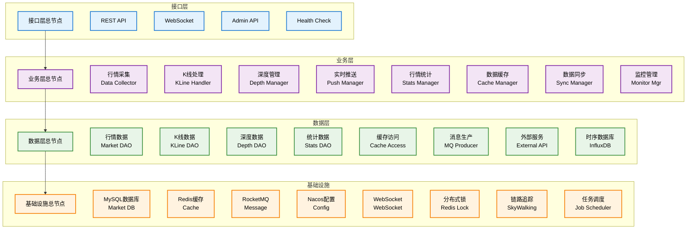
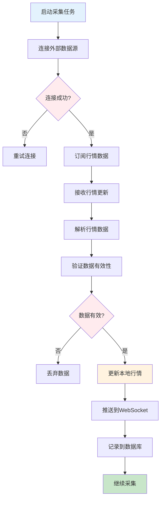
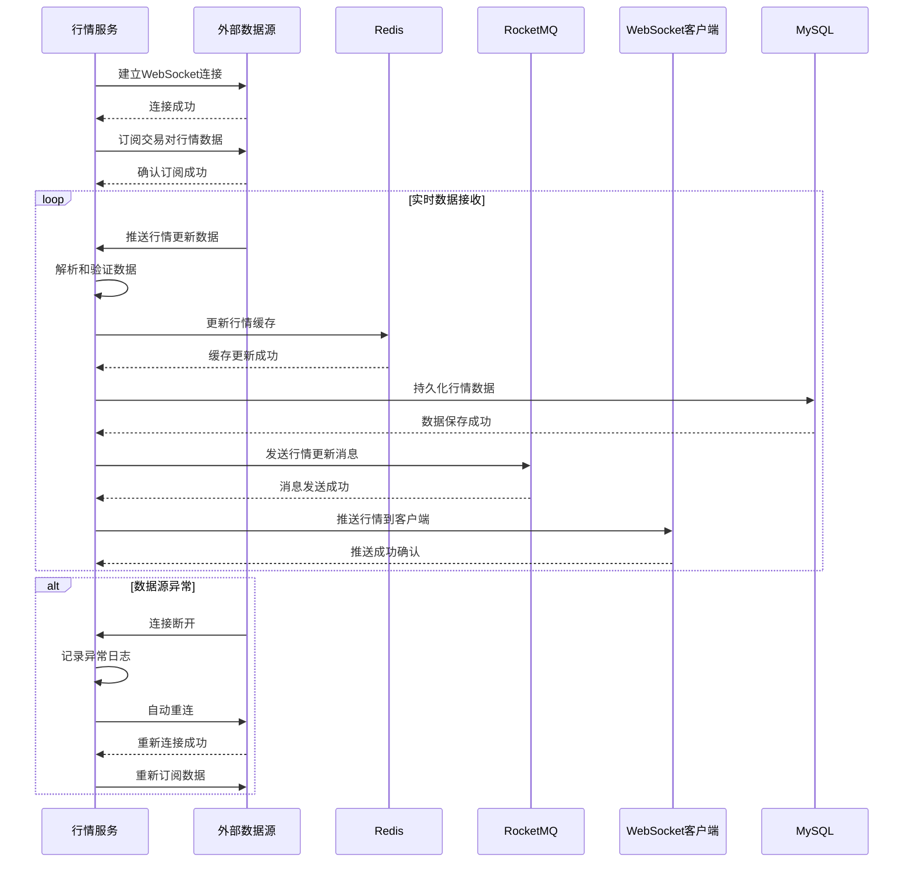
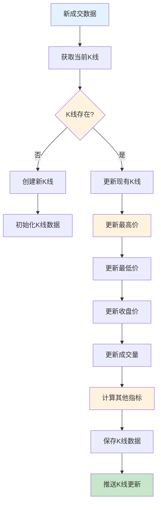
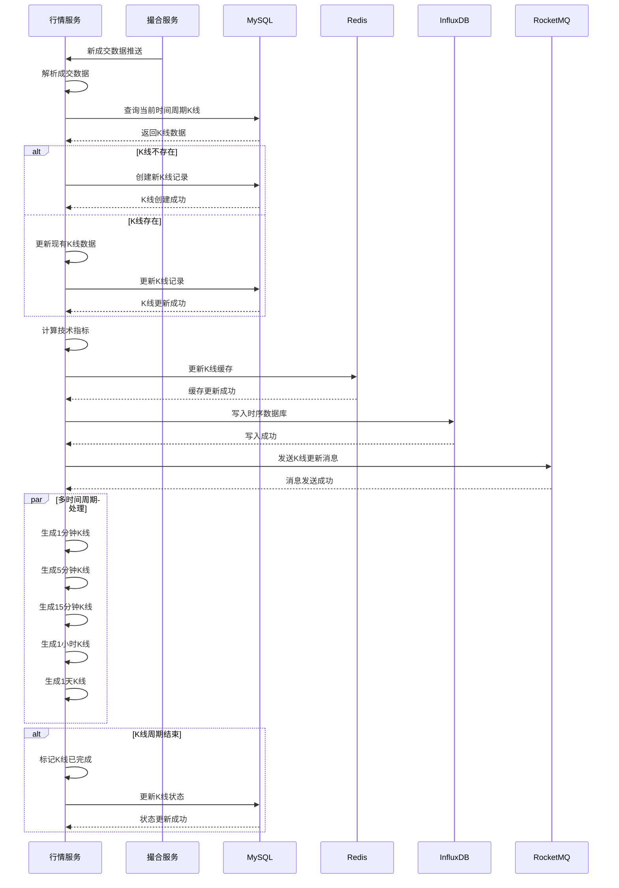
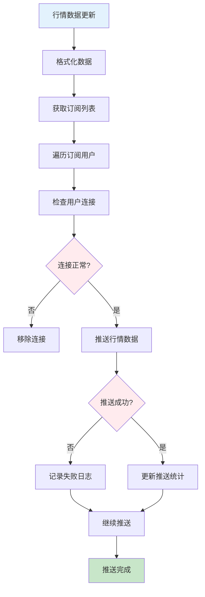
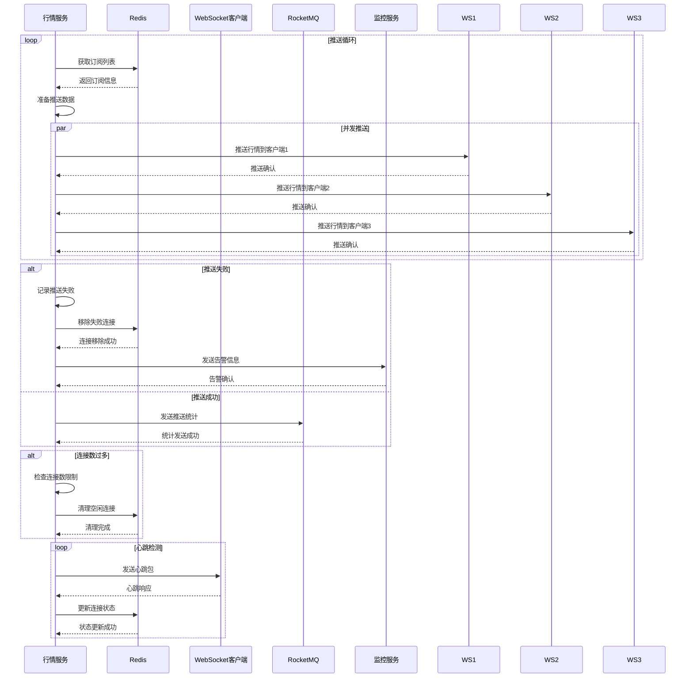
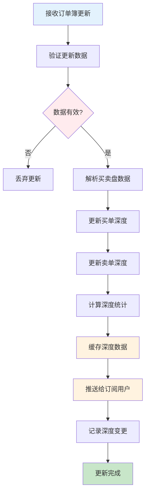
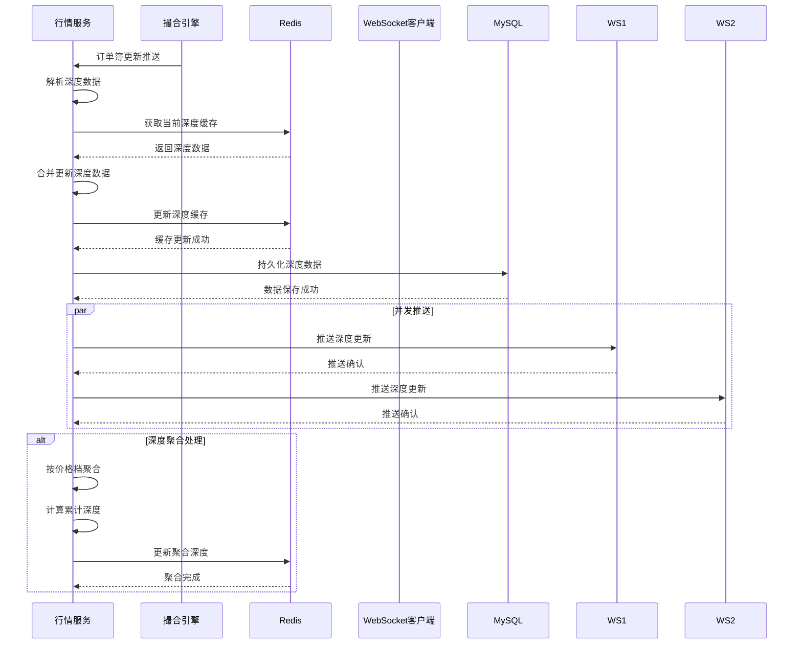
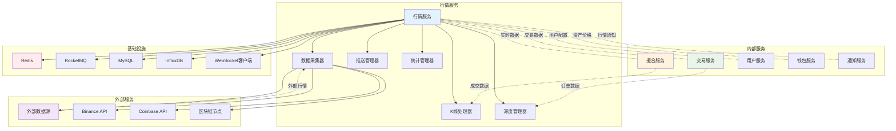

# 行情服务 (Market Service) 技术设计文档

## 1. 服务概述

### 1.1 服务定位
行情服务是Web3 CEX系统的核心数据服务，负责实时行情数据采集、K线数据处理、深度数据管理、WebSocket推送等核心功能。作为系统的行情数据中心，为交易服务、用户端和管理后台提供及时、准确的行情数据支持。

### 1.2 核心职责
- **行情采集**: 从外部数据源和内部撮合系统采集实时行情
- **K线处理**: 生成和管理多时间周期的K线数据
- **深度管理**: 维护和管理买卖盘深度数据
- **实时推送**: 通过WebSocket实时推送行情更新
- **行情统计**: 行情数据统计和历史数据管理

### 1.3 服务指标
- **数据延迟**: < 100ms
- **推送延迟**: < 50ms
- **并发连接**: 支持10,000+ WebSocket连接
- **数据准确性**: 99.9%
- **可用性**: 99.95%

## 2. 技术架构

### 2.1 整体架构


### 2.2 技术栈
- **框架**: Spring Boot 3.2.x
- **WebSocket**: Netty + Spring WebSocket
- **数据库**: MySQL 8.0 + MyBatis Plus
- **缓存**: Redis 7.x
- **时序数据库**: InfluxDB
- **消息队列**: RocketMQ 4.9.x
- **服务治理**: Nacos 2.2.x
- **任务调度**: XXL-Job

### 2.3 依赖关系
```
market-service
├── Nacos (服务注册发现)
├── Redis (缓存)
├── MySQL (数据存储)
├── InfluxDB (时序数据)
├── RocketMQ (消息队列)
├── trade-service (内部交易数据)
├── match-service (撮合数据)
├── 外部数据源 (第三方行情API)
└── WebSocket Client (实时推送)
```

## 3. 数据模型设计

### 3.1 核心数据表

#### 3.1.1 交易对行情表 (market_ticker)
```sql
CREATE TABLE `market_ticker` (
  `id` bigint(20) NOT NULL AUTO_INCREMENT COMMENT '行情ID',
  `symbol` varchar(20) NOT NULL COMMENT '交易对',
  `last_price` decimal(20,8) NOT NULL DEFAULT '0.00000000' COMMENT '最新价格',
  `bid_price` decimal(20,8) NOT NULL DEFAULT '0.00000000' COMMENT '买一价',
  `ask_price` decimal(20,8) NOT NULL DEFAULT '0.00000000' COMMENT '卖一价',
  `high_price` decimal(20,8) NOT NULL DEFAULT '0.00000000' COMMENT '24小时最高价',
  `low_price` decimal(20,8) NOT NULL DEFAULT '0.00000000' COMMENT '24小时最低价',
  `open_price` decimal(20,8) NOT NULL DEFAULT '0.00000000' COMMENT '24小时开盘价',
  `volume` decimal(20,8) NOT NULL DEFAULT '0.00000000' COMMENT '24小时成交量',
  `quote_volume` decimal(20,8) NOT NULL DEFAULT '0.00000000' COMMENT '24小时成交额',
  `price_change` decimal(10,6) NOT NULL DEFAULT '0.000000' COMMENT '价格变化',
  `price_change_percent` decimal(10,6) NOT NULL DEFAULT '0.000000' COMMENT '价格变化百分比',
  `count` int(11) NOT NULL DEFAULT '0' COMMENT '24小时成交次数',
  `last_update_time` datetime NOT NULL DEFAULT CURRENT_TIMESTAMP COMMENT '最后更新时间',
  `create_time` datetime NOT NULL DEFAULT CURRENT_TIMESTAMP COMMENT '创建时间',
  `update_time` datetime NOT NULL DEFAULT CURRENT_TIMESTAMP ON UPDATE CURRENT_TIMESTAMP COMMENT '更新时间',
  PRIMARY KEY (`id`),
  UNIQUE KEY `uk_symbol` (`symbol`),
  KEY `idx_last_update_time` (`last_update_time`),
  KEY `idx_create_time` (`create_time`)
) ENGINE=InnoDB DEFAULT CHARSET=utf8mb4 COMMENT='交易对行情表';
```

#### 3.1.2 K线数据表 (market_kline)
```sql
CREATE TABLE `market_kline` (
  `id` bigint(20) NOT NULL AUTO_INCREMENT COMMENT 'K线ID',
  `symbol` varchar(20) NOT NULL COMMENT '交易对',
  `interval` varchar(10) NOT NULL COMMENT '时间间隔 1m,5m,15m,30m,1h,4h,1d,1w,1M',
  `open_time` datetime NOT NULL COMMENT '开盘时间',
  `close_time` datetime NOT NULL COMMENT '收盘时间',
  `open_price` decimal(20,8) NOT NULL COMMENT '开盘价',
  `high_price` decimal(20,8) NOT NULL COMMENT '最高价',
  `low_price` decimal(20,8) NOT NULL COMMENT '最低价',
  `close_price` decimal(20,8) NOT NULL COMMENT '收盘价',
  `volume` decimal(20,8) NOT NULL COMMENT '成交量',
  `quote_volume` decimal(20,8) NOT NULL COMMENT '成交额',
  `trades` int(11) NOT NULL COMMENT '成交次数',
  `taker_buy_base_volume` decimal(20,8) NOT NULL COMMENT 'Taker买入量',
  `taker_buy_quote_volume` decimal(20,8) NOT NULL COMMENT 'Taker买入额',
  `is_closed` tinyint(1) NOT NULL DEFAULT '0' COMMENT '是否已关闭',
  `create_time` datetime NOT NULL DEFAULT CURRENT_TIMESTAMP COMMENT '创建时间',
  `update_time` datetime NOT NULL DEFAULT CURRENT_TIMESTAMP ON UPDATE CURRENT_TIMESTAMP COMMENT '更新时间',
  PRIMARY KEY (`id`),
  UNIQUE KEY `uk_symbol_interval_open_time` (`symbol`, `interval`, `open_time`),
  KEY `idx_symbol` (`symbol`),
  KEY `idx_interval` (`interval`),
  KEY `idx_open_time` (`open_time`),
  KEY `idx_close_time` (`close_time`),
  KEY `idx_is_closed` (`is_closed`)
) ENGINE=InnoDB DEFAULT CHARSET=utf8mb4 COMMENT='K线数据表';
```

#### 3.1.3 深度数据表 (market_depth)
```sql
CREATE TABLE `market_depth` (
  `id` bigint(20) NOT NULL AUTO_INCREMENT COMMENT '深度ID',
  `symbol` varchar(20) NOT NULL COMMENT '交易对',
  `side` tinyint(1) NOT NULL COMMENT '买卖方向 1-买单 2-卖单',
  `price` decimal(20,8) NOT NULL COMMENT '价格',
  `amount` decimal(20,8) NOT NULL COMMENT '数量',
  `orders_count` int(11) NOT NULL DEFAULT '0' COMMENT '订单数量',
  `update_time` datetime NOT NULL DEFAULT CURRENT_TIMESTAMP ON UPDATE CURRENT_TIMESTAMP COMMENT '更新时间',
  PRIMARY KEY (`id`),
  KEY `idx_symbol` (`symbol`),
  KEY `idx_side` (`side`),
  KEY `idx_price` (`price`),
  KEY `idx_update_time` (`update_time`)
) ENGINE=InnoDB DEFAULT CHARSET=utf8mb4 COMMENT='深度数据表';
```

#### 3.1.4 成交记录表 (market_trade)
```sql
CREATE TABLE `market_trade` (
  `id` bigint(20) NOT NULL AUTO_INCREMENT COMMENT '成交ID',
  `trade_id` varchar(32) NOT NULL COMMENT '成交编号',
  `symbol` varchar(20) NOT NULL COMMENT '交易对',
  `price` decimal(20,8) NOT NULL COMMENT '成交价格',
  `amount` decimal(20,8) NOT NULL COMMENT '成交数量',
  `quote_volume` decimal(20,8) NOT NULL COMMENT '成交额',
  `timestamp` datetime NOT NULL COMMENT '成交时间',
  `is_buyer_maker` tinyint(1) NOT NULL COMMENT '是否买方为Maker',
  `create_time` datetime NOT NULL DEFAULT CURRENT_TIMESTAMP COMMENT '创建时间',
  PRIMARY KEY (`id`),
  UNIQUE KEY `uk_trade_id` (`trade_id`),
  KEY `idx_symbol` (`symbol`),
  KEY `idx_timestamp` (`timestamp`),
  KEY `idx_price` (`price`),
  KEY `idx_create_time` (`create_time`)
) ENGINE=InnoDB DEFAULT CHARSET=utf8mb4 COMMENT='成交记录表';
```

### 3.2 数据关系
```
market_ticker (1) ←→ (N) market_kline
market_ticker (1) ←→ (N) market_depth
market_ticker (1) ←→ (N) market_trade
trade_detail (1) ←→ (1) market_trade
market_kline (1) ←→ (N) market_trade
```

## 4. 核心业务流程

### 4.1 行情采集流程

#### 4.1.1 流程图


##### 4.1.2 时序图


### 4.2 K线生成流程

#### 4.2.1 流程图


#### 4.2.2 K线时间间隔
- **1分钟**: 用于短线交易
- **5分钟**: 用于短线分析
- **15分钟**: 用于中线交易
- **30分钟**: 用于中线分析
- **1小时**: 用于长线交易
- **4小时**: 用于长线分析
- **1天**: 用于趋势分析
- **1周**: 用于长期趋势
- **1月**: 用于长期分析

#### 4.2.3 K线生成时序图


### 4.3 实时推送流程

#### 4.3.1 流程图


#### 4.3.2 实时推送时序图


## 5. WebSocket设计

### 5.1 连接管理
```java
@ServerEndpoint("/ws/market")
@Component
public class MarketWebSocket {
    private static final Map<String, Session> connections = new ConcurrentHashMap<>();

    @OnOpen
    public void onOpen(Session session) {
        String sessionId = session.getId();
        connections.put(sessionId, session);
        log.info("WebSocket连接建立: {}", sessionId);
    }

    @OnClose
    public void onClose(Session session) {
        String sessionId = session.getId();
        connections.remove(sessionId);
        log.info("WebSocket连接关闭: {}", sessionId);
    }

    @OnMessage
    public void onMessage(String message, Session session) {
        // 处理订阅/取消订阅消息
        MarketMessage msg = JSON.parseObject(message, MarketMessage.class);
        handleSubscription(session, msg);
    }
}
```

### 5.2 消息格式
```json
{
  "method": "SUBSCRIBE",
  "params": ["ticker@BTCUSDT", "kline@1m@BTCUSDT"],
  "id": 1
}
```

### 5.3 推送格式
```json
{
  "method": "ticker",
  "symbol": "BTCUSDT",
  "data": {
    "last_price": "50000.00",
    "bid_price": "49999.00",
    "ask_price": "50001.00",
    "high_price": "51000.00",
    "low_price": "49000.00",
    "volume": "1000.5",
    "price_change": "2.5",
    "timestamp": 1640995200000
  }
}
```

## 6. 接口设计

### 6.1 核心接口清单

| 接口路径 | 方法 | 描述 | 权限要求 |
|---------|------|------|----------|
| `/api/v1/market/tickers` | GET | 获取所有交易对行情 | 公开 |
| `/api/v1/market/ticker/{symbol}` | GET | 获取指定交易对行情 | 公开 |
| `/api/v1/market/klines` | GET | 获取K线数据 | 公开 |
| `/api/v1/market/depth/{symbol}` | GET | 获取深度数据 | 公开 |
| `/api/v1/market/trades/{symbol}` | GET | 获取成交记录 | 公开 |
| `/api/v1/market/24h-stats` | GET | 获取24小时统计 | 公开 |

### 6.2 接口详细设计

#### 6.2.1 获取K线数据接口
```http
GET /api/v1/market/klines
Query Parameters:
- symbol: 交易对 (必需)
- interval: 时间间隔 (1m,5m,15m,30m,1h,4h,1d,1w,1M)
- limit: 数据条数 (默认100, 最大1000)
- start_time: 开始时间 (可选)
- end_time: 结束时间 (可选)

响应结果：
{
  "code": 200,
  "message": "成功",
  "data": [
    {
      "timestamp": 1640995200000,
      "open": "50000.00",
      "high": "51000.00",
      "low": "49000.00",
      "close": "50500.00",
      "volume": "100.5",
      "quote_volume": "5050250.00",
      "trades": 500,
      "taker_buy_base_volume": "50.25",
      "taker_buy_quote_volume": "2525125.00"
    }
  ]
}
```

#### 6.2.2 获取深度数据接口
```http
GET /api/v1/market/depth/{symbol}
Query Parameters:
- limit: 深度条数 (默认20, 最大100)

响应结果：
{
  "code": 200,
  "message": "成功",
  "data": {
    "symbol": "BTCUSDT",
    "timestamp": 1640995200000,
    "bids": [
      ["49999.00", "0.5"],
      ["49998.00", "1.2"]
    ],
    "asks": [
      ["50001.00", "0.3"],
      ["50002.00", "0.8"]
    ]
  }
}
```

#### 6.2.3 获取成交记录接口
```http
GET /api/v1/market/trades/{symbol}
Query Parameters:
- limit: 成交条数 (默认20, 最大100)

响应结果：
{
  "code": 200,
  "message": "成功",
  "data": [
    {
      "trade_id": "T20240101001",
      "price": "50000.00",
      "amount": "0.001",
      "quote_volume": "50.00",
      "timestamp": 1640995200000,
      "is_buyer_maker": true
    }
  ]
}
```

## 7. 缓存设计

### 7.1 缓存策略
- **行情缓存**: 缓存最新行情，TTL 1秒
- **K线缓存**: 缓存K线数据，TTL 1分钟
- **深度缓存**: 缓存深度数据，TTL 1秒
- **成交缓存**: 缓存最新成交，TTL 1分钟

### 7.2 缓存键设计
```
market:ticker:{symbol}           - 交易对行情
market:kline:{symbol}:{interval} - K线数据
market:depth:{symbol}            - 深度数据
market:trades:{symbol}          - 成交记录
market:24h-stats:{symbol}        - 24小时统计
market:subscriptions:{session_id} - 订阅信息
```

### 7.3 缓存更新策略
- **实时更新**: 行情数据实时更新
- **批量更新**: K线数据批量更新
- **主动推送**: 深度数据主动推送
- **定期清理**: 定期清理过期数据

## 8. 消息队列设计

### 8.1 消息Topic
- **market-topic**: 行情相关消息
- **kline-topic**: K线相关消息
- **trade-topic**: 成交相关消息

### 8.2 消息类型
- **行情更新消息**: 行情数据更新时发送
- **K线更新消息**: K线数据更新时发送
- **深度更新消息**: 深度数据更新时发送
- **成交消息**: 新成交时发送

### 8.3 消息格式
```json
{
  "header": {
    "message_id": "msg_123456789",
    "topic": "market-topic",
    "tags": "TICKER_UPDATE",
    "keys": "ticker_BTCUSDT",
    "timestamp": 1640995200000,
    "producer_group": "market-service-producer"
  },
  "body": {
    "symbol": "BTCUSDT",
    "last_price": "50000.00",
    "bid_price": "49999.00",
    "ask_price": "50001.00",
    "high_price": "51000.00",
    "low_price": "49000.00",
    "volume": "1000.5",
    "price_change": "2.5",
    "timestamp": 1640995200000
  }
}
```

## 9. 监控设计

### 9.1 业务监控
- **数据延迟**: 行情数据延迟监控
- **推送延迟**: WebSocket推送延迟监控
- **连接数**: WebSocket连接数监控
- **数据准确性**: 行情数据准确性监控

### 9.2 技术监控
- **服务性能**: 行情服务性能监控
- **连接状态**: 外部数据源连接监控
- **内存使用**: 内存使用率监控
- **消息处理**: 消息队列处理监控

### 9.3 告警规则
- **数据延迟**: 行情数据延迟超过1秒
- **推送失败**: WebSocket推送失败率超过5%
- **连接异常**: 外部数据源连接失败
- **服务异常**: 行情服务异常
- **内存异常**: 内存使用率超过80%

## 10. 性能优化

### 10.1 数据处理优化
- **批量处理**: 批量处理K线数据更新
- **异步处理**: 异步处理行情推送
- **缓存优化**: 多级缓存策略
- **压缩传输**: 数据压缩传输

### 10.2 网络优化
- **连接池**: 数据库连接池优化
- **HTTP连接**: HTTP连接池优化
- **WebSocket优化**: WebSocket连接管理优化
- **CDN加速**: 静态资源CDN加速

### 10.3 存储优化
- **分表策略**: K线数据按时间分表
- **数据归档**: 历史数据归档存储
- **索引优化**: 数据库索引优化
- **查询优化**: 查询语句优化

## 11. 扩展设计

### 11.1 数据源扩展
- **插件化设计**: 支持多种数据源接入
- **适配器模式**: 统一的数据源适配器
- **配置化管理**: 数据源配置化管理
- **监控告警**: 数据源监控告警

### 11.2 功能扩展
- **技术指标**: 支持更多技术指标
- **图表展示**: 丰富的图表展示
- **预警通知**: 价格预警通知
- **数据分析**: 深度数据分析

## 12. 深度数据管理流程

### 12.1 深度数据更新流程

#### 12.1.1 流程图


#### 12.1.2 深度数据更新时序图


## 13. 系统交互流程图

### 13.1 行情服务与其他服务交互图


### 13.2 完整行情数据生命周期流程图
```mermaid
graph TD
    A[数据源连接] --> B[行情数据采集]
    B --> C{数据源类型?}
    C -->|外部API| D[HTTP API采集]
    C -->|WebSocket| E[WebSocket订阅]
    C -->|内部撮合| F[撮合数据接收]

    D --> G[数据解析验证]
    E --> G
    F --> G

    G --> H{数据有效性?}
    H -->|无效| I[丢弃数据]
    H -->|有效| J[数据标准化]

    J --> K[行情数据更新]
    K --> L[K线数据生成]
    L --> M[深度数据管理]
    M --> N[实时推送处理]
    N --> O[数据持久化]

    O --> P[缓存更新]
    P --> Q[消息推送]
    Q --> R[统计分析]

    R --> S{数据使用?}
    S -->|API查询| T[REST API响应]
    S -->|WebSocket| U[实时推送]
    S -->|历史数据| V[数据分析]

    T --> W[客户端展示]
    U --> W
    V --> X[报表生成]

    W --> Y[用户决策]
    X --> Z[运营分析]

    Y --> AA[交易操作]
    AA --> AB[回到撮合]

    alt 数据异常处理
        J --> AC[数据质量检查]
        AC --> AD{质量合格?}
        AD -->|不合格| AE[记录异常]
        AD -->|合格| J
    end

    alt 性能优化
        P --> AF[多级缓存]
        AF --> AG[热点数据]
        AG --> AH[性能监控]
    end

    style A fill:#e3f2fd
    style Y fill:#fff3e0
    style AB fill:#c8e6c9
    style H fill:#ffebee
    style S fill:#f3e5f5
    style AD fill:#ffebee
```

通过以上详细设计，行情服务为整个CEX系统提供了实时、准确、高效的行情数据支持。