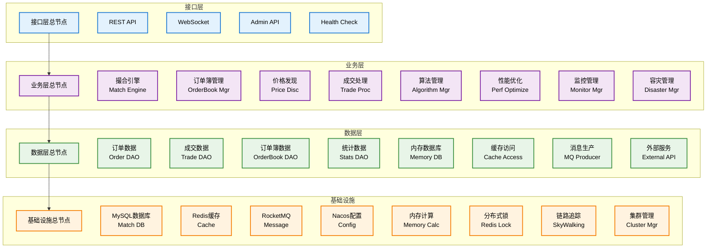
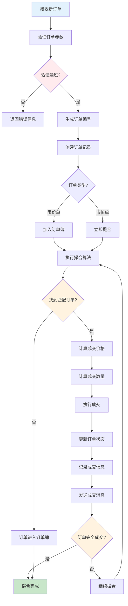
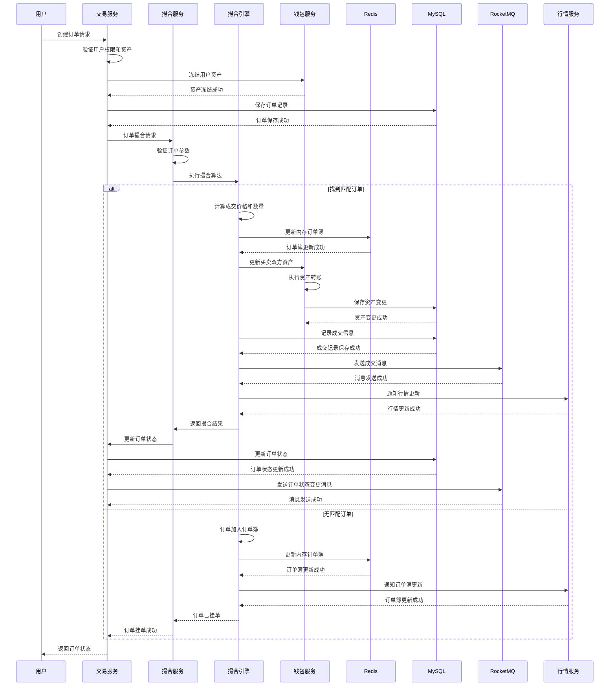
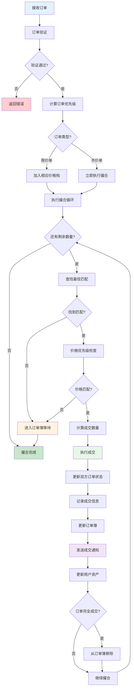
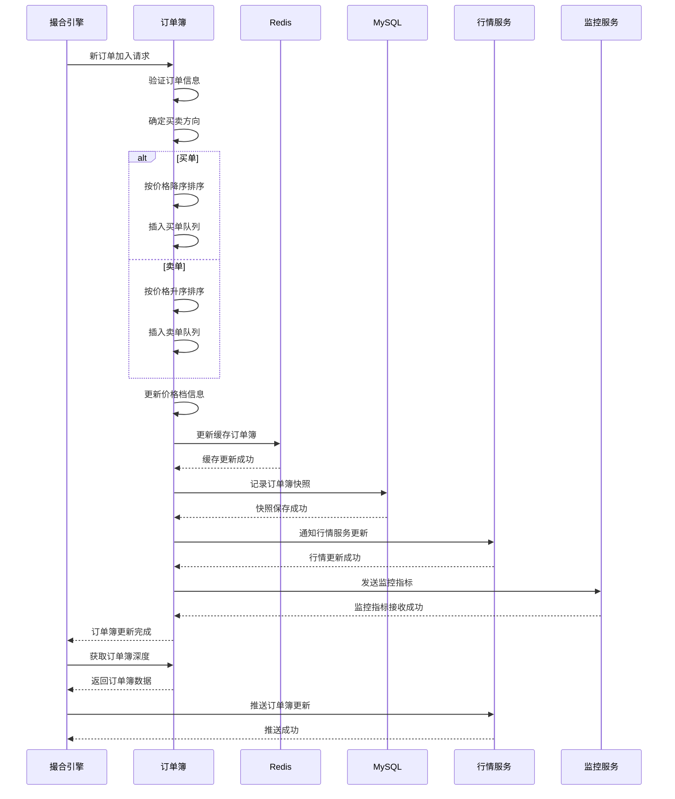
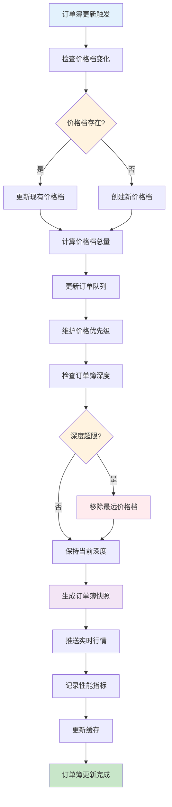
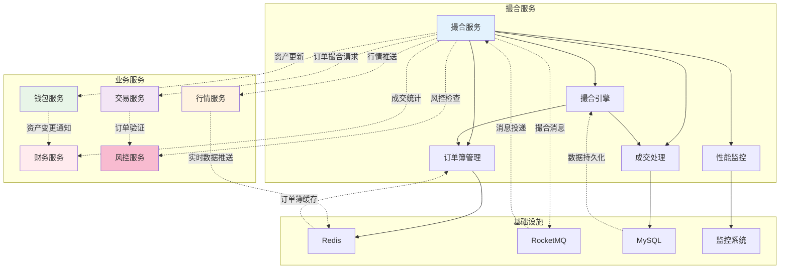
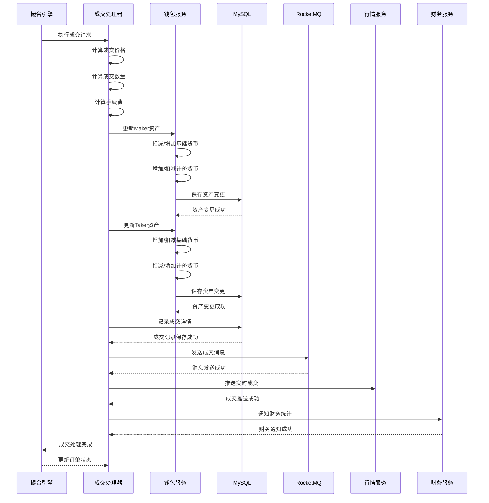
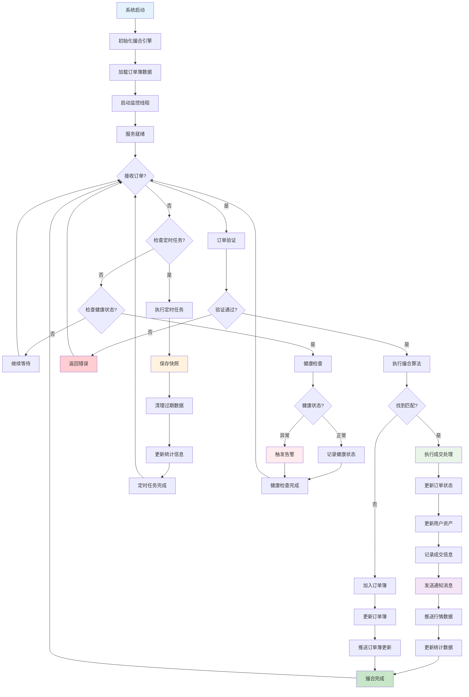

# 撮合服务 (Match Service) 技术设计文档

## 1. 服务概述

### 1.1 服务定位
撮合服务是Web3 CEX系统的核心交易引擎，负责订单匹配、价格发现、成交处理、订单簿管理等核心功能。作为系统的交易核心，为用户提供高效、公平、透明的交易撮合服务。

### 1.2 核心职责
- **订单匹配**: 高效的买卖订单匹配算法
- **价格发现**: 实时价格发现和形成
- **订单簿管理**: 内存订单簿的维护和管理
- **成交处理**: 成交确认和资产结算
- **撮合优化**: 撮合算法性能优化

### 1.3 服务指标
- **撮合延迟**: < 10ms
- **撮合性能**: 50,000+ TPS
- **订单簿深度**: 支持1,000,000+订单
- **数据一致性**: 强一致性保证
- **可用性**: 99.99%

## 2. 技术架构

### 2.1 整体架构


### 2.2 技术栈
- **框架**: Spring Boot 3.2.x
- **内存计算**: 自研内存订单簿
- **并发控制**: Java并发包 + Disruptor
- **数据库**: MySQL 8.0 + MyBatis Plus
- **缓存**: Redis 7.x
- **消息队列**: RocketMQ 4.9.x
- **服务治理**: Nacos 2.2.x

### 2.3 依赖关系
```
match-service
├── Nacos (服务注册发现)
├── Redis (缓存 + 分布式锁)
├── MySQL (数据存储)
├── RocketMQ (消息队列)
├── trade-service (订单服务)
├── wallet-service (资产服务)
├── market-service (行情服务)
├── finance-service (财务服务)
└── user-service (用户服务)
```

## 3. 数据模型设计

### 3.1 核心数据表

#### 3.1.1 订单表 (match_order)
```sql
CREATE TABLE `match_order` (
  `id` bigint(20) NOT NULL AUTO_INCREMENT COMMENT '订单ID',
  `order_no` varchar(32) NOT NULL COMMENT '订单编号',
  `user_id` bigint(20) NOT NULL COMMENT '用户ID',
  `symbol` varchar(20) NOT NULL COMMENT '交易对',
  `order_type` tinyint(1) NOT NULL COMMENT '订单类型 1-限价单 2-市价单',
  `direction` tinyint(1) NOT NULL COMMENT '买卖方向 1-买入 2-卖出',
  `price` decimal(20,8) NOT NULL COMMENT '价格',
  `amount` decimal(20,8) NOT NULL COMMENT '数量',
  `executed_amount` decimal(20,8) NOT NULL DEFAULT '0.00000000' COMMENT '已成交数量',
  `executed_value` decimal(20,8) NOT NULL DEFAULT '0.00000000' COMMENT '已成交金额',
  `fee` decimal(20,8) NOT NULL DEFAULT '0.00000000' COMMENT '手续费',
  `status` tinyint(1) NOT NULL DEFAULT '1' COMMENT '状态 1-待成交 2-部分成交 3-完全成交 4-已取消',
  `time_in_force` tinyint(1) NOT NULL DEFAULT '1' COMMENT '时效类型 1-GTC 2-IOC 3-FOK',
  `source` tinyint(1) NOT NULL DEFAULT '1' COMMENT '来源 1-Web 2-API 3-App',
  `create_time` datetime NOT NULL DEFAULT CURRENT_TIMESTAMP COMMENT '创建时间',
  `update_time` datetime NOT NULL DEFAULT CURRENT_TIMESTAMP ON UPDATE CURRENT_TIMESTAMP COMMENT '更新时间',
  `cancel_time` datetime DEFAULT NULL COMMENT '取消时间',
  `expire_time` datetime DEFAULT NULL COMMENT '过期时间',
  `match_engine_id` varchar(32) DEFAULT NULL COMMENT '撮合引擎ID',
  `priority` bigint(20) NOT NULL DEFAULT '0' COMMENT '订单优先级',
  PRIMARY KEY (`id`),
  UNIQUE KEY `uk_order_no` (`order_no`),
  KEY `idx_user_id` (`user_id`),
  KEY `idx_symbol` (`symbol`),
  KEY `idx_status` (`status`),
  KEY `idx_order_type` (`order_type`),
  KEY `idx_direction` (`direction`),
  KEY `idx_create_time` (`create_time`),
  KEY `idx_price` (`price`),
  KEY `idx_expire_time` (`expire_time`),
  KEY `idx_match_engine_id` (`match_engine_id`)
) ENGINE=InnoDB DEFAULT CHARSET=utf8mb4 COMMENT='订单表';
```

#### 3.1.2 成交记录表 (match_trade)
```sql
CREATE TABLE `match_trade` (
  `id` bigint(20) NOT NULL AUTO_INCREMENT COMMENT '成交ID',
  `trade_no` varchar(32) NOT NULL COMMENT '成交编号',
  `symbol` varchar(20) NOT NULL COMMENT '交易对',
  `maker_order_id` bigint(20) NOT NULL COMMENT 'Maker订单ID',
  `taker_order_id` bigint(20) NOT NULL COMMENT 'Taker订单ID',
  `maker_user_id` bigint(20) NOT NULL COMMENT 'Maker用户ID',
  `taker_user_id` bigint(20) NOT NULL COMMENT 'Taker用户ID',
  `price` decimal(20,8) NOT NULL COMMENT '成交价格',
  `amount` decimal(20,8) NOT NULL COMMENT '成交数量',
  `value` decimal(20,8) NOT NULL COMMENT '成交金额',
  `maker_fee` decimal(20,8) NOT NULL DEFAULT '0.00000000' COMMENT 'Maker手续费',
  `taker_fee` decimal(20,8) NOT NULL DEFAULT '0.00000000' COMMENT 'Taker手续费',
  `maker_fee_rate` decimal(10,6) NOT NULL DEFAULT '0.001000' COMMENT 'Maker手续费率',
  `taker_fee_rate` decimal(10,6) NOT NULL DEFAULT '0.001000' COMMENT 'Taker手续费率',
  `match_engine_id` varchar(32) DEFAULT NULL COMMENT '撮合引擎ID',
  `create_time` datetime NOT NULL DEFAULT CURRENT_TIMESTAMP COMMENT '成交时间',
  PRIMARY KEY (`id`),
  UNIQUE KEY `uk_trade_no` (`trade_no`),
  KEY `idx_symbol` (`symbol`),
  KEY `idx_maker_order_id` (`maker_order_id`),
  KEY `idx_taker_order_id` (`taker_order_id`),
  KEY `idx_maker_user_id` (`maker_user_id`),
  KEY `idx_taker_user_id` (`taker_user_id`),
  KEY `idx_create_time` (`create_time`),
  KEY `idx_price` (`price`),
  KEY `idx_match_engine_id` (`match_engine_id`)
) ENGINE=InnoDB DEFAULT CHARSET=utf8mb4 COMMENT='成交记录表';
```

#### 3.1.3 订单簿快照表 (match_orderbook_snapshot)
```sql
CREATE TABLE `match_orderbook_snapshot` (
  `id` bigint(20) NOT NULL AUTO_INCREMENT COMMENT '快照ID',
  `symbol` varchar(20) NOT NULL COMMENT '交易对',
  `snapshot_type` tinyint(1) NOT NULL COMMENT '快照类型 1-买单 2-卖单',
  `price` decimal(20,8) NOT NULL COMMENT '价格',
  `amount` decimal(20,8) NOT NULL COMMENT '数量',
  `orders_count` int(11) NOT NULL DEFAULT '0' COMMENT '订单数量',
  `snapshot_time` datetime NOT NULL DEFAULT CURRENT_TIMESTAMP COMMENT '快照时间',
  `match_engine_id` varchar(32) DEFAULT NULL COMMENT '撮合引擎ID',
  PRIMARY KEY (`id`),
  KEY `idx_symbol` (`symbol`),
  KEY `idx_snapshot_type` (`snapshot_type`),
  KEY `idx_price` (`price`),
  KEY `idx_snapshot_time` (`snapshot_time`),
  KEY `idx_match_engine_id` (`match_engine_id`)
) ENGINE=InnoDB DEFAULT CHARSET=utf8mb4 COMMENT='订单簿快照表';
```

#### 3.1.4 撮合引擎表 (match_engine)
```sql
CREATE TABLE `match_engine` (
  `id` bigint(20) NOT NULL AUTO_INCREMENT COMMENT '引擎ID',
  `engine_id` varchar(32) NOT NULL COMMENT '引擎编号',
  `symbol` varchar(20) NOT NULL COMMENT '交易对',
  `status` tinyint(1) NOT NULL DEFAULT '1' COMMENT '状态 1-运行中 2-停止 3-故障',
  `total_orders` int(11) NOT NULL DEFAULT '0' COMMENT '总订单数',
  `total_trades` int(11) NOT NULL DEFAULT '0' COMMENT '总成交数',
  `last_trade_time` datetime DEFAULT NULL COMMENT '最后成交时间',
  `last_order_time` datetime DEFAULT NULL COMMENT '最后订单时间',
  `server_ip` varchar(45) DEFAULT NULL COMMENT '服务器IP',
  `server_port` int(11) DEFAULT NULL COMMENT '服务器端口',
  `start_time` datetime DEFAULT NULL COMMENT '启动时间',
  `create_time` datetime NOT NULL DEFAULT CURRENT_TIMESTAMP COMMENT '创建时间',
  `update_time` datetime NOT NULL DEFAULT CURRENT_TIMESTAMP ON UPDATE CURRENT_TIMESTAMP COMMENT '更新时间',
  PRIMARY KEY (`id`),
  UNIQUE KEY `uk_engine_id` (`engine_id`),
  KEY `idx_symbol` (`symbol`),
  KEY `idx_status` (`status`),
  KEY `idx_server_ip` (`server_ip`),
  KEY `idx_create_time` (`create_time`)
) ENGINE=InnoDB DEFAULT CHARSET=utf8mb4 COMMENT='撮合引擎表';
```

### 3.2 数据关系
```
match_order (1) ←→ (N) match_trade
match_order (1) ←→ (1) match_engine
match_trade (1) ←→ (1) match_engine
match_orderbook_snapshot (1) ←→ (1) match_engine
user_info (1) ←→ (N) match_order
user_info (1) ←→ (N) match_trade
```

## 4. 核心业务流程

### 4.1 订单撮合流程

#### 4.1.1 流程图


#### 4.1.2 详细时序图


#### 4.1.3 撮合引擎详细处理流程


### 4.2 订单簿管理流程

#### 4.2.2 订单簿管理详细时序图


#### 4.2.3 订单簿深度管理流程


#### 4.2.2 订单簿数据结构
```java
public class OrderBook {
    private String symbol;                                // 交易对
    private TreeMap<BigDecimal, PriceLevel> bids;        // 买单队列 (价格降序)
    private TreeMap<BigDecimal, PriceLevel> asks;        // 卖单队列 (价格升序)
    private ConcurrentHashMap<Long, Order> orders;        // 所有订单
    private AtomicLong tradeIdGenerator;                 // 成交ID生成器
    private ReentrantReadWriteLock lock;                 // 读写锁

    public class PriceLevel {
        private BigDecimal price;                         // 价格
        private BigDecimal totalAmount;                   // 总数量
        private ConcurrentLinkedQueue<Order> orders;     // 订单队列

        // 添加订单到价格档
        public void addOrder(Order order) {
            orders.add(order);
            totalAmount = totalAmount.add(order.getAmount());
        }

        // 从价格档移除订单
        public void removeOrder(Order order) {
            orders.remove(order);
            totalAmount = totalAmount.subtract(order.getAmount());
        }
    }
}
```

### 4.4 撮合服务系统交互图

#### 4.4.1 撮合服务与其他服务交互图


#### 4.3.1 价格优先时间优先算法
```java
public class MatchEngine {
    private OrderBook orderBook;
    private TradeService tradeService;
    private WalletService walletService;

    public MatchResult matchOrder(Order order) {
        MatchResult result = new MatchResult();
        List<Trade> trades = new ArrayList<>();

        BigDecimal remainingAmount = order.getRemainingAmount();

        while (remainingAmount.compareTo(BigDecimal.ZERO) > 0) {
            Order matchedOrder = findBestMatch(order);
            if (matchedOrder == null) {
                break; // 没有匹配订单
            }

            // 计算成交价格和数量
            BigDecimal tradePrice = calculateTradePrice(order, matchedOrder);
            BigDecimal tradeAmount = calculateTradeAmount(order, matchedOrder, remainingAmount);

            // 执行成交
            Trade trade = executeTrade(order, matchedOrder, tradePrice, tradeAmount);
            trades.add(trade);

            // 更新剩余数量
            remainingAmount = remainingAmount.subtract(tradeAmount);

            // 检查订单是否完全成交
            if (matchedOrder.isFullyFilled()) {
                removeFromOrderBook(matchedOrder);
            }
        }

        result.setTrades(trades);
        result.setSuccess(true);
        return result;
    }

    private Order findBestMatch(Order order) {
        if (order.isBuy()) {
            // 买单找最佳卖单 (最低价格)
            Map.Entry<BigDecimal, PriceLevel> entry = orderBook.getAsks().firstEntry();
            return entry != null && order.getPrice().compareTo(entry.getKey()) >= 0 ?
                   entry.getValue().getOrders().peek() : null;
        } else {
            // 卖单找最佳买单 (最高价格)
            Map.Entry<BigDecimal, PriceLevel> entry = orderBook.getBids().firstEntry();
            return entry != null && order.getPrice().compareTo(entry.getKey()) <= 0 ?
                   entry.getValue().getOrders().peek() : null;
        }
    }
}
```

#### 4.5.3 成交处理详细流程


### 4.6 撮合服务完整生命周期流程图


## 5. 性能优化设计

### 4.5 撮合算法设计

### 5.1 内存优化
- **对象池**: 使用对象池减少GC压力
- **内存管理**: 合理管理内存使用
- **数据压缩**: 压缩历史订单数据
- **分片存储**: 订单簿分片存储

### 5.2 并发优化
- **无锁设计**: 使用CAS操作减少锁竞争
- **读写分离**: 读写锁优化并发性能
- **分片处理**: 按交易对分片处理
- **异步处理**: 异步处理非关键路径

### 5.3 算法优化
- **索引优化**: 使用TreeMap快速查找
- **批量处理**: 批量处理多个订单
- **缓存优化**: 缓存热点数据
- **延迟更新**: 延迟更新订单簿

## 6. 接口设计

### 6.1 核心接口清单

| 接口路径 | 方法 | 描述 | 权限要求 |
|---------|------|------|----------|
| `/api/v1/match/order` | POST | 订单撮合 | 内部调用 |
| `/api/v1/match/cancel` | POST | 订单撤销 | 内部调用 |
| `/api/v1/match/orderbook` | GET | 获取订单簿 | 内部调用 |
| `/api/v1/match/trades` | GET | 获取成交记录 | 内部调用 |
| `/api/v1/match/engine/status` | GET | 获取引擎状态 | 管理员 |
| `/api/v1/match/engine/start` | POST | 启动引擎 | 管理员 |
| `/api/v1/match/engine/stop` | POST | 停止引擎 | 管理员 |

### 6.2 接口详细设计

#### 6.2.1 订单撮合接口
```http
POST /api/v1/match/order
Content-Type: application/json

请求参数：
{
  "order_no": "ORD20240101001",
  "user_id": 123456,
  "symbol": "BTCUSDT",
  "order_type": 1,
  "direction": 1,
  "price": "50000.00",
  "amount": "0.001",
  "time_in_force": 1,
  "source": 1
}

响应结果：
{
  "code": 200,
  "message": "撮合成功",
  "data": {
    "order_id": 123456,
    "order_no": "ORD20240101001",
    "status": 1,
    "executed_amount": "0.00000000",
    "executed_value": "0.00000000",
    "trades": [],
    "match_time": "2024-01-01T00:00:00.123Z"
  }
}
```

#### 6.2.2 获取订单簿接口
```http
GET /api/v1/match/orderbook
Query Parameters:
- symbol: 交易对 (必需)
- limit: 深度条数 (默认20, 最大100)

响应结果：
{
  "code": 200,
  "message": "成功",
  "data": {
    "symbol": "BTCUSDT",
    "timestamp": 1640995200000,
    "bids": [
      ["49999.00", "0.5", 3],
      ["49998.00", "1.2", 5]
    ],
    "asks": [
      ["50001.00", "0.3", 2],
      ["50002.00", "0.8", 4]
    ]
  }
}
```

#### 6.2.3 获取引擎状态接口
```http
GET /api/v1/match/engine/status
Authorization: Bearer {admin_token}

响应结果：
{
  "code": 200,
  "message": "成功",
  "data": {
    "engine_id": "engine_001",
    "symbol": "BTCUSDT",
    "status": 1,
    "total_orders": 1500,
    "total_trades": 800,
    "last_trade_time": "2024-01-01T00:00:00Z",
    "last_order_time": "2024-01-01T00:00:05Z",
    "server_ip": "192.168.1.100",
    "server_port": 8080,
    "uptime": 3600
  }
}
```

## 7. 缓存设计

### 7.1 缓存策略
- **订单簿缓存**: 缓存订单簿深度数据，TTL 1秒
- **成交缓存**: 缓存最新成交记录，TTL 1分钟
- **统计缓存**: 缓存撮合统计数据，TTL 5分钟
- **引擎缓存**: 缓存引擎状态信息，TTL 10秒

### 7.2 缓存键设计
```
match:orderbook:{symbol}          - 订单簿数据
match:trades:{symbol}:{limit}     - 成交记录
match:stats:{symbol}             - 撮合统计
match:engine:{engine_id}          - 引擎状态
match:price:{symbol}              - 最新价格
match:snapshot:{symbol}:{time}    - 订单簿快照
```

### 7.3 缓存更新策略
- **实时更新**: 订单簿实时更新
- **批量更新**: 统计数据批量更新
- **定时更新**: 引擎状态定时更新
- **事件驱动**: 事件驱动缓存更新

## 8. 消息队列设计

### 8.1 消息Topic
- **match-topic**: 撮合相关消息
- **trade-topic**: 成交相关消息
- **orderbook-topic**: 订单簿相关消息

### 8.2 消息类型
- **成交消息**: 新成交时发送
- **订单消息**: 订单状态变更时发送
- **订单簿消息**: 订单簿更新时发送
- **引擎消息**: 引擎状态变更时发送

### 8.3 消息格式
```json
{
  "header": {
    "message_id": "msg_123456789",
    "topic": "match-topic",
    "tags": "TRADE_EXECUTE",
    "keys": "trade_123",
    "timestamp": 1640995200000,
    "producer_group": "match-service-producer"
  },
  "body": {
    "trade_id": 123,
    "trade_no": "T20240101001",
    "symbol": "BTCUSDT",
    "maker_order_id": 456,
    "taker_order_id": 789,
    "price": "50000.00",
    "amount": "0.001",
    "maker_user_id": 111,
    "taker_user_id": 222,
    "trade_time": 1640995200000
  }
}
```

## 9. 监控设计

### 9.1 业务监控
- **撮合延迟**: 撮合处理延迟监控
- **成交率**: 订单成交率监控
- **订单簿深度**: 订单簿深度监控
- **价格监控**: 价格异常监控

### 9.2 技术监控
- **引擎性能**: 撮合引擎性能监控
- **内存使用**: 内存使用率监控
- **CPU使用**: CPU使用率监控
- **网络延迟**: 网络延迟监控

### 9.3 告警规则
- **撮合延迟**: 撮合延迟超过10ms
- **引擎异常**: 撮合引擎异常
- **内存异常**: 内存使用率超过80%
- **价格异常**: 价格波动超过10%

## 10. 容灾设计

### 10.1 故障恢复
- **主备切换**: 主备引擎切换
- **数据恢复**: 订单簿数据恢复
- **状态同步**: 引擎状态同步
- **故障转移**: 自动故障转移

### 10.2 数据一致性
- **事务消息**: 保证消息一致性
- **幂等设计**: 防止重复处理
- **数据校验**: 数据一致性校验
- **补偿机制**: 数据补偿机制

通过以上详细设计，撮合服务为整个CEX系统提供了高效、公平、透明的交易撮合能力。