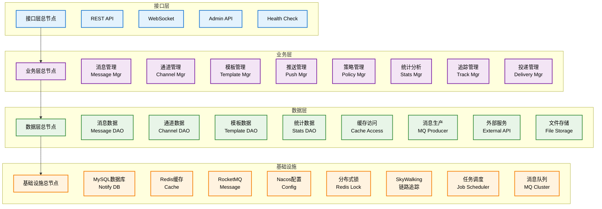
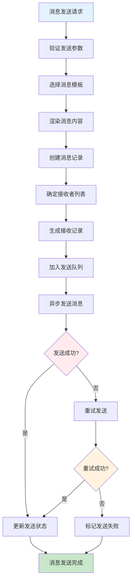
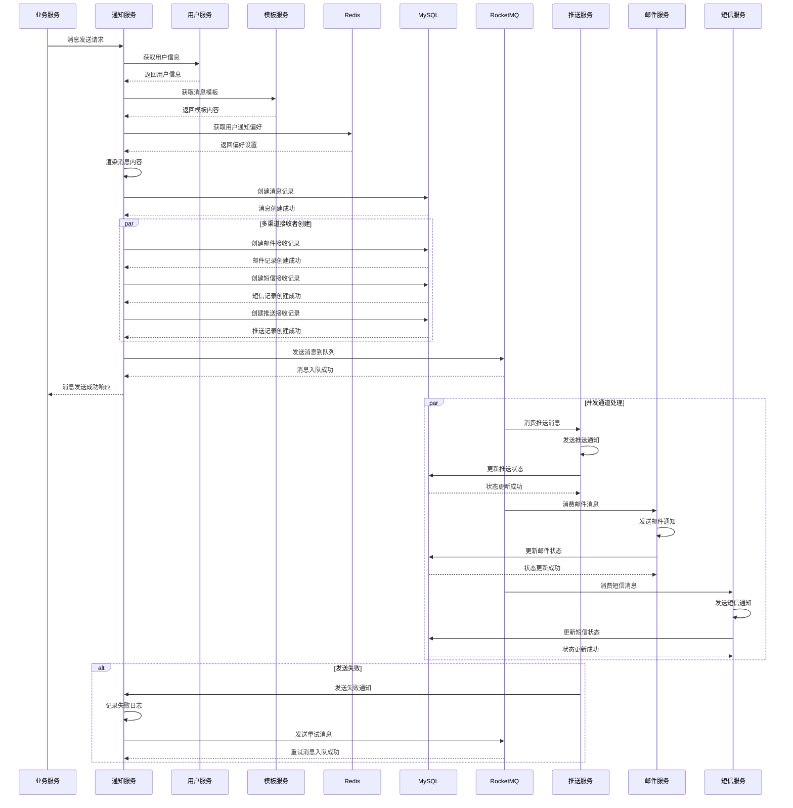
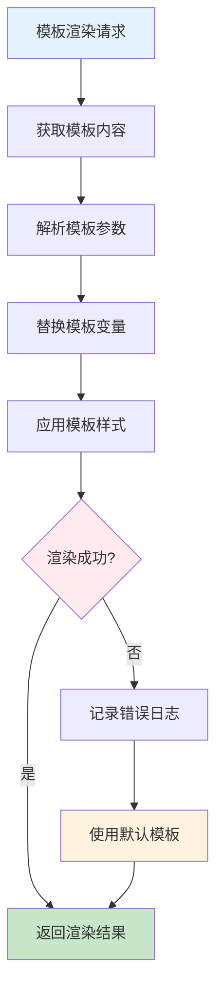
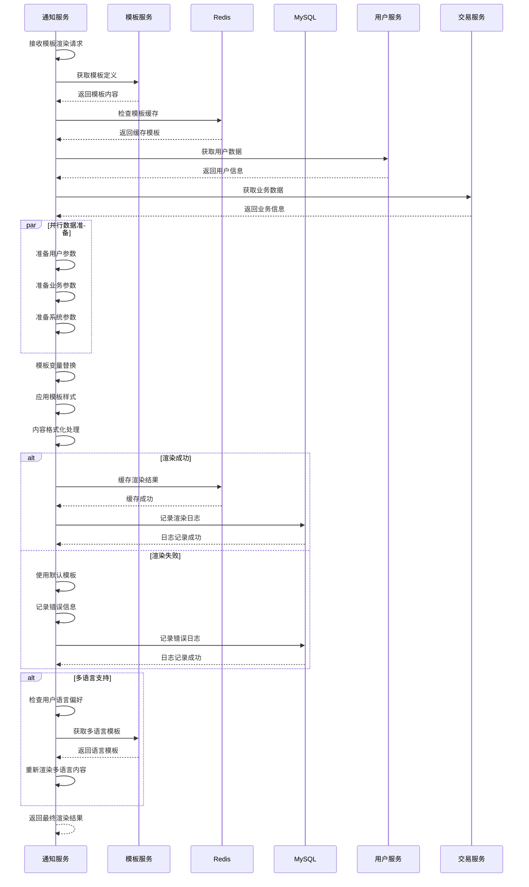

# 通知服务 (Notify Service) 技术设计文档

## 1. 服务概述

### 1.1 服务定位
通知服务是Web3 CEX系统的核心消息服务，负责系统内外的消息通知、推送服务、消息管理等核心功能。作为系统的消息中心，为用户、管理员和第三方系统提供及时、可靠的消息传递服务。

### 1.2 核心职责
- **消息管理**: 消息创建、存储、查询和管理
- **多渠道推送**: 支持邮件、短信、站内信、推送等多种渠道
- **消息模板**: 消息模板管理和动态渲染
- **通知策略**: 通知策略配置和执行
- **消息追踪**: 消息发送状态追踪和统计

### 1.3 服务指标
- **消息延迟**: < 5秒
- **发送成功率**: > 99%
- **并发处理**: 支持10,000+并发消息
- **可用性**: 99.9%
- **消息可靠性**: 100%

## 2. 技术架构

### 2.1 整体架构


### 2.2 技术栈
- **框架**: Spring Boot 3.2.x
- **邮件服务**: JavaMailSender
- **短信服务**: 阿里云短信 / 腾讯云短信
- **推送服务**: 极光推送 / 个推
- **模板引擎**: Freemarker / Thymeleaf
- **数据库**: MySQL 8.0 + MyBatis Plus
- **缓存**: Redis 7.x
- **消息队列**: RocketMQ 4.9.x
- **服务治理**: Nacos 2.2.x

### 2.3 依赖关系
```
notify-service
├── Nacos (服务注册发现)
├── Redis (缓存)
├── MySQL (数据存储)
├── RocketMQ (消息队列)
├── user-service (用户信息)
├── trade-service (交易通知)
├── wallet-service (资产通知)
├── finance-service (财务通知)
├── risk-service (风险告警)
├── 邮件服务提供商
├── 短信服务提供商
└── 推送服务提供商
```

## 3. 数据模型设计

### 3.1 核心数据表

#### 3.1.1 消息表 (notify_message)
```sql
CREATE TABLE `notify_message` (
  `id` bigint(20) NOT NULL AUTO_INCREMENT COMMENT '消息ID',
  `message_no` varchar(32) NOT NULL COMMENT '消息编号',
  `message_type` tinyint(1) NOT NULL COMMENT '消息类型 1-系统消息 2-交易消息 3-营销消息',
  `message_category` varchar(50) NOT NULL COMMENT '消息分类',
  `title` varchar(255) NOT NULL COMMENT '消息标题',
  `content` text NOT NULL COMMENT '消息内容',
  `sender_id` bigint(20) DEFAULT NULL COMMENT '发送者ID',
  `sender_type` tinyint(1) DEFAULT NULL COMMENT '发送者类型 1-系统 2-用户 3-管理员',
  `priority` tinyint(1) NOT NULL DEFAULT '2' COMMENT '优先级 1-高 2-中 3-低',
  `status` tinyint(1) NOT NULL DEFAULT '1' COMMENT '状态 1-待发送 2-发送中 3-已发送 4-失败',
  `send_time` datetime DEFAULT NULL COMMENT '发送时间',
  `expire_time` datetime DEFAULT NULL COMMENT '过期时间',
  `create_time` datetime NOT NULL DEFAULT CURRENT_TIMESTAMP COMMENT '创建时间',
  `update_time` datetime NOT NULL DEFAULT CURRENT_TIMESTAMP ON UPDATE CURRENT_TIMESTAMP COMMENT '更新时间',
  `template_id` bigint(20) DEFAULT NULL COMMENT '模板ID',
  `business_type` varchar(50) DEFAULT NULL COMMENT '业务类型',
  `business_id` varchar(50) DEFAULT NULL COMMENT '业务ID',
  `remark` varchar(500) DEFAULT NULL COMMENT '备注',
  PRIMARY KEY (`id`),
  UNIQUE KEY `uk_message_no` (`message_no`),
  KEY `idx_message_type` (`message_type`),
  KEY `idx_message_category` (`message_category`),
  KEY `idx_sender_id` (`sender_id`),
  KEY `idx_status` (`status`),
  KEY `idx_send_time` (`send_time`),
  KEY `idx_create_time` (`create_time`),
  KEY `idx_business_type` (`business_type`),
  KEY `idx_template_id` (`template_id`)
) ENGINE=InnoDB DEFAULT CHARSET=utf8mb4 COMMENT='消息表';
```

#### 3.1.2 消息接收表 (notify_receiver)
```sql
CREATE TABLE `notify_receiver` (
  `id` bigint(20) NOT NULL AUTO_INCREMENT COMMENT '接收者ID',
  `message_id` bigint(20) NOT NULL COMMENT '消息ID',
  `receiver_id` bigint(20) NOT NULL COMMENT '接收者ID',
  `receiver_type` tinyint(1) NOT NULL COMMENT '接收者类型 1-用户 2-管理员 3-系统',
  `channel` tinyint(1) NOT NULL COMMENT '发送渠道 1-邮件 2-短信 3-站内信 4-推送',
  `send_status` tinyint(1) NOT NULL DEFAULT '1' COMMENT '发送状态 1-待发送 2-发送中 3-已发送 4-失败',
  `read_status` tinyint(1) NOT NULL DEFAULT '1' COMMENT '阅读状态 1-未读 2-已读',
  `send_time` datetime DEFAULT NULL COMMENT '发送时间',
  `read_time` datetime DEFAULT NULL COMMENT '阅读时间',
  `error_message` text DEFAULT NULL COMMENT '错误信息',
  `retry_count` int(11) NOT NULL DEFAULT '0' COMMENT '重试次数',
  `next_retry_time` datetime DEFAULT NULL COMMENT '下次重试时间',
  `create_time` datetime NOT NULL DEFAULT CURRENT_TIMESTAMP COMMENT '创建时间',
  `update_time` datetime NOT NULL DEFAULT CURRENT_TIMESTAMP ON UPDATE CURRENT_TIMESTAMP COMMENT '更新时间',
  PRIMARY KEY (`id`),
  KEY `idx_message_id` (`message_id`),
  KEY `idx_receiver_id` (`receiver_id`),
  KEY `idx_receiver_type` (`receiver_type`),
  KEY `idx_channel` (`channel`),
  KEY `idx_send_status` (`send_status`),
  KEY `idx_read_status` (`read_status`),
  KEY `idx_send_time` (`send_time`),
  KEY `idx_create_time` (`create_time`),
  KEY `idx_next_retry_time` (`next_retry_time`)
) ENGINE=InnoDB DEFAULT CHARSET=utf8mb4 COMMENT='消息接收表';
```

#### 3.1.3 消息模板表 (notify_template)
```sql
CREATE TABLE `notify_template` (
  `id` bigint(20) NOT NULL AUTO_INCREMENT COMMENT '模板ID',
  `template_code` varchar(50) NOT NULL COMMENT '模板代码',
  `template_name` varchar(100) NOT NULL COMMENT '模板名称',
  `template_type` tinyint(1) NOT NULL COMMENT '模板类型 1-邮件 2-短信 3-站内信 4-推送',
  `title_template` varchar(255) DEFAULT NULL COMMENT '标题模板',
  `content_template` text NOT NULL COMMENT '内容模板',
  `template_params` text DEFAULT NULL COMMENT '模板参数',
  `language` varchar(10) NOT NULL DEFAULT 'zh-CN' COMMENT '语言',
  `status` tinyint(1) NOT NULL DEFAULT '1' COMMENT '状态 1-启用 2-禁用',
  `description` varchar(500) DEFAULT NULL COMMENT '模板描述',
  `create_time` datetime NOT NULL DEFAULT CURRENT_TIMESTAMP COMMENT '创建时间',
  `update_time` datetime NOT NULL DEFAULT CURRENT_TIMESTAMP ON UPDATE CURRENT_TIMESTAMP COMMENT '更新时间',
  `create_by` varchar(32) DEFAULT NULL COMMENT '创建人',
  `update_by` varchar(32) DEFAULT NULL COMMENT '更新人',
  PRIMARY KEY (`id`),
  UNIQUE KEY `uk_template_code_language` (`template_code`, `language`),
  KEY `idx_template_type` (`template_type`),
  KEY `idx_status` (`status`),
  KEY `idx_language` (`language`),
  KEY `idx_create_time` (`create_time`)
) ENGINE=InnoDB DEFAULT CHARSET=utf8mb4 COMMENT='消息模板表';
```

#### 3.1.4 通知配置表 (notify_config)
```sql
CREATE TABLE `notify_config` (
  `id` bigint(20) NOT NULL AUTO_INCREMENT COMMENT '配置ID',
  `config_type` tinyint(1) NOT NULL COMMENT '配置类型 1-邮件 2-短信 3-推送',
  `config_key` varchar(50) NOT NULL COMMENT '配置键',
  `config_value` varchar(500) NOT NULL COMMENT '配置值',
  `description` varchar(255) DEFAULT NULL COMMENT '配置描述',
  `is_enabled` tinyint(1) NOT NULL DEFAULT '1' COMMENT '是否启用',
  `status` tinyint(1) NOT NULL DEFAULT '1' COMMENT '状态 1-正常 2-维护',
  `create_time` datetime NOT NULL DEFAULT CURRENT_TIMESTAMP COMMENT '创建时间',
  `update_time` datetime NOT NULL DEFAULT CURRENT_TIMESTAMP ON UPDATE CURRENT_TIMESTAMP COMMENT '更新时间',
  PRIMARY KEY (`id`),
  UNIQUE KEY `uk_config_type_key` (`config_type`, `config_key`),
  KEY `idx_config_type` (`config_type`),
  KEY `idx_is_enabled` (`is_enabled`),
  KEY `idx_status` (`status`)
) ENGINE=InnoDB DEFAULT CHARSET=utf8mb4 COMMENT='通知配置表';
```

### 3.2 数据关系
```
notify_message (1) ←→ (N) notify_receiver
notify_template (1) ←→ (N) notify_message
user_info (1) ←→ (N) notify_receiver
notify_config (1) ←→ (N) notify_channel
```

## 4. 核心业务流程

### 4.1 消息发送流程

#### 4.1.1 流程图


#### 4.1.2 消息发送时序图


### 4.2 模板渲染流程

#### 4.2.1 流程图


#### 4.2.2 模板渲染时序图


#### 4.2.3 模板示例
```html
<!-- 邮件模板 -->
<html>
<head>
    <title>${title}</title>
</head>
<body>
    <h2>尊敬的${username}用户：</h2>
    <p>${content}</p>
    <#if amount??>
    <p>交易金额：${amount} ${coinId}</p>
    </#if>
    <p>发送时间：${sendTime?string('yyyy-MM-dd HH:mm:ss')}</p>
    <p>如有疑问，请联系客服。</p>
</body>
</html>
```

### 4.3 通道适配器设计

#### 4.3.1 适配器接口
```java
public interface ChannelAdapter {
    // 发送消息
    SendResult send(Message message, List<Receiver> receivers);

    // 批量发送
    List<SendResult> batchSend(Message message, List<Receiver> receivers);

    // 获取通道状态
    ChannelStatus getStatus();

    // 获取通道配置
    ChannelConfig getConfig();
}
```

#### 4.3.2 邮件通道实现
```java
@Service
public class EmailChannelAdapter implements ChannelAdapter {

    @Override
    public SendResult send(Message message, List<Receiver> receivers) {
        try {
            // 构建邮件内容
            MimeMessage mimeMessage = buildEmailMessage(message, receivers);

            // 发送邮件
            javaMailSender.send(mimeMessage);

            return SendResult.success();
        } catch (Exception e) {
            log.error("邮件发送失败", e);
            return SendResult.fail(e.getMessage());
        }
    }
}
```

## 5. 接口设计

### 5.1 核心接口清单

| 接口路径 | 方法 | 描述 | 权限要求 |
|---------|------|------|----------|
| `/api/v1/notify/send` | POST | 发送消息 | 内部调用 |
| `/api/v1/notify/messages` | GET | 获取消息列表 | 需要登录 |
| `/api/v1/notify/messages/{messageId}` | GET | 获取消息详情 | 需要登录 |
| `/api/v1/notify/messages/{messageId}/read` | PUT | 标记消息已读 | 需要登录 |
| `/api/v1/notify/templates` | GET | 获取模板列表 | 管理员 |
| `/api/v1/notify/channels/status` | GET | 获取通道状态 | 管理员 |

### 5.2 接口详细设计

#### 5.2.1 发送消息接口
```http
POST /api/v1/notify/send
Content-Type: application/json

请求参数：
{
  "message_type": 2,
  "message_category": "交易通知",
  "template_code": "TRADE_SUCCESS",
  "receivers": [
    {
      "receiver_id": 123456,
      "receiver_type": 1,
      "channels": [1, 3]
    }
  ],
  "template_params": {
    "username": "testuser",
    "amount": "0.001",
    "coinId": "BTC",
    "price": "50000.00"
  },
  "priority": 2,
  "business_type": "trade",
  "business_id": "TD20240101001"
}

响应结果：
{
  "code": 200,
  "message": "消息发送成功",
  "data": {
    "message_id": 123456,
    "message_no": "MSG20240101001",
    "status": 1,
    "create_time": "2024-01-01T00:00:00Z"
  }
}
```

#### 5.2.2 获取消息列表接口
```http
GET /api/v1/notify/messages
Authorization: Bearer {token}
Query Parameters:
- message_type: 消息类型 (可选)
- channel: 发送渠道 (可选)
- read_status: 阅读状态 (可选)
- start_time: 开始时间 (可选)
- end_time: 结束时间 (可选)
- page: 页码 (默认1)
- size: 页大小 (默认20)

响应结果：
{
  "code": 200,
  "message": "成功",
  "data": {
    "total": 50,
    "page": 1,
    "size": 20,
    "messages": [
      {
        "message_id": 123456,
        "message_no": "MSG20240101001",
        "message_type": 2,
        "message_category": "交易通知",
        "title": "交易成功通知",
        "content": "您的BTC交易已完成",
        "priority": 2,
        "read_status": 1,
        "send_time": "2024-01-01T00:00:00Z",
        "create_time": "2024-01-01T00:00:00Z"
      }
    ]
  }
}
```

#### 5.2.3 获取模板列表接口
```http
GET /api/v1/notify/templates
Authorization: Bearer {admin_token}
Query Parameters:
- template_type: 模板类型 (可选)
- language: 语言 (可选)
- status: 状态 (可选)

响应结果：
{
  "code": 200,
  "message": "成功",
  "data": [
    {
      "template_id": 123,
      "template_code": "TRADE_SUCCESS",
      "template_name": "交易成功通知",
      "template_type": 1,
      "title_template": "交易成功通知-${symbol}",
      "content_template": "尊敬的${username}用户，您的${symbol}交易已完成...",
      "language": "zh-CN",
      "status": 1,
      "create_time": "2024-01-01T00:00:00Z"
    }
  ]
}
```

## 6. 缓存设计

### 6.1 缓存策略
- **模板缓存**: 缓存消息模板，TTL 1小时
- **配置缓存**: 缓存通道配置，TTL 30分钟
- **用户偏好**: 缓存用户通知偏好，TTL 1小时
- **发送统计**: 缓存发送统计数据，TTL 5分钟

### 6.2 缓存键设计
```
notify:template:{code}:{language}    - 消息模板
notify:config:{type}                - 通道配置
notify:user:preference:{user_id}    - 用户偏好
notify:stats:{date}                 - 发送统计
notify:channel:status:{type}        - 通道状态
notify:blacklist:{type}:{value}     - 黑名单
```

### 6.3 缓存更新策略
- **主动更新**: 模板变更时主动更新
- **定时更新**: 定时任务更新统计数据
- **被动失效**: 缓存过期自动失效

## 7. 消息队列设计

### 7.1 消息Topic
- **notify-topic**: 通知消息主topic
- **notify-email-topic**: 邮件发送topic
- **notify-sms-topic**: 短信发送topic
- **notify-push-topic**: 推送发送topic

### 7.2 消息类型
- **发送消息**: 消息发送请求
- **重试消息**: 消息重试请求
- **状态更新**: 消息状态更新
- **统计消息**: 发送统计消息

### 7.3 消息格式
```json
{
  "header": {
    "message_id": "msg_123456789",
    "topic": "notify-topic",
    "tags": "MESSAGE_SEND",
    "keys": "notify_123",
    "timestamp": 1640995200000,
    "producer_group": "notify-service-producer"
  },
  "body": {
    "message_id": 123,
    "message_no": "MSG20240101001",
    "message_type": 2,
    "receivers": [
      {
        "receiver_id": 456,
        "receiver_type": 1,
        "channels": [1, 3]
      }
    ],
    "content": "您的BTC交易已完成",
    "priority": 2,
    "retry_count": 0,
    "send_time": 1640995200000
  }
}
```

## 8. 重试机制

### 8.1 重试策略
- **指数退避**: 重试间隔指数增长
- **最大重试**: 最多重试3次
- **重试间隔**: 1分钟、5分钟、30分钟
- **死信队列**: 重试失败进入死信队列

### 8.2 重试实现
```java
@Component
public class MessageRetryHandler {

    @RabbitListener(queues = "notify.retry.queue")
    public void handleRetryMessage(Message message) {
        int retryCount = message.getRetryCount();

        if (retryCount >= MAX_RETRY_COUNT) {
            // 进入死信队列
            deadLetterQueueService.sendToDeadLetter(message);
            return;
        }

        // 计算下次重试时间
        long nextRetryTime = calculateNextRetryTime(retryCount);

        // 更新重试信息
        message.setRetryCount(retryCount + 1);
        message.setNextRetryTime(new Date(nextRetryTime));

        // 重新发送
        messageSender.send(message);
    }
}
```

## 9. 监控设计

### 9.1 业务监控
- **发送监控**: 消息发送成功率监控
- **延迟监控**: 消息发送延迟监控
- **通道监控**: 各通道发送状态监控
- **统计监控**: 消息发送统计监控

### 9.2 技术监控
- **服务性能**: 通知服务性能监控
- **队列监控**: 消息队列积压监控
- **通道健康**: 通道健康状态监控
- **资源使用**: 资源使用率监控

### 9.3 告警规则
- **发送失败**: 发送失败率超过5%
- **消息积压**: 消息积压超过1000条
- **通道异常**: 通道异常超过10分钟
- **服务异常**: 通知服务异常

## 10. 性能优化

### 10.1 发送优化
- **批量发送**: 批量发送消息
- **异步处理**: 异步发送消息
- **连接池**: 数据库连接池优化
- **缓存优化**: 多级缓存策略

### 10.2 存储优化
- **分表策略**: 按时间分表存储
- **索引优化**: 数据库索引优化
- **数据归档**: 历史数据归档
- **清理策略**: 定期清理过期数据

### 10.3 网络优化
- **HTTP连接**: HTTP连接池优化
- **压缩传输**: 消息内容压缩
- **CDN加速**: 静态资源CDN加速
- **负载均衡**: 通道负载均衡

## 11. 系统交互流程图

### 11.1 通知服务与其他服务交互图

```mermaid
graph TB
    subgraph 通知服务
        NS[通知服务]
        MM[消息管理器]
        CM[通道管理器]
        TM[模板管理器]
        PM[推送管理器]
        SM[策略管理器]
        TMG[追踪管理器]
    end

    subgraph 业务服务
        US[用户服务]
        TS[交易服务]
        WS[钱包服务]
        FS[财务服务]
        RS[风控服务]
        MS[行情服务]
    end

    subgraph 外部服务
        PS[推送服务]
        ES[邮件服务]
        SS[短信服务]
        API[第三方API]
    end

    subgraph 基础设施
        R[Redis]
        MQ[RocketMQ]
        DB[MySQL]
        FS[文件存储]
    end

    NS --> MM
    NS --> CM
    NS --> TM
    NS --> PM
    NS --> SM
    NS --> TMG

    NS -.-|用户通知| US
    NS -.-|交易通知| TS
    NS -.-|资产通知| WS
    NS -.-|财务通知| FS
    NS -.-|风险告警| RS
    NS -.-|行情推送| MS

    NS --> R
    NS --> MQ
    NS --> DB
    NS --> FS

    NS -.-|推送通知| PS
    NS -.-|邮件发送| ES
    NS -.-|短信发送| SS
    NS -.-|第三方通知| API

    US -.->|用户偏好| SM
    TS -.->|交易数据| MM
    WS -.->|资产变动| MM
    RS -.->|风险事件| MM
    PS -.->|推送状态| TMG
    ES -.->|邮件状态| TMG

    style NS fill:#e3f2fd
    style US fill:#f3e5f5
    style TS fill:#e8f5e8
    style PS fill:#fff3e0
    style R fill:#ffebee
```


### 11.2 完整消息生命周期流程图
```mermaid
graph TD
    A[消息创建触发] --> B{触发来源?}
    B -->|用户行为| C[用户行为通知]
    B -->|交易事件| D[交易状态通知]
    B -->|资产变动| E[资产变化通知]
    B -->|系统事件| F[系统消息通知]
    B -->|风控告警| G[风险预警通知]

    C --> H[消息内容生成]
    D --> H
    E --> H
    F --> H
    G --> H

    H --> I[选择消息模板]
    I --> J[模板参数填充]
    J --> K[内容渲染处理]
    K --> L{渲染成功?}

    L -->|成功| M[创建消息记录]
    L -->|失败| N[使用默认模板]
    N --> M

    M --> O[确定接收者]
    O --> P[用户偏好检查]
    P --> Q[确定发送渠道]
    Q --> R[创建接收记录]
    R --> S[加入发送队列]

    S --> T[异步发送处理]
    T --> U{发送状态?}

    U -->|成功| V[更新发送状态]
    U -->|失败| W[重试机制]
    W --> X{重试次数?}

    X -->|未超限| Y[延迟重试]
    Y --> T
    X -->|超限| Z[标记发送失败]
    Z --> AA[进入死信队列]

    V --> AB[发送完成统计]
    AA --> AB

    AB --> AC{需要追踪?}
    AC -->|是| AD[消息状态追踪]
    AC -->|否| AE[生命周期结束]

    AD --> AF[阅读状态监控]
    AF --> AG{用户已读?}
    AG -->|是| AH[更新阅读状态]
    AG -->|否| AI[持续追踪]
    AI --> AF

    AH --> AJ[生成统计报告]
    AJ --> AK[优化通知策略]
    AK --> AE

    alt 多渠道发送
        Q --> AL[邮件渠道]
        Q --> AM[短信渠道]
        Q --> AN[推送渠道]
        Q --> AO[站内信渠道]

        AL --> AP[邮件发送]
        AM --> AQ[短信发送]
        AN --> AR[推送发送]
        AO --> AS[站内信发送]

        AP --> AT[邮件状态更新]
        AQ --> AU[短信状态更新]
        AR --> AV[推送状态更新]
        AS --> AW[站内信状态更新]
    end

    alt 实时推送
        loop 实时状态检查
            T --> U
            AF --> AG
        end
    end

    style A fill:#e3f2fd
    style AE fill:#c8e6c9
    style L fill:#ffebee
    style U fill:#fff3e0
    style X fill:#ffebee
    style AG fill:#f3e5f5
```

### 11.3 多渠道并发发送流程图
```mermaid
graph TD
    A[消息接收] --> B[解析消息内容]
    B --> C[确定接收者列表]
    C --> D[用户偏好查询]
    D --> E[生成发送任务]
    E --> F[任务分发器]

    F --> G[邮件发送队列]
    F --> H[短信发送队列]
    F --> I[推送发送队列]
    F --> J[站内信队列]

    G --> K[邮件发送器]
    H --> L[短信发送器]
    I --> M[推送发送器]
    J --> N[站内信发送器]

    K --> O[SMTP连接池]
    L --> P[短信API网关]
    M --> Q[推送服务SDK]
    N --> R[实时推送]

    O --> S{邮件发送?}
    P --> T{短信发送?}
    Q --> U{推送发送?}
    R --> V{站内信发送?}

    S -->|成功| W[邮件成功]
    S -->|失败| X[邮件重试]
    T -->|成功| Y[短信成功]
    T -->|失败| Z[短信重试]
    U -->|成功| AA[推送成功]
    U -->|失败| AB[推送重试]
    V -->|成功| AC[站内信成功]
    V -->|失败| AD[站内信重试]

    W --> AE[状态聚合]
    Y --> AE
    AA --> AE
    AC --> AE

    X --> AF[重试队列]
    Z --> AF
    AB --> AF
    AD --> AF

    AF --> AG[重试管理器]
    AG --> AH{重试策略}
    AH -->|指数退避| AI[延迟重试]
    AH -->|固定间隔| AJ[定时重试]
    AI --> F
    AJ --> F

    AE --> AK[生成发送报告]
    AK --> AL[更新消息状态]
    AL --> AM[通知发送完成]

    alt 限流控制
        F --> AN[限流检查]
        AN --> AO{是否限流?}
        AO -->|是| AP[进入等待队列]
        AO -->|否| AQ[正常发送]
        AP --> AR[等待限流恢复]
        AR --> F
    end

    alt 实时监控
        loop 发送过程监控
            K --> AS[监控邮件状态]
            L --> AT[监控短信状态]
            M --> AU[监控推送状态]
            N --> AV[监控站内信状态]
            AS --> AW[状态聚合分析]
            AT --> AW
            AU --> AW
            AV --> AW
        end
    end

    style A fill:#e3f2fd
    style AM fill:#c8e6c9
    style S fill:#ffebee
    style AH fill:#fff3e0
    style AO fill:#ffcdd2
```

通过以上详细设计，通知服务为整个CEX系统提供了可靠、高效的消息通知服务。