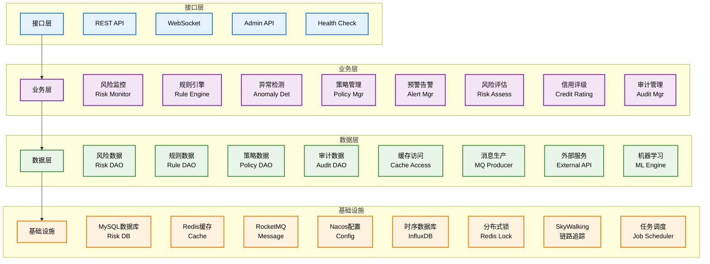
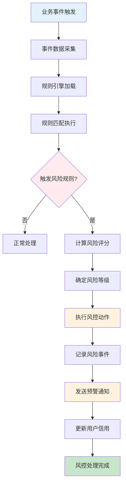
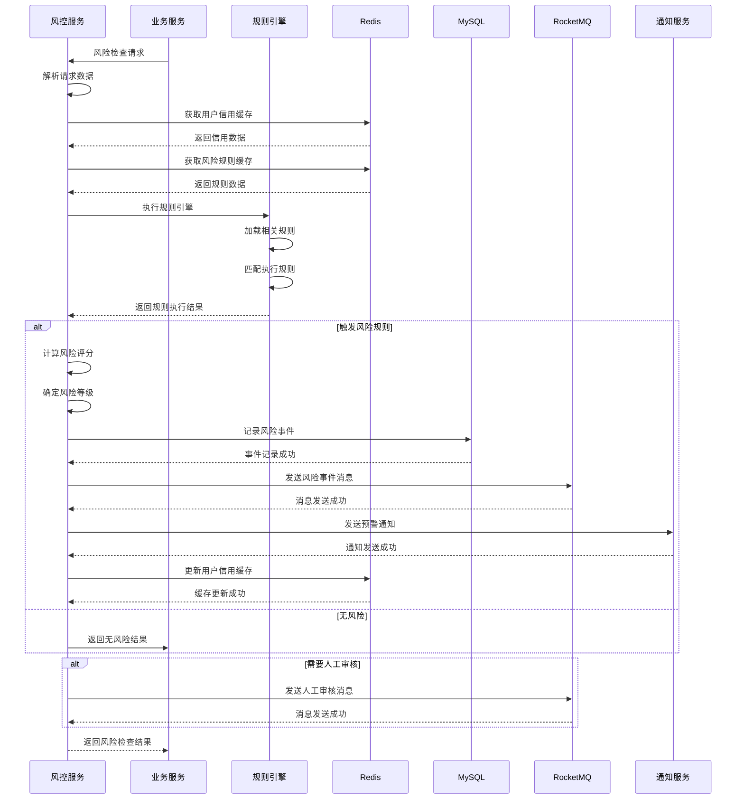
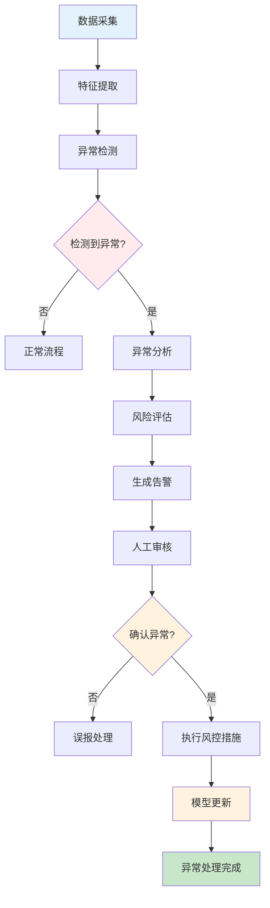
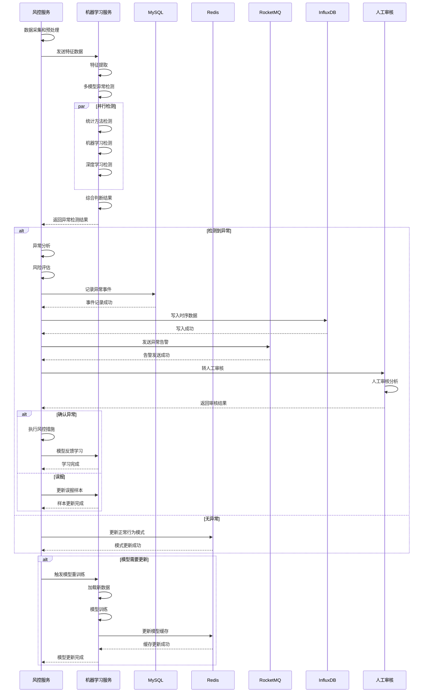
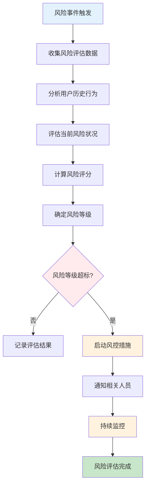
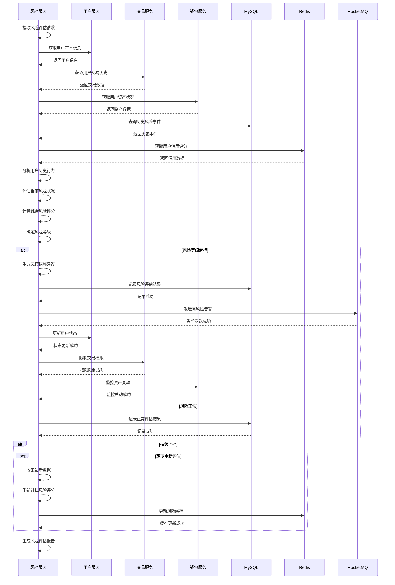
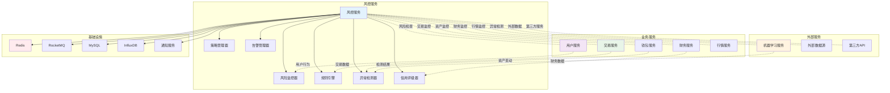

# 风控服务 (Risk Service) 技术设计文档

## 1. 服务概述

### 1.1 服务定位
风控服务是Web3 CEX系统的核心安全保障服务，负责实时风险监控、规则引擎执行、异常交易检测、安全策略管理等核心功能。作为系统的安全卫士，为整个交易平台提供全方位的风险防控和安全保障。

### 1.2 核心职责
- **风险监控**: 实时监控交易行为和资产变动
- **规则引擎**: 动态规则管理和执行
- **异常检测**: 识别异常交易模式和用户行为
- **安全策略**: 风险策略配置和管理
- **预警告警**: 实时风险预警和告警通知

### 1.3 服务指标
- **检测延迟**: < 100ms
- **准确率**: 99.5%
- **误报率**: < 1%
- **漏报率**: < 0.1%
- **可用性**: 99.99%

## 2. 技术架构

### 2.1 整体架构


### 2.2 技术栈
- **框架**: Spring Boot 3.2.x
- **规则引擎**: Drools
- **机器学习**: Python + Scikit-learn + TensorFlow
- **数据库**: MySQL 8.0 + MyBatis Plus
- **缓存**: Redis 7.x
- **时序数据库**: InfluxDB
- **消息队列**: RocketMQ 4.9.x
- **服务治理**: Nacos 2.2.x

### 2.3 依赖关系
```
risk-service
├── Nacos (服务注册发现)
├── Redis (缓存)
├── MySQL (数据存储)
├── InfluxDB (时序数据)
├── RocketMQ (消息队列)
├── user-service (用户行为)
├── trade-service (交易数据)
├── wallet-service (资产变动)
├── finance-service (财务数据)
└── ML Service (机器学习)
```

## 3. 数据模型设计

### 3.1 核心数据表

#### 3.1.1 风险规则表 (risk_rule)
```sql
CREATE TABLE `risk_rule` (
  `id` bigint(20) NOT NULL AUTO_INCREMENT COMMENT '规则ID',
  `rule_code` varchar(50) NOT NULL COMMENT '规则代码',
  `rule_name` varchar(100) NOT NULL COMMENT '规则名称',
  `rule_type` tinyint(1) NOT NULL COMMENT '规则类型 1-交易规则 2-资产规则 3-行为规则',
  `rule_category` varchar(50) NOT NULL COMMENT '规则分类',
  `rule_expression` text NOT NULL COMMENT '规则表达式',
  `rule_condition` text NOT NULL COMMENT '规则条件',
  `risk_level` tinyint(1) NOT NULL COMMENT '风险等级 1-低 2-中 3-高',
  `action_type` tinyint(1) NOT NULL COMMENT '动作类型 1-告警 2-限制 3-冻结',
  `threshold_value` decimal(20,8) DEFAULT NULL COMMENT '阈值',
  `time_window` int(11) DEFAULT NULL COMMENT '时间窗口(秒)',
  `status` tinyint(1) NOT NULL DEFAULT '1' COMMENT '状态 1-启用 2-禁用',
  `priority` int(11) NOT NULL DEFAULT '0' COMMENT '优先级',
  `description` varchar(500) DEFAULT NULL COMMENT '规则描述',
  `create_time` datetime NOT NULL DEFAULT CURRENT_TIMESTAMP COMMENT '创建时间',
  `update_time` datetime NOT NULL DEFAULT CURRENT_TIMESTAMP ON UPDATE CURRENT_TIMESTAMP COMMENT '更新时间',
  `create_by` varchar(32) DEFAULT NULL COMMENT '创建人',
  `update_by` varchar(32) DEFAULT NULL COMMENT '更新人',
  PRIMARY KEY (`id`),
  UNIQUE KEY `uk_rule_code` (`rule_code`),
  KEY `idx_rule_type` (`rule_type`),
  KEY `idx_rule_category` (`rule_category`),
  KEY `idx_risk_level` (`risk_level`),
  KEY `idx_status` (`status`),
  KEY `idx_priority` (`priority`)
) ENGINE=InnoDB DEFAULT CHARSET=utf8mb4 COMMENT='风险规则表';
```

#### 3.1.2 风险事件表 (risk_event)
```sql
CREATE TABLE `risk_event` (
  `id` bigint(20) NOT NULL AUTO_INCREMENT COMMENT '事件ID',
  `event_no` varchar(32) NOT NULL COMMENT '事件编号',
  `user_id` bigint(20) DEFAULT NULL COMMENT '用户ID',
  `event_type` tinyint(1) NOT NULL COMMENT '事件类型 1-交易 2-资产 3-行为',
  `event_source` varchar(50) NOT NULL COMMENT '事件来源',
  `event_content` text NOT NULL COMMENT '事件内容',
  `risk_score` decimal(10,6) NOT NULL DEFAULT '0.000000' COMMENT '风险评分',
  `risk_level` tinyint(1) NOT NULL COMMENT '风险等级 1-低 2-中 3-高',
  `rule_id` bigint(20) DEFAULT NULL COMMENT '触发规则ID',
  `rule_name` varchar(100) DEFAULT NULL COMMENT '触发规则名称',
  `action_taken` tinyint(1) NOT NULL DEFAULT '1' COMMENT '采取动作 1-告警 2-限制 3-冻结',
  `status` tinyint(1) NOT NULL DEFAULT '1' COMMENT '状态 1-待处理 2-处理中 3-已处理 4-已关闭',
  `ip_address` varchar(45) DEFAULT NULL COMMENT 'IP地址',
  `device_id` varchar(100) DEFAULT NULL COMMENT '设备ID',
  `location` varchar(100) DEFAULT NULL COMMENT '地理位置',
  `remark` varchar(500) DEFAULT NULL COMMENT '备注',
  `create_time` datetime NOT NULL DEFAULT CURRENT_TIMESTAMP COMMENT '创建时间',
  `update_time` datetime NOT NULL DEFAULT CURRENT_TIMESTAMP ON UPDATE CURRENT_TIMESTAMP COMMENT '更新时间',
  `process_time` datetime DEFAULT NULL COMMENT '处理时间',
  `process_user` varchar(32) DEFAULT NULL COMMENT '处理人',
  `process_result` varchar(500) DEFAULT NULL COMMENT '处理结果',
  PRIMARY KEY (`id`),
  UNIQUE KEY `uk_event_no` (`event_no`),
  KEY `idx_user_id` (`user_id`),
  KEY `idx_event_type` (`event_type`),
  KEY `idx_risk_level` (`risk_level`),
  KEY `idx_rule_id` (`rule_id`),
  KEY `idx_status` (`status`),
  KEY `idx_create_time` (`create_time`),
  KEY `idx_ip_address` (`ip_address`)
) ENGINE=InnoDB DEFAULT CHARSET=utf8mb4 COMMENT='风险事件表';
```

#### 3.1.3 用户信用表 (user_credit)
```sql
CREATE TABLE `user_credit` (
  `id` bigint(20) NOT NULL AUTO_INCREMENT COMMENT '信用ID',
  `user_id` bigint(20) NOT NULL COMMENT '用户ID',
  `credit_score` int(11) NOT NULL DEFAULT '500' COMMENT '信用评分 0-1000',
  `credit_level` varchar(10) NOT NULL DEFAULT 'C' COMMENT '信用等级 A-F',
  `total_events` int(11) NOT NULL DEFAULT '0' COMMENT '总事件数',
  `high_risk_events` int(11) NOT NULL DEFAULT '0' COMMENT '高风险事件数',
  `medium_risk_events` int(11) NOT NULL DEFAULT '0' COMMENT '中风险事件数',
  `low_risk_events` int(11) NOT NULL DEFAULT '0' COMMENT '低风险事件数',
  `last_event_time` datetime DEFAULT NULL COMMENT '最后事件时间',
  `last_update_time` datetime NOT NULL DEFAULT CURRENT_TIMESTAMP COMMENT '最后更新时间',
  `status` tinyint(1) NOT NULL DEFAULT '1' COMMENT '状态 1-正常 2-监控 3-限制',
  `remark` varchar(500) DEFAULT NULL COMMENT '备注',
  `create_time` datetime NOT NULL DEFAULT CURRENT_TIMESTAMP COMMENT '创建时间',
  `update_time` datetime NOT NULL DEFAULT CURRENT_TIMESTAMP ON UPDATE CURRENT_TIMESTAMP COMMENT '更新时间',
  PRIMARY KEY (`id`),
  UNIQUE KEY `uk_user_id` (`user_id`),
  KEY `idx_credit_score` (`credit_score`),
  KEY `idx_credit_level` (`credit_level`),
  KEY `idx_status` (`status`),
  KEY `idx_create_time` (`create_time`)
) ENGINE=InnoDB DEFAULT CHARSET=utf8mb4 COMMENT='用户信用表';
```

#### 3.1.4 风控策略表 (risk_policy)
```sql
CREATE TABLE `risk_policy` (
  `id` bigint(20) NOT NULL AUTO_INCREMENT COMMENT '策略ID',
  `policy_code` varchar(50) NOT NULL COMMENT '策略代码',
  `policy_name` varchar(100) NOT NULL COMMENT '策略名称',
  `policy_type` tinyint(1) NOT NULL COMMENT '策略类型 1-交易策略 2-资产策略 3-行为策略',
  `policy_content` text NOT NULL COMMENT '策略内容',
  `target_users` varchar(255) DEFAULT NULL COMMENT '目标用户',
  `effective_time` datetime NOT NULL COMMENT '生效时间',
  `expire_time` datetime DEFAULT NULL COMMENT '过期时间',
  `status` tinyint(1) NOT NULL DEFAULT '1' COMMENT '状态 1-启用 2-禁用',
  `priority` int(11) NOT NULL DEFAULT '0' COMMENT '优先级',
  `description` varchar(500) DEFAULT NULL COMMENT '策略描述',
  `create_time` datetime NOT NULL DEFAULT CURRENT_TIMESTAMP COMMENT '创建时间',
  `update_time` datetime NOT NULL DEFAULT CURRENT_TIMESTAMP ON UPDATE CURRENT_TIMESTAMP COMMENT '更新时间',
  `create_by` varchar(32) DEFAULT NULL COMMENT '创建人',
  `update_by` varchar(32) DEFAULT NULL COMMENT '更新人',
  PRIMARY KEY (`id`),
  UNIQUE KEY `uk_policy_code` (`policy_code`),
  KEY `idx_policy_type` (`policy_type`),
  KEY `idx_status` (`status`),
  KEY `idx_priority` (`priority`),
  KEY `idx_effective_time` (`effective_time`),
  KEY `idx_expire_time` (`expire_time`)
) ENGINE=InnoDB DEFAULT CHARSET=utf8mb4 COMMENT='风控策略表';
```

### 3.2 数据关系
```
risk_rule (1) ←→ (N) risk_event
user_info (1) ←→ (1) user_credit
user_info (1) ←→ (N) risk_event
risk_policy (1) ←→ (N) risk_rule
risk_event (1) ←→ (N) risk_action_log
```

## 4. 核心业务流程

### 4.1 风险监控流程

#### 4.1.1 流程图


#### 4.1.2 风险监控时序图


### 4.2 异常检测流程

#### 4.2.1 流程图


#### 4.2.2 异常检测时序图


### 4.3 风险评估流程

#### 4.3.1 流程图


#### 4.3.2 风险评估时序图


## 5. 风控规则设计

### 5.1 规则分类
- **交易规则**: 交易频率、金额、时间等规则
- **资产规则**: 资产变动、余额异常等规则
- **行为规则**: 登录行为、操作习惯等规则
- **安全规则**: 账户安全、权限控制等规则

### 5.2 规则示例
```java
// 交易频率规则
rule "High Frequency Trading"
    when
        $user: User()
        $trades: List(size > 10) from collect(Trade(user == $user, timestamp > [now-1h]))
    then
        riskResult.setRiskTriggered(true);
        riskResult.setRiskLevel("HIGH");
        riskResult.setActionType("LIMIT");
end

// 大额交易规则
rule "Large Amount Trading"
    when
        $trade: Trade(amount > 100000)
    then
        riskResult.setRiskTriggered(true);
        riskResult.setRiskLevel("MEDIUM");
        riskResult.setActionType("ALERT");
end

// 异常登录规则
rule "Abnormal Login"
    when
        $login: Login(isSuccess == true, location != "China")
    then
        riskResult.setRiskTriggered(true);
        riskResult.setRiskLevel("MEDIUM");
        riskResult.setActionType("ALERT");
end
```

### 5.3 动态规则管理
- **规则热加载**: 支持规则动态更新
- **版本控制**: 规则版本管理
- **A/B测试**: 规则A/B测试
- **效果评估**: 规则效果评估

## 6. 接口设计

### 6.1 核心接口清单

| 接口路径 | 方法 | 描述 | 权限要求 |
|---------|------|------|----------|
| `/api/v1/risk/check` | POST | 风险检查 | 内部调用 |
| `/api/v1/risk/rules` | GET | 获取风险规则 | 管理员 |
| `/api/v1/risk/rules` | POST | 创建风险规则 | 管理员 |
| `/api/v1/risk/rules/{ruleId}` | PUT | 更新风险规则 | 管理员 |
| `/api/v1/risk/events` | GET | 获取风险事件 | 管理员 |
| `/api/v1/risk/events/{eventId}` | PUT | 处理风险事件 | 管理员 |
| `/api/v1/risk/credit/{userId}` | GET | 获取用户信用 | 管理员 |

### 6.2 接口详细设计

#### 6.2.1 风险检查接口
```http
POST /api/v1/risk/check
Content-Type: application/json

请求参数：
{
  "user_id": 123456,
  "event_type": 1,
  "event_source": "trade-service",
  "event_content": {
    "symbol": "BTCUSDT",
    "amount": "1.0",
    "price": "50000.00"
  },
  "ip_address": "192.168.1.1",
  "device_id": "device_123"
}

响应结果：
{
  "code": 200,
  "message": "风险检查完成",
  "data": {
    "risk_score": 85.5,
    "risk_level": 2,
    "is_risk": true,
    "triggered_rules": [
      {
        "rule_id": 1,
        "rule_name": "大额交易规则",
        "risk_level": 2
      }
    ],
    "action": "ALERT",
    "message": "检测到大额交易，需要人工审核"
  }
}
```

#### 6.2.2 创建风险规则接口
```http
POST /api/v1/risk/rules
Authorization: Bearer {admin_token}
Content-Type: application/json

请求参数：
{
  "rule_code": "LARGE_TRADE_RULE",
  "rule_name": "大额交易规则",
  "rule_type": 1,
  "rule_category": "交易安全",
  "rule_expression": "trade.amount > 100000",
  "rule_condition": "user.credit_score > 700",
  "risk_level": 2,
  "action_type": 2,
  "threshold_value": "100000.00",
  "time_window": 3600,
  "status": 1,
  "priority": 1,
  "description": "大额交易监控规则"
}

响应结果：
{
  "code": 200,
  "message": "规则创建成功",
  "data": {
    "rule_id": 123,
    "rule_code": "LARGE_TRADE_RULE",
    "status": 1,
    "create_time": "2024-01-01T00:00:00Z"
  }
}
```

#### 6.2.3 获取风险事件接口
```http
GET /api/v1/risk/events
Authorization: Bearer {admin_token}
Query Parameters:
- user_id: 用户ID (可选)
- event_type: 事件类型 (可选)
- risk_level: 风险等级 (可选)
- status: 状态 (可选)
- start_time: 开始时间 (可选)
- end_time: 结束时间 (可选)
- page: 页码 (默认1)
- size: 页大小 (默认20)

响应结果：
{
  "code": 200,
  "message": "成功",
  "data": {
    "total": 100,
    "page": 1,
    "size": 20,
    "events": [
      {
        "event_id": 123456,
        "event_no": "RE20240101001",
        "user_id": 789,
        "event_type": 1,
        "event_source": "trade-service",
        "risk_score": 85.5,
        "risk_level": 2,
        "rule_name": "大额交易规则",
        "action_taken": 2,
        "status": 1,
        "ip_address": "192.168.1.1",
        "create_time": "2024-01-01T00:00:00Z"
      }
    ]
  }
}
```

## 7. 缓存设计

### 7.1 缓存策略
- **规则缓存**: 缓存风险规则，TTL 5分钟
- **信用缓存**: 缓存用户信用，TTL 10分钟
- **策略缓存**: 缓存风控策略，TTL 30分钟
- **模型缓存**: 缓存机器学习模型，TTL 1小时

### 7.2 缓存键设计
```
risk:rules:{rule_type}            - 风险规则
risk:credit:{user_id}             - 用户信用
risk:policy:{policy_type}         - 风控策略
risk:model:{model_name}           - 机器学习模型
risk:stats:{date}                 - 风险统计
risk:blacklist:{type}              - 黑名单数据
```

### 7.3 缓存更新策略
- **主动更新**: 规则变更时主动更新
- **定时更新**: 定时任务更新统计数据
- **被动失效**: 缓存过期自动失效

## 8. 消息队列设计

### 8.1 消息Topic
- **risk-topic**: 风控相关消息
- **alert-topic**: 告警相关消息
- **audit-topic**: 审计相关消息

### 8.2 消息类型
- **风险事件消息**: 新风险事件时发送
- **规则更新消息**: 规则更新时发送
- **告警消息**: 风险告警时发送
- **审计消息**: 风控审计时发送

### 8.3 消息格式
```json
{
  "header": {
    "message_id": "msg_123456789",
    "topic": "risk-topic",
    "tags": "RISK_EVENT",
    "keys": "risk_123",
    "timestamp": 1640995200000,
    "producer_group": "risk-service-producer"
  },
  "body": {
    "event_id": 123,
    "event_no": "RE20240101001",
    "user_id": 456,
    "event_type": 1,
    "risk_score": 85.5,
    "risk_level": 2,
    "rule_name": "大额交易规则",
    "action_taken": 2,
    "create_time": 1640995200000
  }
}
```

## 9. 监控设计

### 9.1 业务监控
- **风险事件监控**: 风险事件数量和类型监控
- **规则执行监控**: 规则执行效率监控
- **告警响应监控**: 告警响应时间监控
- **信用评分监控**: 用户信用评分变化监控

### 9.2 技术监控
- **规则引擎监控**: 规则引擎性能监控
- **机器学习监控**: 模型预测准确性监控
- **系统性能监控**: 风控服务性能监控
- **数据质量监控**: 数据准确性监控

### 9.3 告警规则
- **规则异常**: 规则执行失败率超过5%
- **风险事件**: 高风险事件数量激增
- **系统异常**: 风控服务异常
- **模型异常**: 机器学习模型异常
- **数据异常**: 数据质量问题

## 10. 机器学习设计

### 10.1 特征工程
- **用户特征**: 交易频率、金额、时间等
- **行为特征**: 登录频率、IP变化、设备变化等
- **资产特征**: 余额变化、资金流向等
- **时间特征**: 交易时间、频率等

### 10.2 模型选择
- **异常检测**: Isolation Forest, One-Class SVM
- **风险评分**: Random Forest, XGBoost
- **行为分析**: LSTM, Autoencoder
- **实时预测**: Online Learning

### 10.3 模型管理
- **版本控制**: 模型版本管理
- **性能监控**: 模型性能监控
- **自动更新**: 模型自动更新
- **A/B测试**: 模型A/B测试

## 11. 系统交互流程图

### 11.1 风控服务与其他服务交互图


### 11.2 完整风控生命周期流程图
```mermaid
graph TD
    A[数据采集触发] --> B{数据来源?}
    B -->|用户行为| C[用户行为分析]
    B -->|交易数据| D[交易行为监控]
    B -->|资产变动| E[资产异常检测]
    B -->|系统事件| F[系统安全监控]

    C --> G[特征提取]
    D --> G
    E --> G
    F --> G

    G --> H[规则引擎执行]
    H --> I{触发规则?}
    I -->|是| J[风险评估]
    I -->|否| K[正常处理]

    J --> L[计算风险评分]
    L --> M[确定风险等级]
    M --> N{风险等级?}

    N -->|低风险| O[记录并监控]
    N -->|中风险| P[告警通知]
    N -->|高风险| Q[立即干预]

    O --> R[更新用户信用]
    P --> S[发送预警通知]
    Q --> T[执行风控措施]

    R --> U{是否需要持续监控?}
    S --> U
    T --> U

    U -->|是| V[持续监控]
    U -->|否| W[处理完成]

    V --> X[定期重新评估]
    X --> Y{风险状况改善?}
    Y -->|是| W
    Y -->|否| Z[升级处理措施]
    Z --> AA[人工介入]
    AA --> AB[人工审核决策]
    AB --> AC{解除限制?}
    AC -->|是| W
    AC -->|否| V

    alt 异常检测
        G --> AD[机器学习异常检测]
        AD --> AE{检测到异常?}
        AE -->|是| AF[异常分析]
        AE -->|否| H
        AF --> AG[生成异常报告]
        AG --> J
    end

    alt 模型学习
        AB --> AH[反馈学习]
        AH --> AI[更新模型]
        AI --> AJ[优化规则]
        AJ --> H
    end

    style A fill:#e3f2fd
    style W fill:#c8e6c9
    style I fill:#ffebee
    style N fill:#fff3e0
    style U fill:#f3e5f5
    style AC fill:#fff3e0
```

### 11.3 实时风控监控流程图
```mermaid
graph TD
    A[实时数据流] --> B[数据接收队列]
    B --> C[数据预处理]
    C --> D[实时特征计算]
    D --> E[并行风控检查]

    E --> F[规则引擎检查]
    E --> G[异常模型检查]
    E --> H[黑名单检查]
    E --> I[行为模式检查]

    F --> J{规则触发?}
    G --> K{异常检测?}
    H --> L{黑名单命中?}
    I --> M{行为异常?}

    J -->|是| N[风险事件生成]
    K -->|是| N
    L -->|是| N
    M -->|是| N

    J -->|否| O[正常放行]
    K -->|否| O
    L -->|否| O
    M -->|否| O

    N --> P[风险评估]
    P --> Q[风险等级判定]
    Q --> R{风险等级}

    R -->|低| S[记录并观察]
    R -->|中| T[告警并限制]
    R -->|高| U[阻断并冻结]

    S --> V[写入风控日志]
    T --> V
    U --> V

    V --> W[实时监控面板]
    W --> X[运营人员通知]
    X --> Y[人工审核处理]
    Y --> Z[处理结果反馈]

    alt 高频监控
        loop 毫秒级监控
            A --> B
            C --> D
        end
    end

    style A fill:#e3f2fd
    style Z fill:#c8e6c9
    style J fill:#ffebee
    style R fill:#fff3e0
    style U fill:#ffcdd2
```

通过以上详细设计，风控服务为整个CEX系统提供了全方位的安全保障和风险防控能力。