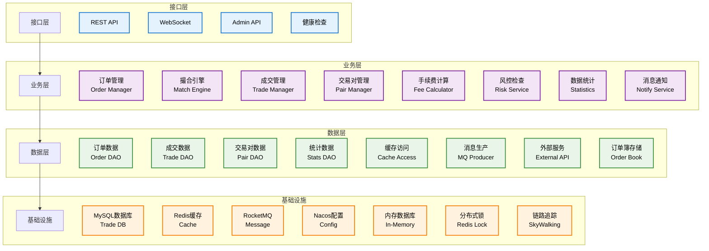
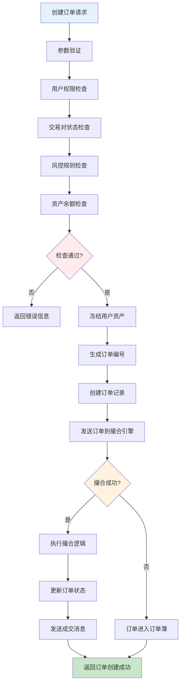
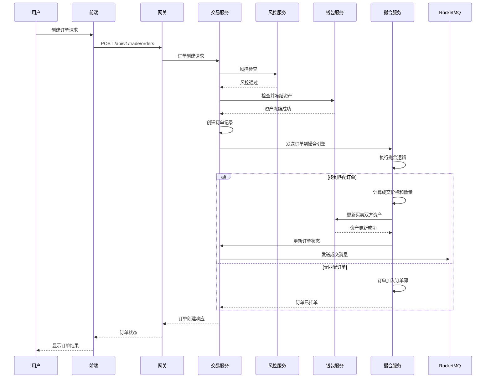
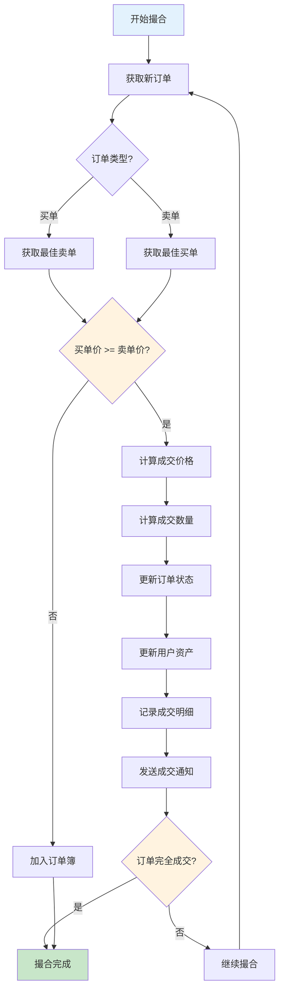
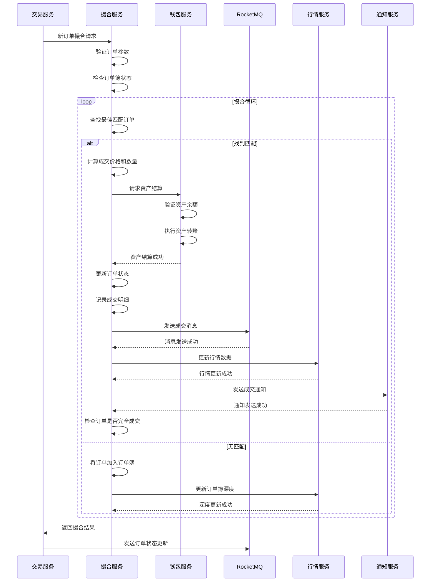
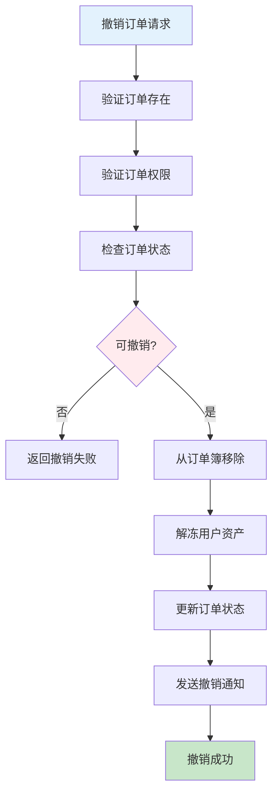
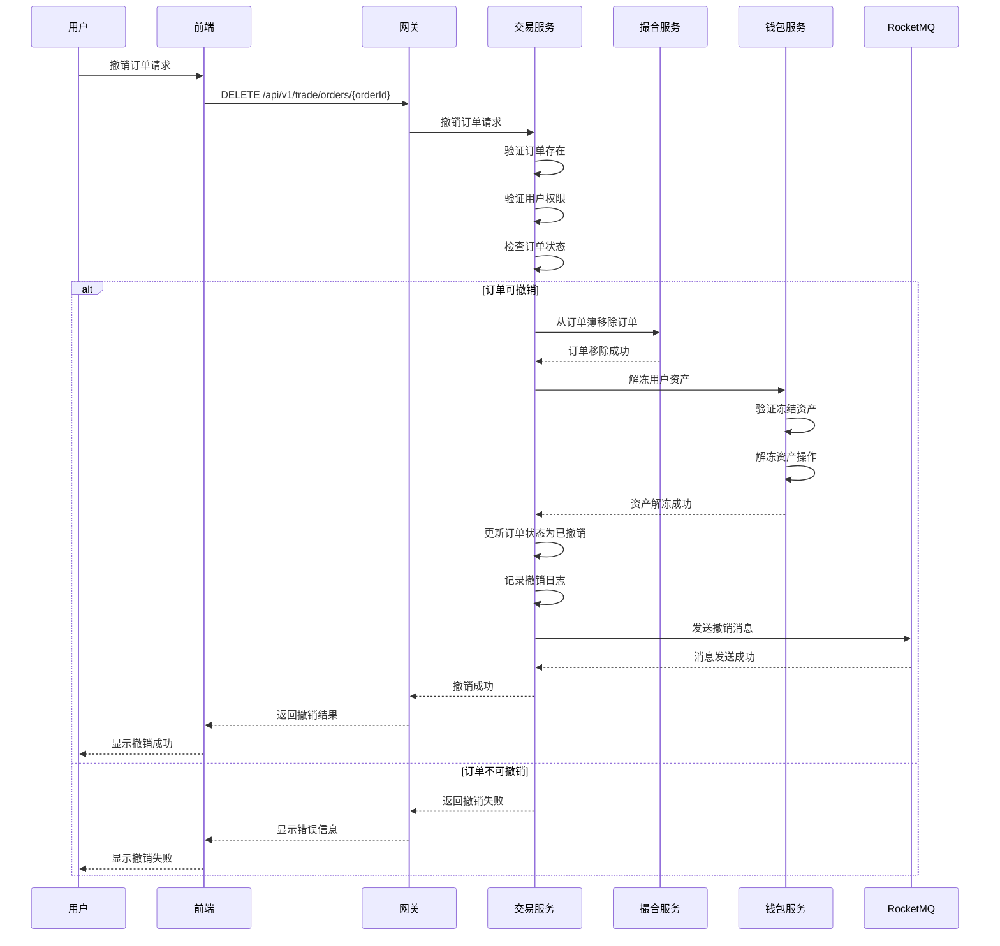
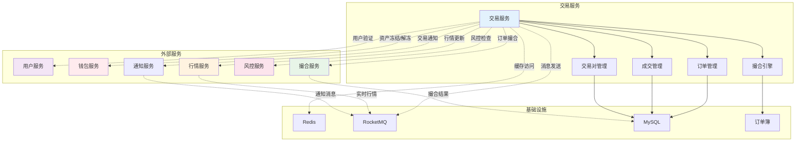
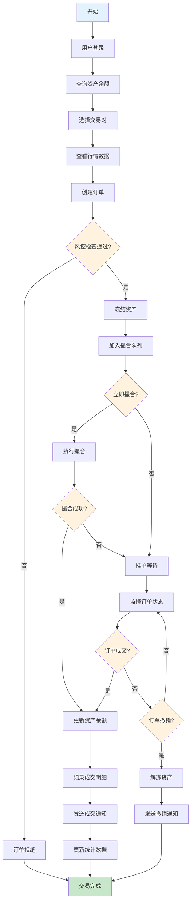

# 交易服务 (Trade Service) 技术设计文档

## 1. 服务概述

### 1.1 服务定位
交易服务是Web3 CEX系统的核心业务服务，负责数字资产交易的全流程管理，包括订单管理、交易撮合、成交处理、手续费计算等核心功能。作为系统的交易引擎，为用户提供高效、稳定、安全的交易体验。

### 1.2 核心职责
- **订单管理**: 订单创建、查询、修改、撤销
- **交易撮合**: 订单匹配、价格计算、成交执行
- **成交管理**: 成交记录、手续费计算、资产结算
- **交易对管理**: 交易对配置、状态管理、参数设置
- **风控检查**: 交易风控、限额管理、异常监控

### 1.3 服务指标
- **可用性**: 99.95%
- **订单处理延迟**: < 100ms
- **撮合性能**: 50,000+ TPS
- **数据一致性**: 强一致性保证

## 2. 技术架构

### 2.1 整体架构


### 2.2 技术栈
- **框架**: Spring Boot 3.2.x
- **数据库**: MySQL 8.0 + MyBatis Plus
- **缓存**: Redis 7.x (集群模式)
- **消息队列**: RocketMQ 4.9.x
- **内存计算**: 自研内存订单簿
- **服务治理**: Nacos 2.2.x
- **监控**: Micrometer + Prometheus
- **分布式锁**: Redisson

### 2.3 依赖关系
```
trade-service
├── Nacos (服务注册发现)
├── Redis (缓存 + 分布式锁)
├── MySQL (数据存储)
├── RocketMQ (消息队列)
├── user-service (用户验证)
├── wallet-service (资产操作)
├── match-service (撮合引擎)
├── market-service (行情数据)
└── risk-service (风控检查)
```

## 3. 数据模型设计

### 3.1 核心数据表

#### 3.1.1 交易对配置表 (trade_pair)
```sql
CREATE TABLE `trade_pair` (
  `id` bigint(20) NOT NULL AUTO_INCREMENT COMMENT '交易对ID',
  `symbol` varchar(20) NOT NULL COMMENT '交易对符号',
  `base_coin` varchar(32) NOT NULL COMMENT '基础币种',
  `quote_coin` varchar(32) NOT NULL COMMENT '计价币种',
  `pair_name` varchar(50) NOT NULL COMMENT '交易对名称',
  `status` tinyint(1) NOT NULL DEFAULT '1' COMMENT '状态 1-正常 2-暂停',
  `price_precision` int(11) NOT NULL DEFAULT '8' COMMENT '价格精度',
  `amount_precision` int(11) NOT NULL DEFAULT '8' COMMENT '数量精度',
  `min_amount` decimal(20,8) NOT NULL DEFAULT '0.00000001' COMMENT '最小数量',
  `max_amount` decimal(20,8) NOT NULL DEFAULT '1000000.00000000' COMMENT '最大数量',
  `min_price` decimal(20,8) NOT NULL DEFAULT '0.00000001' COMMENT '最小价格',
  `max_price` decimal(20,8) NOT NULL DEFAULT '1000000.00000000' COMMENT '最大价格',
  `fee_rate` decimal(10,6) NOT NULL DEFAULT '0.001000' COMMENT '手续费率',
  `maker_fee_rate` decimal(10,6) NOT NULL DEFAULT '0.001000' COMMENT 'Maker手续费率',
  `taker_fee_rate` decimal(10,6) NOT NULL DEFAULT '0.001000' COMMENT 'Taker手续费率',
  `sort_order` int(11) NOT NULL DEFAULT '0' COMMENT '排序',
  `create_time` datetime NOT NULL DEFAULT CURRENT_TIMESTAMP COMMENT '创建时间',
  `update_time` datetime NOT NULL DEFAULT CURRENT_TIMESTAMP ON UPDATE CURRENT_TIMESTAMP COMMENT '更新时间',
  PRIMARY KEY (`id`),
  UNIQUE KEY `uk_symbol` (`symbol`),
  KEY `idx_status` (`status`),
  KEY `idx_base_coin` (`base_coin`),
  KEY `idx_quote_coin` (`quote_coin`),
  KEY `idx_sort_order` (`sort_order`)
) ENGINE=InnoDB DEFAULT CHARSET=utf8mb4 COMMENT='交易对配置表';
```

#### 3.1.2 订单表 (trade_order)
```sql
CREATE TABLE `trade_order` (
  `id` bigint(20) NOT NULL AUTO_INCREMENT COMMENT '订单ID',
  `order_no` varchar(32) NOT NULL COMMENT '订单编号',
  `user_id` bigint(20) NOT NULL COMMENT '用户ID',
  `symbol` varchar(20) NOT NULL COMMENT '交易对',
  `order_type` tinyint(1) NOT NULL COMMENT '订单类型 1-限价单 2-市价单',
  `direction` tinyint(1) NOT NULL COMMENT '买卖方向 1-买入 2-卖出',
  `price` decimal(20,8) NOT NULL COMMENT '价格',
  `amount` decimal(20,8) NOT NULL COMMENT '数量',
  `executed_amount` decimal(20,8) NOT NULL DEFAULT '0.00000000' COMMENT '已成交数量',
  `executed_value` decimal(20,8) NOT NULL DEFAULT '0.00000000' COMMENT '已成交金额',
  `fee` decimal(20,8) NOT NULL DEFAULT '0.00000000' COMMENT '手续费',
  `status` tinyint(1) NOT NULL DEFAULT '1' COMMENT '状态 1-待成交 2-部分成交 3-完全成交 4-已取消',
  `time_in_force` tinyint(1) NOT NULL DEFAULT '1' COMMENT '时效类型 1-GTC 2-IOC 3-FOK',
  `source` tinyint(1) NOT NULL DEFAULT '1' COMMENT '来源 1-Web 2-API 3-App',
  `create_time` datetime NOT NULL DEFAULT CURRENT_TIMESTAMP COMMENT '创建时间',
  `update_time` datetime NOT NULL DEFAULT CURRENT_TIMESTAMP ON UPDATE CURRENT_TIMESTAMP COMMENT '更新时间',
  `cancel_time` datetime DEFAULT NULL COMMENT '取消时间',
  `expire_time` datetime DEFAULT NULL COMMENT '过期时间',
  PRIMARY KEY (`id`),
  UNIQUE KEY `uk_order_no` (`order_no`),
  KEY `idx_user_id` (`user_id`),
  KEY `idx_symbol` (`symbol`),
  KEY `idx_status` (`status`),
  KEY `idx_order_type` (`order_type`),
  KEY `idx_direction` (`direction`),
  KEY `idx_create_time` (`create_time`),
  KEY `idx_price` (`price`),
  KEY `idx_expire_time` (`expire_time`)
) ENGINE=InnoDB DEFAULT CHARSET=utf8mb4 COMMENT='订单表';
```

#### 3.1.3 成交明细表 (trade_detail)
```sql
CREATE TABLE `trade_detail` (
  `id` bigint(20) NOT NULL AUTO_INCREMENT COMMENT '成交ID',
  `trade_no` varchar(32) NOT NULL COMMENT '成交编号',
  `symbol` varchar(20) NOT NULL COMMENT '交易对',
  `maker_order_id` bigint(20) NOT NULL COMMENT 'Maker订单ID',
  `taker_order_id` bigint(20) NOT NULL COMMENT 'Taker订单ID',
  `maker_user_id` bigint(20) NOT NULL COMMENT 'Maker用户ID',
  `taker_user_id` bigint(20) NOT NULL COMMENT 'Taker用户ID',
  `price` decimal(20,8) NOT NULL COMMENT '成交价格',
  `amount` decimal(20,8) NOT NULL COMMENT '成交数量',
  `value` decimal(20,8) NOT NULL COMMENT '成交金额',
  `maker_fee` decimal(20,8) NOT NULL DEFAULT '0.00000000' COMMENT 'Maker手续费',
  `taker_fee` decimal(20,8) NOT NULL DEFAULT '0.00000000' COMMENT 'Taker手续费',
  `create_time` datetime NOT NULL DEFAULT CURRENT_TIMESTAMP COMMENT '成交时间',
  PRIMARY KEY (`id`),
  UNIQUE KEY `uk_trade_no` (`trade_no`),
  KEY `idx_symbol` (`symbol`),
  KEY `idx_maker_order_id` (`maker_order_id`),
  KEY `idx_taker_order_id` (`taker_order_id`),
  KEY `idx_maker_user_id` (`maker_user_id`),
  KEY `idx_taker_user_id` (`taker_user_id`),
  KEY `idx_create_time` (`create_time`),
  KEY `idx_price` (`price`)
) ENGINE=InnoDB DEFAULT CHARSET=utf8mb4 COMMENT='成交明细表';
```

### 3.2 内存订单簿结构
```java
// 内存订单簿数据结构
class OrderBook {
    private String symbol;                    // 交易对
    private TreeMap<BigDecimal, List<Order>> bids;  // 买单队列 (价格降序)
    private TreeMap<BigDecimal, List<Order>> asks;  // 卖单队列 (价格升序)
    private ConcurrentHashMap<Long, Order> orders;    // 所有订单
    private AtomicLong tradeIdGenerator;        // 成交ID生成器

    // 核心方法
    public void addOrder(Order order);         // 添加订单
    public void cancelOrder(long orderId);      // 撤销订单
    public MatchResult matchOrder(Order order); // 撮合订单
    public List<Trade> getTrades();            // 获取成交记录
}
```

## 4. 核心业务流程

### 4.1 订单创建流程

#### 4.1.1 流程图


#### 4.1.2 时序图


### 4.2 订单撮合流程

#### 4.2.1 撮合算法
```
撮合原则：价格优先、时间优先

买入订单：按价格降序排列，价格相同按时间升序排列
卖出订单：按价格升序排列，价格相同按时间升序排列

撮合条件：
1. 买入价 >= 卖出价
2. 数量充足
3. 订单状态正常

撮合逻辑：
1. 取最佳买入订单和最佳卖出订单
2. 如果买入价 >= 卖出价，进行撮合
3. 撮合价格 = Min(买入价, 卖出价)
4. 撮合数量 = Min(买入数量, 卖出数量)
5. 更新订单状态和资产
6. 记录成交明细
7. 继续撮合剩余数量
```

#### 4.2.2 流程图


#### 4.2.3 撮合引擎详细时序图


### 4.3 订单撤销流程

#### 4.3.1 流程图


#### 4.3.2 订单撤销时序图


### 4.4 系统交互流程图

#### 4.4.1 交易服务与其他服务交互图


#### 4.4.2 完整交易生命周期流程图


## 5. 撮合引擎设计

### 5.1 内存订单簿
- **数据结构**: 使用TreeMap维护价格队列
- **并发控制**: 使用读写锁保证并发安全
- **性能优化**: 分片存储减少锁竞争
- **持久化**: 定期持久化到数据库

### 5.2 撮合算法
```java
public class MatchEngine {
    private OrderBook orderBook;
    private TradeService tradeService;
    private WalletService walletService;

    public MatchResult matchOrder(Order order) {
        MatchResult result = new MatchResult();
        List<Order> matchedOrders = new ArrayList<>();

        while (order.getRemainingAmount().compareTo(BigDecimal.ZERO) > 0) {
            Order matchedOrder = findBestMatch(order);
            if (matchedOrder == null) {
                break; // 没有匹配订单
            }

            // 计算成交价格和数量
            BigDecimal tradePrice = calculateTradePrice(order, matchedOrder);
            BigDecimal tradeAmount = calculateTradeAmount(order, matchedOrder);

            // 执行成交
            executeTrade(order, matchedOrder, tradePrice, tradeAmount);

            // 记录成交
            matchedOrders.add(matchedOrder);
        }

        result.setMatchedOrders(matchedOrders);
        result.setSuccess(true);
        return result;
    }
}
```

### 5.3 性能优化
- **内存计算**: 全程内存计算，避免磁盘IO
- **无锁设计**: 使用CAS操作减少锁竞争
- **批量处理**: 批量处理多个订单
- **异步通知**: 异步发送通知消息

## 6. 接口设计

### 6.1 核心接口清单

| 接口路径 | 方法 | 描述 | 权限要求 |
|---------|------|------|----------|
| `/api/v1/trade/pairs` | GET | 获取交易对列表 | 公开 |
| `/api/v1/trade/pairs/{symbol}` | GET | 获取交易对详情 | 公开 |
| `/api/v1/trade/orders` | POST | 创建订单 | 需要登录 |
| `/api/v1/trade/orders` | GET | 获取订单列表 | 需要登录 |
| `/api/v1/trade/orders/{orderId}` | GET | 获取订单详情 | 需要登录 |
| `/api/v1/trade/orders/{orderId}` | DELETE | 撤销订单 | 需要登录 |
| `/api/v1/trade/open-orders` | GET | 获取当前委托 | 需要登录 |
| `/api/v1/trade/history-orders` | GET | 获取历史订单 | 需要登录 |
| `/api/v1/trade/trades` | GET | 获取成交记录 | 需要登录 |

### 6.2 接口详细设计

#### 6.2.1 创建订单接口
```http
POST /api/v1/trade/orders
Authorization: Bearer {token}
Content-Type: application/json

请求参数：
{
  "symbol": "BTCUSDT",           // 交易对
  "order_type": 1,               // 订单类型 1-限价单 2-市价单
  "direction": 1,               // 买卖方向 1-买入 2-卖出
  "price": "50000.00",           // 价格（限价单必需）
  "amount": "0.001",            // 数量
  "time_in_force": 1            // 时效类型 1-GTC 2-IOC 3-FOK
}

响应结果：
{
  "code": 200,
  "message": "订单创建成功",
  "data": {
    "order_id": 123456,
    "order_no": "ORD20240101001",
    "symbol": "BTCUSDT",
    "order_type": 1,
    "direction": 1,
    "price": "50000.00",
    "amount": "0.001",
    "executed_amount": "0.00000000",
    "status": 1,
    "create_time": "2024-01-01T00:00:00Z"
  }
}
```

#### 6.2.2 获取订单列表接口
```http
GET /api/v1/trade/orders
Authorization: Bearer {token}
Query Parameters:
- symbol: 交易对 (可选)
- status: 订单状态 (可选)
- start_time: 开始时间 (可选)
- end_time: 结束时间 (可选)
- page: 页码 (默认1)
- size: 页大小 (默认20)

响应结果：
{
  "code": 200,
  "message": "成功",
  "data": {
    "total": 100,
    "page": 1,
    "size": 20,
    "orders": [
      {
        "order_id": 123456,
        "order_no": "ORD20240101001",
        "symbol": "BTCUSDT",
        "order_type": 1,
        "direction": 1,
        "price": "50000.00",
        "amount": "0.001",
        "executed_amount": "0.00050000",
        "executed_value": "25.00000000",
        "fee": "0.00100000",
        "status": 2,
        "create_time": "2024-01-01T00:00:00Z",
        "update_time": "2024-01-01T00:01:00Z"
      }
    ]
  }
}
```

## 7. 消息队列设计

### 7.1 消息Topic
- **order-topic**: 订单相关消息
- **trade-topic**: 交易相关消息
- **match-topic**: 撮合相关消息

### 7.2 消息类型
- **订单创建消息**: 新订单创建时发送
- **订单成交消息**: 订单成交时发送
- **订单撤销消息**: 订单撤销时发送
- **撮合结果消息**: 撮合结果发送

### 7.3 消息格式
```json
{
  "header": {
    "message_id": "msg_123456789",
    "topic": "order-topic",
    "tags": "ORDER_CREATE",
    "keys": "order_123",
    "timestamp": 1640995200000,
    "producer_group": "trade-service-producer"
  },
  "body": {
    "order_id": 123,
    "order_no": "ORD20240101001",
    "user_id": 456,
    "symbol": "BTCUSDT",
    "order_type": 1,
    "direction": 1,
    "price": "50000.00",
    "amount": "0.001",
    "status": 1
  }
}
```

## 8. 缓存设计

### 8.1 缓存策略
- **交易对缓存**: 缓存交易对配置，TTL 1小时
- **订单簿缓存**: 缓存订单簿状态，实时更新
- **用户订单缓存**: 缓存用户订单，TTL 5分钟
- **行情数据缓存**: 缓存行情数据，TTL 1秒

### 8.2 缓存键设计
```
trade:pair:{symbol}           - 交易对配置
trade:orderbook:{symbol}      - 订单簿数据
trade:user:orders:{user_id}   - 用户订单
trade:market:{symbol}         - 行情数据
trade:stats:{symbol}          - 统计数据
trade:config:fee_rates        - 手续费率配置
```

## 9. 风控设计

### 9.1 风控规则
- **交易限额**: 单笔交易限额、日累计限额
- **频率限制**: 订单创建频率限制
- **价格限制**: 价格偏离限制
- **异常监控**: 异常交易行为监控

### 9.2 风控检查流程
```java
public class RiskService {
    public boolean checkTradeRisk(TradeRequest request) {
        // 检查用户状态
        if (!checkUserStatus(request.getUserId())) {
            return false;
        }

        // 检查交易限额
        if (!checkTradeLimit(request)) {
            return false;
        }

        // 检查频率限制
        if (!checkFrequencyLimit(request)) {
            return false;
        }

        // 检查价格限制
        if (!checkPriceLimit(request)) {
            return false;
        }

        return true;
    }
}
```

## 10. 监控设计

### 10.1 业务监控
- **订单量**: 订单创建量统计
- **成交量**: 成交量统计
- **撮合率**: 订单撮合率监控
- **手续费收入**: 手续费收入统计

### 10.2 技术监控
- **撮合延迟**: 撮合处理延迟监控
- **订单簿深度**: 订单簿深度监控
- **系统负载**: 系统负载监控
- **错误率**: 错误率监控

### 10.3 告警规则
- **撮合延迟**: 超过100ms告警
- **订单积压**: 订单积压超过1000个告警
- **系统异常**: 错误率超过1%告警
- **资产异常**: 资产不一致告警

## 11. 性能优化

### 11.1 内存优化
- **对象池**: 使用对象池减少GC压力
- **内存管理**: 合理管理内存使用
- **数据压缩**: 压缩历史数据减少内存占用

### 11.2 并发优化
- **无锁设计**: 使用CAS操作减少锁竞争
- **分片处理**: 分片处理提高并发能力
- **异步处理**: 异步处理非关键路径

### 11.3 数据库优化
- **读写分离**: 主库写入，从库读取
- **分库分表**: 按时间或用户ID分表
- **索引优化**: 合理设计索引

## 12. 扩展设计

### 12.1 水平扩展
- **撮合引擎分片**: 按交易对分片
- **服务集群**: 多实例部署
- **数据分片**: 数据水平分片

### 12.2 功能扩展
- **订单类型**: 支持更多订单类型
- **交易策略**: 支持策略交易
- **量化交易**: 支持量化交易接口

通过以上详细设计，交易服务为整个CEX系统提供了高效、稳定、安全的交易引擎。