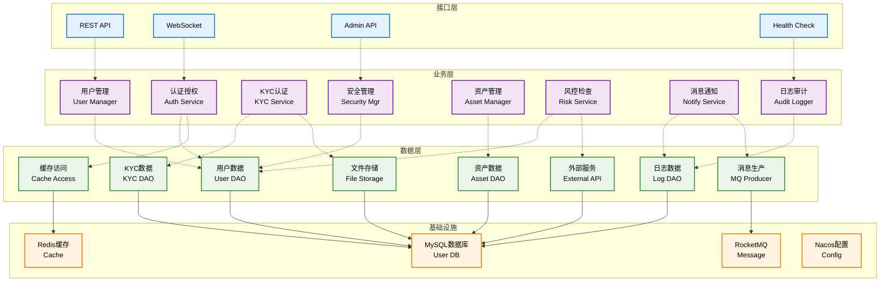
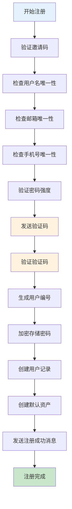
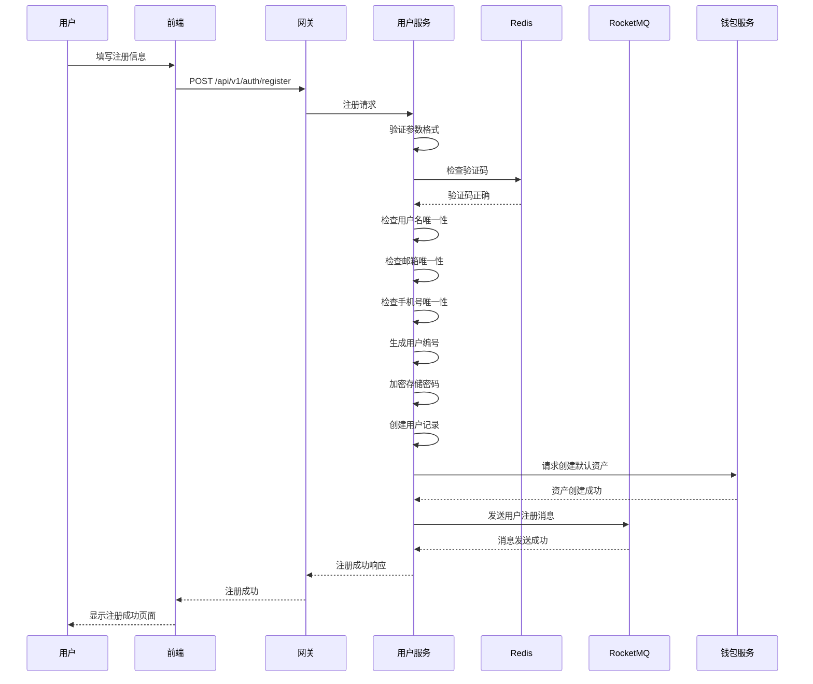
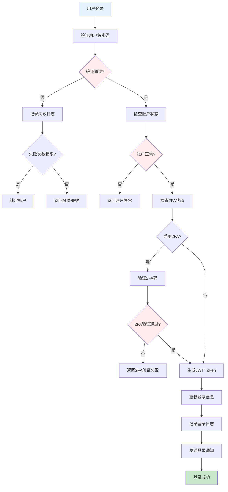
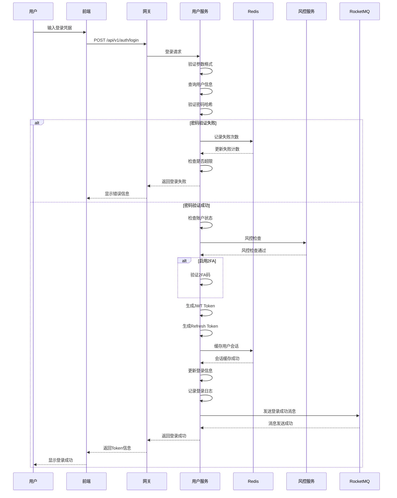
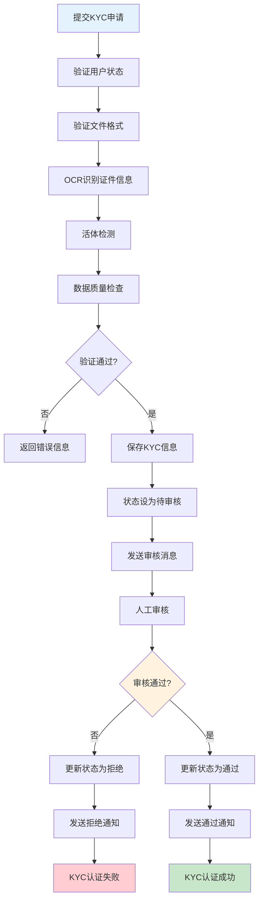
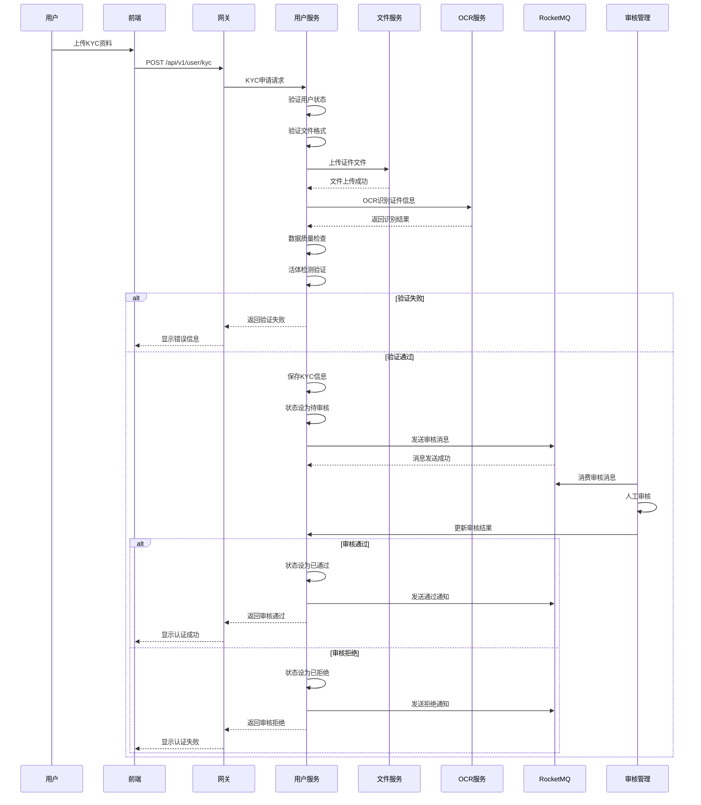
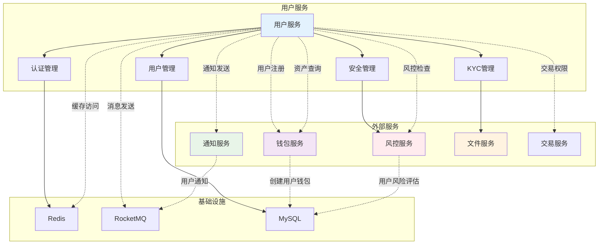
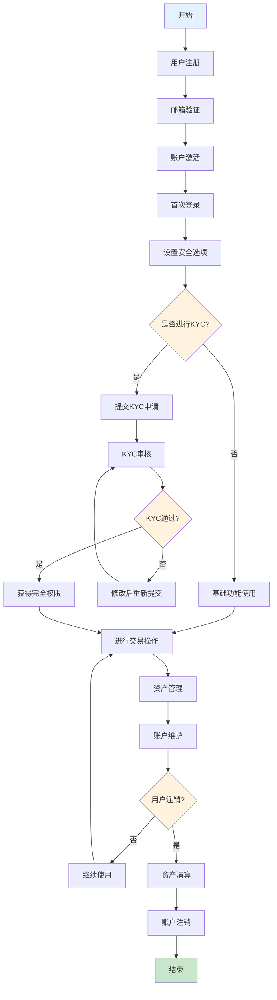

# 用户服务 (User Service) 技术设计文档

## 1. 服务概述

### 1.1 服务定位
用户服务是Web3 CEX系统的核心基础服务，负责用户全生命周期管理，包括用户注册、认证授权、KYC认证、安全设置等核心功能。作为系统的入口服务，为其他所有业务服务提供用户身份验证和权限管理。

### 1.2 核心职责
- **用户管理**: 用户注册、信息维护、状态管理
- **认证授权**: 登录认证、权限控制、会话管理
- **KYC认证**: 身份验证、证件审核、合规管理
- **安全管理**: 密码管理、2FA认证、安全设置
- **资产管理**: 资产查询、余额管理、基础统计

### 1.3 服务指标
- **可用性**: 99.9%
- **响应时间**: < 200ms
- **并发能力**: 支持5,000+并发用户
- **数据一致性**: 强一致性保证

## 2. 技术架构

### 2.1 整体架构


### 2.2 技术栈
- **框架**: Spring Boot 3.2.x
- **安全**: Spring Security 6.x + JWT
- **数据库**: MySQL 8.0 + MyBatis Plus
- **缓存**: Redis 7.x
- **消息队列**: RocketMQ 4.9.x
- **服务治理**: Nacos 2.2.x
- **监控**: Micrometer + Prometheus
- **日志**: Logback + ELK

### 2.3 依赖关系
```
user-service
├── Nacos (服务注册发现)
├── Redis (缓存)
├── MySQL (数据存储)
├── RocketMQ (消息队列)
├── wallet-service (资产查询)
├── risk-service (风控检查)
└── notify-service (消息通知)
```

## 3. 数据模型设计

### 3.1 核心数据表

#### 3.1.1 用户基本信息表 (user_info)
```sql
CREATE TABLE `user_info` (
  `id` bigint(20) NOT NULL AUTO_INCREMENT COMMENT '用户ID',
  `user_no` varchar(32) NOT NULL COMMENT '用户编号',
  `username` varchar(50) NOT NULL COMMENT '用户名',
  `email` varchar(100) NOT NULL COMMENT '邮箱',
  `phone` varchar(20) NOT NULL COMMENT '手机号',
  `password_hash` varchar(255) NOT NULL COMMENT '密码哈希',
  `salt` varchar(32) NOT NULL COMMENT '密码盐值',
  `nickname` varchar(50) DEFAULT NULL COMMENT '昵称',
  `avatar` varchar(255) DEFAULT NULL COMMENT '头像URL',
  `country` varchar(50) DEFAULT NULL COMMENT '国家',
  `language` varchar(10) DEFAULT 'zh-CN' COMMENT '语言',
  `timezone` varchar(50) DEFAULT 'Asia/Shanghai' COMMENT '时区',
  `status` tinyint(1) NOT NULL DEFAULT '1' COMMENT '状态 1-正常 2-冻结 3-注销',
  `kyc_status` tinyint(1) NOT NULL DEFAULT '0' COMMENT 'KYC状态 0-未认证 1-已认证',
  `register_time` datetime NOT NULL COMMENT '注册时间',
  `last_login_time` datetime DEFAULT NULL COMMENT '最后登录时间',
  `last_login_ip` varchar(45) DEFAULT NULL COMMENT '最后登录IP',
  `google_auth_secret` varchar(32) DEFAULT NULL COMMENT 'Google认证密钥',
  `google_auth_enabled` tinyint(1) NOT NULL DEFAULT '0' COMMENT 'Google认证启用',
  `login_failed_count` int(11) NOT NULL DEFAULT '0' COMMENT '登录失败次数',
  `account_locked_until` datetime DEFAULT NULL COMMENT '账户锁定到期时间',
  `invite_code` varchar(32) DEFAULT NULL COMMENT '邀请码',
  `inviter_id` bigint(20) DEFAULT NULL COMMENT '邀请人ID',
  `create_time` datetime NOT NULL DEFAULT CURRENT_TIMESTAMP COMMENT '创建时间',
  `update_time` datetime NOT NULL DEFAULT CURRENT_TIMESTAMP ON UPDATE CURRENT_TIMESTAMP COMMENT '更新时间',
  `create_by` varchar(32) DEFAULT NULL COMMENT '创建人',
  `update_by` varchar(32) DEFAULT NULL COMMENT '更新人',
  PRIMARY KEY (`id`),
  UNIQUE KEY `uk_user_no` (`user_no`),
  UNIQUE KEY `uk_username` (`username`),
  UNIQUE KEY `uk_email` (`email`),
  UNIQUE KEY `uk_phone` (`phone`),
  KEY `idx_status` (`status`),
  KEY `idx_kyc_status` (`kyc_status`),
  KEY `idx_create_time` (`create_time`),
  KEY `idx_inviter_id` (`inviter_id`)
) ENGINE=InnoDB DEFAULT CHARSET=utf8mb4 COMMENT='用户基本信息表';
```

#### 3.1.2 用户KYC表 (user_kyc)
```sql
CREATE TABLE `user_kyc` (
  `id` bigint(20) NOT NULL AUTO_INCREMENT COMMENT 'KYC ID',
  `user_id` bigint(20) NOT NULL COMMENT '用户ID',
  `real_name` varchar(100) NOT NULL COMMENT '真实姓名',
  `id_card_type` varchar(20) NOT NULL COMMENT '证件类型',
  `id_card_no` varchar(50) NOT NULL COMMENT '证件号码',
  `id_card_front` varchar(255) NOT NULL COMMENT '身份证正面照片',
  `id_card_back` varchar(255) NOT NULL COMMENT '身份证背面照片',
  `id_card_hand` varchar(255) DEFAULT NULL COMMENT '手持身份证照片',
  `nationality` varchar(50) NOT NULL COMMENT '国籍',
  `birthday` date DEFAULT NULL COMMENT '出生日期',
  `gender` tinyint(1) DEFAULT NULL COMMENT '性别 1-男 2-女',
  `address` varchar(255) NOT NULL COMMENT '地址',
  `occupation` varchar(100) DEFAULT NULL COMMENT '职业',
  `purpose` varchar(200) DEFAULT NULL COMMENT '交易目的',
  `status` tinyint(1) NOT NULL DEFAULT '0' COMMENT '状态 0-待审核 1-已通过 2-已拒绝',
  `audit_time` datetime DEFAULT NULL COMMENT '审核时间',
  `audit_user` varchar(32) DEFAULT NULL COMMENT '审核人',
  `reject_reason` varchar(500) DEFAULT NULL COMMENT '拒绝原因',
  `create_time` datetime NOT NULL DEFAULT CURRENT_TIMESTAMP COMMENT '创建时间',
  `update_time` datetime NOT NULL DEFAULT CURRENT_TIMESTAMP ON UPDATE CURRENT_TIMESTAMP COMMENT '更新时间',
  PRIMARY KEY (`id`),
  UNIQUE KEY `uk_user_id` (`user_id`),
  KEY `idx_status` (`status`),
  KEY `idx_id_card_no` (`id_card_no`),
  KEY `idx_audit_time` (`audit_time`)
) ENGINE=InnoDB DEFAULT CHARSET=utf8mb4 COMMENT='用户KYC表';
```

#### 3.1.3 用户资产表 (user_asset)
```sql
CREATE TABLE `user_asset` (
  `id` bigint(20) NOT NULL AUTO_INCREMENT COMMENT '资产ID',
  `user_id` bigint(20) NOT NULL COMMENT '用户ID',
  `coin_id` varchar(32) NOT NULL COMMENT '币种ID',
  `coin_name` varchar(50) NOT NULL COMMENT '币种名称',
  `available_balance` decimal(20,8) NOT NULL DEFAULT '0.00000000' COMMENT '可用余额',
  `frozen_balance` decimal(20,8) NOT NULL DEFAULT '0.00000000' COMMENT '冻结余额',
  `total_balance` decimal(20,8) NOT NULL DEFAULT '0.00000000' COMMENT '总余额',
  `address` varchar(255) DEFAULT NULL COMMENT '充值地址',
  `status` tinyint(1) NOT NULL DEFAULT '1' COMMENT '状态 1-正常 2-冻结',
  `create_time` datetime NOT NULL DEFAULT CURRENT_TIMESTAMP COMMENT '创建时间',
  `update_time` datetime NOT NULL DEFAULT CURRENT_TIMESTAMP ON UPDATE CURRENT_TIMESTAMP COMMENT '更新时间',
  PRIMARY KEY (`id`),
  UNIQUE KEY `uk_user_coin` (`user_id`, `coin_id`),
  KEY `idx_user_id` (`user_id`),
  KEY `idx_coin_id` (`coin_id`),
  KEY `idx_status` (`status`),
  CONSTRAINT `fk_user_asset_user` FOREIGN KEY (`user_id`) REFERENCES `user_info` (`id`)
) ENGINE=InnoDB DEFAULT CHARSET=utf8mb4 COMMENT='用户资产表';
```

### 3.2 数据关系
```
user_info (1) ←→ (1) user_kyc
user_info (1) ←→ (N) user_asset
user_info (1) ←→ (N) user_login_log
user_info (1) ←→ (1) user_security_setting
```

## 4. 核心业务流程

### 4.1 用户注册流程

#### 4.1.1 流程图


#### 4.1.2 时序图


### 4.2 用户登录流程

#### 4.2.1 流程图


#### 4.2.2 时序图


#### 4.2.3 安全措施
- **密码验证**: BCrypt哈希加密验证
- **账户锁定**: 连续失败5次锁定30分钟
- **IP限制**: 异常IP检测和限制
- **设备指纹**: 设备信息记录和验证
- **会话管理**: 多设备登录管理

### 4.3 KYC认证流程

#### 4.3.1 流程图


#### 4.3.2 时序图


### 4.4 系统交互流程图

#### 4.4.1 用户服务与其他服务交互图


#### 4.4.2 完整用户生命周期流程图


## 5. 接口设计

### 5.1 核心接口清单

| 接口路径 | 方法 | 描述 | 权限要求 |
|---------|------|------|----------|
| `/api/v1/auth/register` | POST | 用户注册 | 公开 |
| `/api/v1/auth/login` | POST | 用户登录 | 公开 |
| `/api/v1/auth/logout` | POST | 用户登出 | 需要登录 |
| `/api/v1/auth/refresh` | POST | 刷新Token | 需要登录 |
| `/api/v1/user/info` | GET | 获取用户信息 | 需要登录 |
| `/api/v1/user/info` | PUT | 更新用户信息 | 需要登录 |
| `/api/v1/user/password` | PUT | 修改密码 | 需要登录 |
| `/api/v1/user/kyc` | POST | 提交KYC认证 | 需要登录 |
| `/api/v1/user/kyc/status` | GET | 获取KYC状态 | 需要登录 |
| `/api/v1/user/google-2fa/enable` | POST | 启用Google 2FA | 需要登录 |
| `/api/v1/user/google-2fa/disable` | POST | 禁用Google 2FA | 需要登录 |
| `/api/v1/user/assets` | GET | 获取资产列表 | 需要登录 |

### 5.2 接口详细设计

#### 5.2.1 用户注册接口
```http
POST /api/v1/auth/register
Content-Type: application/json

请求参数：
{
  "username": "string",         // 用户名，3-50字符
  "email": "string",           // 邮箱，符合邮箱格式
  "phone": "string",           // 手机号，国际格式
  "password": "string",        // 密码，8-32字符
  "confirm_password": "string", // 确认密码
  "verification_code": "string", // 验证码
  "invite_code": "string"      // 邀请码（可选）
}

响应结果：
{
  "code": 200,
  "message": "注册成功",
  "data": {
    "user_id": 123456,
    "user_no": "U20240101001",
    "email": "user@example.com",
    "status": 1
  }
}
```

#### 5.2.2 用户登录接口
```http
POST /api/v1/auth/login
Content-Type: application/json

请求参数：
{
  "username": "string",     // 用户名或邮箱
  "password": "string",      // 密码
  "google_code": "string",  // Google验证码（可选）
  "captcha": "string"       // 验证码（可选）
}

响应结果：
{
  "code": 200,
  "message": "登录成功",
  "data": {
    "token": "eyJhbGciOiJIUzI1NiIsInR5cCI6IkpXVCJ9...",
    "refresh_token": "eyJhbGciOiJIUzI1NiIsInR5cCI6IkpXVCJ9...",
    "expires_in": 3600,
    "user_info": {
      "user_id": 123456,
      "username": "user123",
      "email": "user@example.com",
      "kyc_status": 0
    }
  }
}
```

## 6. 安全设计

### 6.1 认证授权
- **JWT认证**: 使用RSA256算法签名
- **Token机制**: Access Token + Refresh Token双Token机制
- **权限控制**: 基于角色的访问控制(RBAC)
- **会话管理**: 支持多设备登录和踢下线功能

### 6.2 数据安全
- **密码加密**: BCrypt哈希加密，自动加盐
- **敏感数据**: 手机号、邮箱等敏感信息脱敏显示
- **传输加密**: 全链路HTTPS加密传输
- **存储加密**: 数据库敏感字段AES加密

### 6.3 防护措施
- **限流保护**: 基于IP和用户的请求频率限制
- **参数验证**: 严格的参数格式和业务规则验证
- **SQL注入防护**: 使用MyBatis Plus参数化查询
- **XSS防护**: 输入输出过滤和转义
- **CSRF防护**: Token验证机制

## 7. 缓存设计

### 7.1 缓存策略
- **用户信息缓存**: 缓存用户基本信息，TTL 30分钟
- **会话缓存**: 缓存用户会话信息，TTL 24小时
- **权限缓存**: 缓存用户权限信息，TTL 1小时
- **验证码缓存**: 缓存验证码，TTL 5分钟

### 7.2 缓存键设计
```
user:info:{user_id}          - 用户基本信息
user:session:{session_id}    - 用户会话信息
user:permission:{user_id}     - 用户权限信息
user:kyc:{user_id}           - 用户KYC状态
user:asset:{user_id}         - 用户资产信息
verify:code:{phone}          - 手机验证码
verify:code:{email}          - 邮箱验证码
login:fail:{ip}              - IP登录失败次数
login:fail:{user_id}         - 用户登录失败次数
```

### 7.3 缓存更新策略
- **主动更新**: 数据变更时主动更新缓存
- **被动失效**: 缓存过期自动失效
- **预热机制**: 系统启动时预热热点数据

## 8. 消息队列设计

### 8.1 消息Topic
- **user-topic**: 用户相关消息
- **auth-topic**: 认证相关消息
- **kyc-topic**: KYC相关消息

### 8.2 消息类型
- **用户注册消息**: 用户成功注册后发送
- **用户登录消息**: 用户登录后发送
- **KYC审核消息**: KYC状态变更后发送
- **安全告警消息**: 安全事件触发后发送

### 8.3 消息格式
```json
{
  "header": {
    "message_id": "msg_123456789",
    "topic": "user-topic",
    "tags": "USER_REGISTER",
    "keys": "user_123",
    "timestamp": 1640995200000,
    "producer_group": "user-service-producer"
  },
  "body": {
    "user_id": 123,
    "user_no": "U20240101001",
    "username": "user123",
    "email": "user@example.com",
    "register_time": 1640995200000
  }
}
```

## 9. 监控设计

### 9.1 业务监控
- **用户注册量**: 新用户注册数量统计
- **活跃用户数**: 日活跃用户数统计
- **登录成功率**: 用户登录成功率监控
- **KYC通过率**: KYC认证通过率统计

### 9.2 技术监控
- **API响应时间**: 接口响应时间监控
- **错误率**: 系统错误率统计
- **缓存命中率**: 缓存命中率监控
- **数据库性能**: 数据库查询性能监控

### 9.3 告警规则
- **注册异常**: 注册失败率超过5%
- **登录异常**: 登录失败率超过10%
- **系统异常**: 错误率超过1%
- **性能异常**: 响应时间超过1秒

## 10. 部署配置

### 10.1 应用配置
```yaml
server:
  port: 8001
  servlet:
    context-path: /user-service

spring:
  application:
    name: user-service
  datasource:
    url: jdbc:mysql://mysql-master:3306/user_db?useSSL=false&characterEncoding=utf8
    username: ${DB_USERNAME}
    password: ${DB_PASSWORD}
    hikari:
      maximum-pool-size: 20
      minimum-idle: 10
  redis:
    host: redis-cluster
    port: 6379
    database: 0
  rocketmq:
    name-server: rocketmq-nameserver:9876
    producer:
      group: user-service-producer
```

### 10.2 Docker配置
```dockerfile
FROM openjdk:17-jre-slim

WORKDIR /app
COPY target/user-service-1.0.0.jar app.jar

EXPOSE 8001

ENV JAVA_OPTS="-Xmx2g -Xms2g"

CMD ["java", "-jar", "app.jar"]
```

## 11. 测试设计

### 11.1 单元测试
- **服务层测试**: 业务逻辑单元测试
- **数据层测试**: 数据访问层测试
- **工具类测试**: 工具方法测试
- **异常测试**: 异常场景测试

### 11.2 集成测试
- **接口测试**: API接口功能测试
- **数据库测试**: 数据库集成测试
- **缓存测试**: 缓存功能测试
- **消息测试**: 消息队列测试

### 11.3 性能测试
- **并发测试**: 高并发用户注册测试
- **负载测试**: 系统负载能力测试
- **压力测试**: 极限压力测试
- **稳定性测试**: 长时间稳定性测试

## 12. 扩展设计

### 12.1 水平扩展
- **无状态服务**: 服务实例无状态，支持水平扩展
- **数据库扩展**: 支持读写分离和分库分表
- **缓存扩展**: 支持Redis集群
- **消息扩展**: 支持Broker集群

### 12.2 功能扩展
- **多语言支持**: 国际化多语言支持
- **第三方登录**: 支持Google、Apple等第三方登录
- **生物识别**: 支持指纹、面部识别等生物认证
- **社交功能**: 用户社交功能扩展

通过以上详细设计，用户服务为整个CEX系统提供了稳定、安全、高效的用户管理基础。