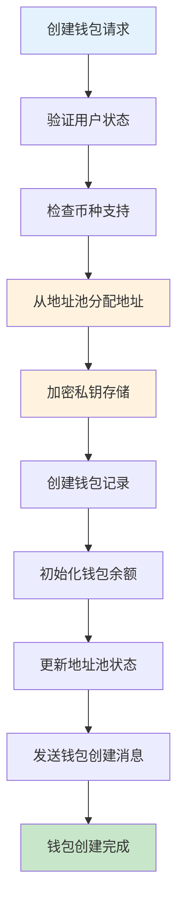
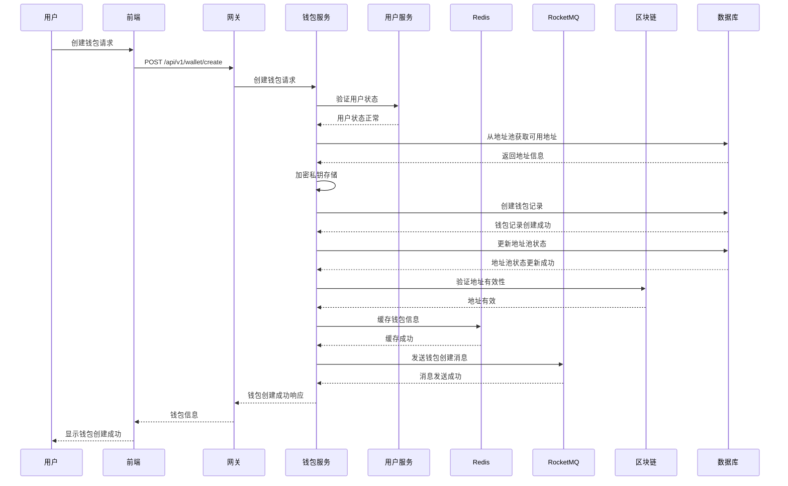
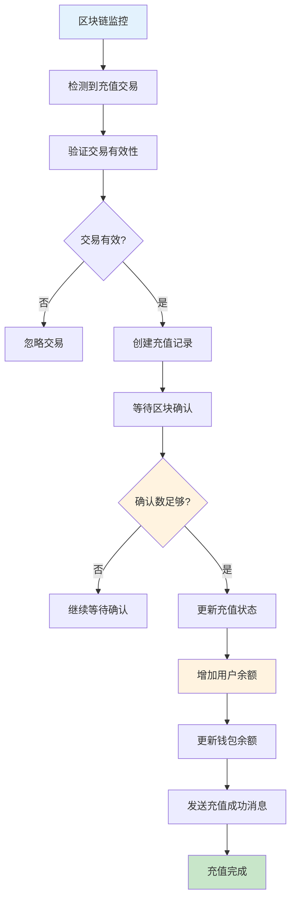
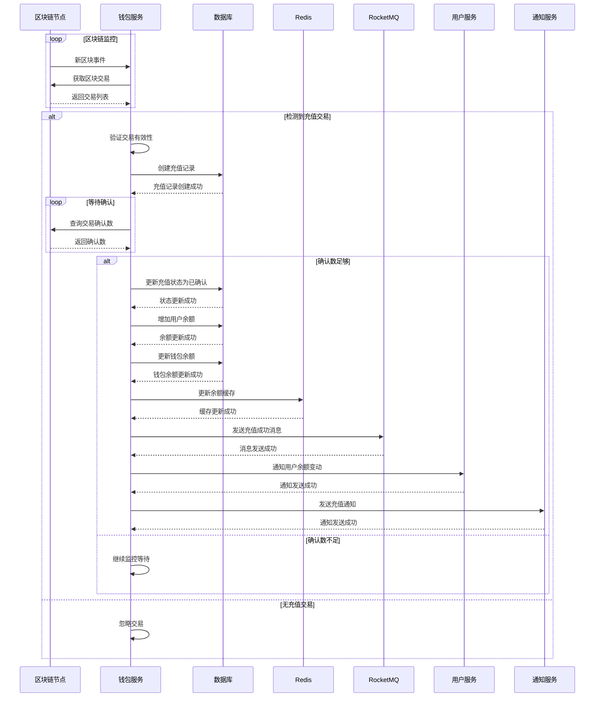
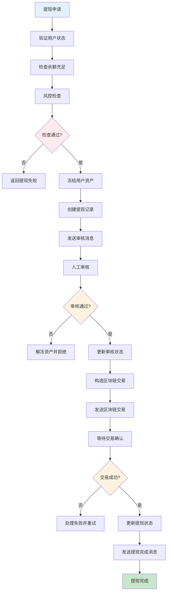
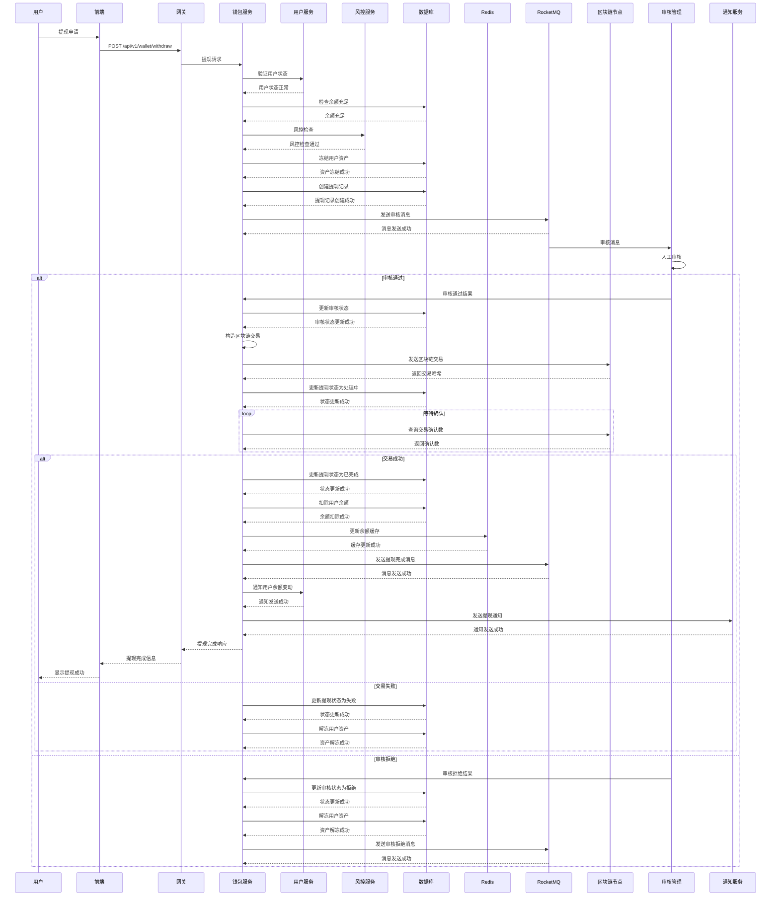
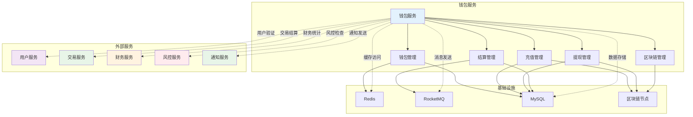
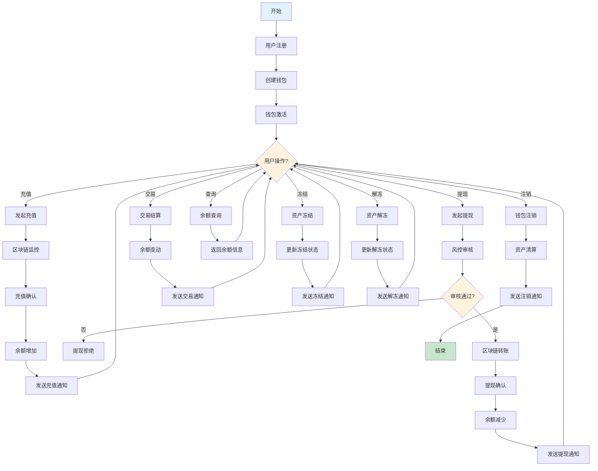

# 钱包服务 (Wallet Service) 技术设计文档

## 1. 服务概述

### 1.1 服务定位
钱包服务是Web3 CEX系统的核心金融基础服务，负责用户数字资产的全生命周期管理，包括多币种钱包管理、充值提现处理、资产安全监控等核心功能。作为系统的资产管理中心，为交易服务提供资产基础和结算保障。

### 1.2 核心职责
- **钱包管理**: 多币种钱包创建、地址管理、余额监控
- **充值处理**: 区块链充值监控、交易确认、资产入账
- **提现处理**: 提现审核、区块链转账、交易确认
- **资产安全**: 冷热钱包分离、多重签名、安全监控
- **资产结算**: 交易结算、手续费计算、资产变动

### 1.3 服务指标
- **可用性**: 99.95%
- **充值确认时间**: < 30分钟
- **提现处理时间**: < 10分钟
- **资产安全**: 零资产丢失
- **并发处理**: 支持1,000+并发充值/提现

## 2. 技术架构

### 2.1 整体架构
```
┌─────────────────────────────────────────────────────────────────────────────────┐
│                              接口层                                              │
│  ┌─────────────┐  ┌─────────────┐  ┌─────────────┐  ┌─────────────┐             │
│  │  REST API   │  │ WebSocket   │  │  Admin API  │ │ Health Check│             │
│  └─────────────┘  └─────────────┘  └─────────────┘  └─────────────┘             │
└─────────────────────────────────────────────────────────────────────────────────┘
                                        │
┌─────────────────────────────────────────────────────────────────────────────────┐
│                              业务层                                              │
│  ┌─────────────┐  ┌─────────────┐  ┌─────────────┐  ┌─────────────┐             │
│  │ 钱包管理     │  │ 充值处理     │  │ 提现处理     │  │ 资产结算     │             │
│  │Wallet Mgr   │ │Deposit Mgr  │ │Withdraw Mgr │ │Settlement Mgr│           │
│  └─────────────┘  └─────────────┘  └─────────────┘  └─────────────┘             │
│  ┌─────────────┐  ┌─────────────┐  ┌─────────────┐  ┌─────────────┐             │
│  │ 区块链交互   │  │ 安全管理     │  │ 地址管理     │  │ 监控告警     │             │
│  │Blockchain   │ │Security Mgr │ │Address Mgr  │ │Monitor Mgr  │             │
│  └─────────────┘  └─────────────┘  └─────────────┘  └─────────────┘             │
└─────────────────────────────────────────────────────────────────────────────────┘
                                        │
┌─────────────────────────────────────────────────────────────────────────────────┐
│                              数据层                                              │
│  ┌─────────────┐  ┌─────────────┐  ┌─────────────┐  ┌─────────────┐             │
│  │ 钱包数据     │  │ 充值数据     │  │ 提现数据     │  │ 地址数据     │             │
│  │Wallet DAO   │ │Deposit DAO  │ │Withdraw DAO │ │Address DAO  │             │
│  └─────────────┘  └─────────────┘  └─────────────┘  └─────────────┘             │
│  ┌─────────────┐  ┌─────────────┐  ┌─────────────┐  ┌─────────────┐             │
│  │ 缓存访问     │  │ 消息生产     │  │ 外部服务     │  │ 区块链节点   │             │
│  │Cache Access │ │MQ Producer  │ │External API │ │Blockchain   │             │
│  └─────────────┘  └─────────────┘  └─────────────┘  └─────────────┘             │
└─────────────────────────────────────────────────────────────────────────────────┘
                                        │
┌─────────────────────────────────────────────────────────────────────────────────┐
│                              基础设施                                            │
│  ┌─────────────┐  ┌─────────────┐  ┌─────────────┐  ┌─────────────┐             │
│  │ MySQL数据库  │  │ Redis缓存    │  │ RocketMQ    │  │ Nacos配置   │             │
│  │ Wallet DB   │ │ Cache       │ │ Message     │ │ Config      │             │
│  └─────────────┘  └─────────────┘  └─────────────┘  └─────────────┘             │
│  ┌─────────────┐  ┌─────────────┐  ┌─────────────┐  ┌─────────────┐             │
│  │ 区块链节点   │  │ 分布式锁     │  │ 链路追踪     │  │ 文件存储     │             │
│  │ Node Client │ │Redis Lock   │ │SkyWalking  │ │File Storage │             │
│  └─────────────┘  └─────────────┘  └─────────────┘  └─────────────┘             │
└─────────────────────────────────────────────────────────────────────────────────┘
```

### 2.2 技术栈
- **框架**: Spring Boot 3.2.x
- **区块链**: Web3.js + Ethers.js
- **数据库**: MySQL 8.0 + MyBatis Plus
- **缓存**: Redis 7.x (集群模式)
- **消息队列**: RocketMQ 4.9.x
- **服务治理**: Nacos 2.2.x
- **监控**: Micrometer + Prometheus
- **分布式锁**: Redisson

### 2.3 依赖关系
```
wallet-service
├── Nacos (服务注册发现)
├── Redis (缓存 + 分布式锁)
├── MySQL (数据存储)
├── RocketMQ (消息队列)
├── user-service (用户验证)
├── trade-service (交易结算)
├── finance-service (财务统计)
├── risk-service (风控检查)
└── Blockchain Nodes (区块链交互)
```

## 3. 数据模型设计

### 3.1 核心数据表

#### 3.1.1 钱包信息表 (wallet_info)
```sql
CREATE TABLE `wallet_info` (
  `id` bigint(20) NOT NULL AUTO_INCREMENT COMMENT '钱包ID',
  `user_id` bigint(20) NOT NULL COMMENT '用户ID',
  `wallet_type` tinyint(1) NOT NULL DEFAULT '1' COMMENT '钱包类型 1-热钱包 2-冷钱包',
  `wallet_name` varchar(50) NOT NULL COMMENT '钱包名称',
  `wallet_address` varchar(255) NOT NULL COMMENT '钱包地址',
  `private_key_encrypted` text NOT NULL COMMENT '加密私钥',
  `mnemonic_encrypted` text DEFAULT NULL COMMENT '加密助记词',
  `blockchain_type` varchar(20) NOT NULL COMMENT '区块链类型',
  `coin_id` varchar(32) NOT NULL COMMENT '币种ID',
  `status` tinyint(1) NOT NULL DEFAULT '1' COMMENT '状态 1-正常 2-冻结 3-注销',
  `balance` decimal(20,8) NOT NULL DEFAULT '0.00000000' COMMENT '余额',
  `frozen_balance` decimal(20,8) NOT NULL DEFAULT '0.00000000' COMMENT '冻结余额',
  `create_time` datetime NOT NULL DEFAULT CURRENT_TIMESTAMP COMMENT '创建时间',
  `update_time` datetime NOT NULL DEFAULT CURRENT_TIMESTAMP ON UPDATE CURRENT_TIMESTAMP COMMENT '更新时间',
  `last_transaction_time` datetime DEFAULT NULL COMMENT '最后交易时间',
  `total_transactions` int(11) NOT NULL DEFAULT '0' COMMENT '总交易次数',
  `total_fee` decimal(20,8) NOT NULL DEFAULT '0.00000000' COMMENT '总手续费',
  PRIMARY KEY (`id`),
  UNIQUE KEY `uk_wallet_address` (`wallet_address`),
  KEY `idx_user_id` (`user_id`),
  KEY `idx_coin_id` (`coin_id`),
  KEY `idx_wallet_type` (`wallet_type`),
  KEY `idx_status` (`status`),
  KEY `idx_create_time` (`create_time`)
) ENGINE=InnoDB DEFAULT CHARSET=utf8mb4 COMMENT='钱包信息表';
```

#### 3.1.2 充值记录表 (deposit_record)
```sql
CREATE TABLE `deposit_record` (
  `id` bigint(20) NOT NULL AUTO_INCREMENT COMMENT '充值ID',
  `deposit_no` varchar(32) NOT NULL COMMENT '充值编号',
  `user_id` bigint(20) NOT NULL COMMENT '用户ID',
  `wallet_id` bigint(20) NOT NULL COMMENT '钱包ID',
  `coin_id` varchar(32) NOT NULL COMMENT '币种ID',
  `amount` decimal(20,8) NOT NULL COMMENT '充值数量',
  `from_address` varchar(255) NOT NULL COMMENT '来源地址',
  `to_address` varchar(255) NOT NULL COMMENT '目标地址',
  `tx_hash` varchar(255) NOT NULL COMMENT '交易哈希',
  `block_number` bigint(20) DEFAULT NULL COMMENT '区块高度',
  `block_hash` varchar(255) DEFAULT NULL COMMENT '区块哈希',
  `confirmations` int(11) NOT NULL DEFAULT '0' COMMENT '确认数',
  `required_confirmations` int(11) NOT NULL DEFAULT '12' COMMENT '所需确认数',
  `status` tinyint(1) NOT NULL DEFAULT '1' COMMENT '状态 1-待确认 2-已确认 3-已完成 4-失败',
  `fee` decimal(20,8) NOT NULL DEFAULT '0.00000000' COMMENT '手续费',
  `gas_price` decimal(20,8) DEFAULT NULL COMMENT 'Gas价格',
  `gas_used` bigint(20) DEFAULT NULL COMMENT 'Gas使用量',
  `memo` varchar(255) DEFAULT NULL COMMENT '备注',
  `create_time` datetime NOT NULL DEFAULT CURRENT_TIMESTAMP COMMENT '创建时间',
  `update_time` datetime NOT NULL DEFAULT CURRENT_TIMESTAMP ON UPDATE CURRENT_TIMESTAMP COMMENT '更新时间',
  `confirm_time` datetime DEFAULT NULL COMMENT '确认时间',
  `complete_time` datetime DEFAULT NULL COMMENT '完成时间',
  PRIMARY KEY (`id`),
  UNIQUE KEY `uk_deposit_no` (`deposit_no`),
  UNIQUE KEY `uk_tx_hash` (`tx_hash`),
  KEY `idx_user_id` (`user_id`),
  KEY `idx_wallet_id` (`wallet_id`),
  KEY `idx_coin_id` (`coin_id`),
  KEY `idx_status` (`status`),
  KEY `idx_create_time` (`create_time`),
  KEY `idx_confirmations` (`confirmations`)
) ENGINE=InnoDB DEFAULT CHARSET=utf8mb4 COMMENT='充值记录表';
```

#### 3.1.3 提现记录表 (withdraw_record)
```sql
CREATE TABLE `withdraw_record` (
  `id` bigint(20) NOT NULL AUTO_INCREMENT COMMENT '提现ID',
  `withdraw_no` varchar(32) NOT NULL COMMENT '提现编号',
  `user_id` bigint(20) NOT NULL COMMENT '用户ID',
  `wallet_id` bigint(20) NOT NULL COMMENT '钱包ID',
  `coin_id` varchar(32) NOT NULL COMMENT '币种ID',
  `amount` decimal(20,8) NOT NULL COMMENT '提现数量',
  `fee` decimal(20,8) NOT NULL DEFAULT '0.00000000' COMMENT '手续费',
  `actual_amount` decimal(20,8) NOT NULL COMMENT '实际到账数量',
  `from_address` varchar(255) NOT NULL COMMENT '来源地址',
  `to_address` varchar(255) NOT NULL COMMENT '目标地址',
  `tx_hash` varchar(255) DEFAULT NULL COMMENT '交易哈希',
  `block_number` bigint(20) DEFAULT NULL COMMENT '区块高度',
  `confirmations` int(11) NOT NULL DEFAULT '0' COMMENT '确认数',
  `required_confirmations` int(11) NOT NULL DEFAULT '6' COMMENT '所需确认数',
  `status` tinyint(1) NOT NULL DEFAULT '1' COMMENT '状态 1-待审核 2-审核中 3-已审核 4-处理中 5-已完成 6-失败 7-已取消',
  `audit_user_id` bigint(20) DEFAULT NULL COMMENT '审核人ID',
  `audit_time` datetime DEFAULT NULL COMMENT '审核时间',
  `audit_remark` varchar(500) DEFAULT NULL COMMENT '审核备注',
  `gas_price` decimal(20,8) DEFAULT NULL COMMENT 'Gas价格',
  `gas_limit` bigint(20) DEFAULT NULL COMMENT 'Gas限制',
  `gas_used` bigint(20) DEFAULT NULL COMMENT 'Gas使用量',
  `nonce` bigint(20) DEFAULT NULL COMMENT 'Nonce值',
  `memo` varchar(255) DEFAULT NULL COMMENT '备注',
  `create_time` datetime NOT NULL DEFAULT CURRENT_TIMESTAMP COMMENT '创建时间',
  `update_time` datetime NOT NULL DEFAULT CURRENT_TIMESTAMP ON UPDATE CURRENT_TIMESTAMP COMMENT '更新时间',
  `process_time` datetime DEFAULT NULL COMMENT '处理时间',
  `complete_time` datetime DEFAULT NULL COMMENT '完成时间',
  PRIMARY KEY (`id`),
  UNIQUE KEY `uk_withdraw_no` (`withdraw_no`),
  KEY `idx_user_id` (`user_id`),
  KEY `idx_wallet_id` (`wallet_id`),
  KEY `idx_coin_id` (`coin_id`),
  KEY `idx_status` (`status`),
  KEY `idx_audit_user_id` (`audit_user_id`),
  KEY `idx_create_time` (`create_time`),
  KEY `idx_tx_hash` (`tx_hash`)
) ENGINE=InnoDB DEFAULT CHARSET=utf8mb4 COMMENT='提现记录表';
```

#### 3.1.4 地址管理表 (address_pool)
```sql
CREATE TABLE `address_pool` (
  `id` bigint(20) NOT NULL AUTO_INCREMENT COMMENT '地址ID',
  `coin_id` varchar(32) NOT NULL COMMENT '币种ID',
  `address` varchar(255) NOT NULL COMMENT '地址',
  `private_key_encrypted` text NOT NULL COMMENT '加密私钥',
  `mnemonic_encrypted` text DEFAULT NULL COMMENT '加密助记词',
  `status` tinyint(1) NOT NULL DEFAULT '1' COMMENT '状态 1-未使用 2-已分配 3-已回收',
  `user_id` bigint(20) DEFAULT NULL COMMENT '分配用户ID',
  `assign_time` datetime DEFAULT NULL COMMENT '分配时间',
  `wallet_id` bigint(20) DEFAULT NULL COMMENT '关联钱包ID',
  `balance` decimal(20,8) NOT NULL DEFAULT '0.00000000' COMMENT '余额',
  `total_deposit` decimal(20,8) NOT NULL DEFAULT '0.00000000' COMMENT '总充值',
  `transaction_count` int(11) NOT NULL DEFAULT '0' COMMENT '交易次数',
  `create_time` datetime NOT NULL DEFAULT CURRENT_TIMESTAMP COMMENT '创建时间',
  `update_time` datetime NOT NULL DEFAULT CURRENT_TIMESTAMP ON UPDATE CURRENT_TIMESTAMP COMMENT '更新时间',
  PRIMARY KEY (`id`),
  UNIQUE KEY `uk_address` (`address`),
  KEY `idx_coin_id` (`coin_id`),
  KEY `idx_status` (`status`),
  KEY `idx_user_id` (`user_id`),
  KEY `idx_wallet_id` (`wallet_id`),
  KEY `idx_create_time` (`create_time`)
) ENGINE=InnoDB DEFAULT CHARSET=utf8mb4 COMMENT='地址池表';
```

### 3.2 数据关系
```
user_info (1) ←→ (N) wallet_info
wallet_info (1) ←→ (N) deposit_record
wallet_info (1) ←→ (N) withdraw_record
wallet_info (1) ←→ (1) address_pool
user_info (1) ←→ (N) deposit_record
user_info (1) ←→ (N) withdraw_record
```

## 4. 核心业务流程

### 4.1 创建钱包流程

#### 4.1.1 流程图


#### 4.1.2 时序图


### 4.2 充值处理流程

#### 4.2.1 流程图


#### 4.2.2 充值处理时序图


#### 4.2.3 区块链监控策略
- **监控频率**: 每10秒扫描一次新区块
- **确认策略**: 不同币种采用不同确认数
  - BTC: 6个确认
  - ETH: 12个确认
  - USDT: 12个确认
  - 其他ERC20: 12个确认
- **重试机制**: 失败交易自动重试3次
- **异常处理**: 监控异常交易并告警

### 4.3 提现处理流程

#### 4.3.1 流程图


#### 4.3.2 提现处理时序图


#### 4.3.3 安全措施
- **多重审核**: 大额提现需要多重审核
- **白名单地址**: 支持提现地址白名单
- **限额控制**: 单笔和日累计限额
- **延时提现**: 大额提现延时处理
- **交易监控**: 实时监控异常交易

### 4.4 钱包服务系统交互流程图

#### 4.4.1 系统交互图


#### 4.4.2 完整钱包生命周期流程图


## 5. 区块链集成设计

### 5.1 区块链适配器
```java
public interface BlockchainAdapter {
    // 基础操作
    String createWallet(String mnemonic);
    String importWallet(String privateKey);
    BigDecimal getBalance(String address);

    // 交易操作
    String sendTransaction(String fromAddress, String toAddress,
                         BigDecimal amount, BigDecimal gasPrice);

    // 监控操作
    List<Transaction> getTransactions(String address, int limit);
    Transaction getTransaction(String txHash);
    int getConfirmations(String txHash);

    // 代币操作
    BigDecimal getTokenBalance(String address, String tokenAddress);
    String sendTokenTransaction(String fromAddress, String toAddress,
                              String tokenAddress, BigDecimal amount);
}
```

### 5.2 支持的区块链
| 区块链 | 类型 | 确认数 | 手续费 | 监控方式 |
|--------|------|--------|--------|----------|
| Bitcoin | 主链 | 6 | 动态 | 区块扫描 |
| Ethereum | 主链 | 12 | 动态 | 事件监听 |
| BSC | 主链 | 12 | 动态 | 事件监听 |
| Polygon | Layer2 | 12 | 动态 | 事件监听 |
| Arbitrum | Layer2 | 12 | 动态 | 事件监听 |

### 5.3 私钥管理
- **加密存储**: 使用AES-256加密私钥
- **分片存储**: 私钥分片存储在不同位置
- **访问控制**: 严格的访问权限控制
- **备份策略**: 多重备份策略
- **恢复机制**: 完善的私钥恢复流程

## 6. 接口设计

### 6.1 核心接口清单

| 接口路径 | 方法 | 描述 | 权限要求 |
|---------|------|------|----------|
| `/api/v1/wallet/create` | POST | 创建钱包 | 需要登录 |
| `/api/v1/wallet/list` | GET | 获取钱包列表 | 需要登录 |
| `/api/v1/wallet/{walletId}` | GET | 获取钱包详情 | 需要登录 |
| `/api/v1/wallet/deposit-address` | GET | 获取充值地址 | 需要登录 |
| `/api/v1/wallet/withdraw` | POST | 申请提现 | 需要登录 |
| `/api/v1/wallet/withdraw/{withdrawId}` | GET | 获取提现详情 | 需要登录 |
| `/api/v1/wallet/deposits` | GET | 获取充值记录 | 需要登录 |
| `/api/v1/wallet/withdrawals` | GET | 获取提现记录 | 需要登录 |
| `/api/v1/wallet/transfer` | POST | 内部转账 | 需要登录 |

### 6.2 接口详细设计

#### 6.2.1 创建钱包接口
```http
POST /api/v1/wallet/create
Authorization: Bearer {token}
Content-Type: application/json

请求参数：
{
  "coin_id": "BTC",           // 币种ID
  "wallet_name": "我的BTC钱包", // 钱包名称
  "wallet_type": 1           // 钱包类型 1-热钱包 2-冷钱包
}

响应结果：
{
  "code": 200,
  "message": "钱包创建成功",
  "data": {
    "wallet_id": 123456,
    "wallet_name": "我的BTC钱包",
    "wallet_address": "1A1zP1eP5QGefi2DMPTfTL5SLmv7DivfNa",
    "coin_id": "BTC",
    "balance": "0.00000000",
    "status": 1,
    "create_time": "2024-01-01T00:00:00Z"
  }
}
```

#### 6.2.2 申请提现接口
```http
POST /api/v1/wallet/withdraw
Authorization: Bearer {token}
Content-Type: application/json

请求参数：
{
  "wallet_id": 123456,          // 钱包ID
  "coin_id": "BTC",             // 币种ID
  "amount": "0.001",            // 提现数量
  "to_address": "1A1zP1eP5QGefi2DMPTfTL5SLmv7DivfNa", // 目标地址
  "memo": "提现到个人钱包",      // 备注
  "verification_code": "123456"  // 验证码
}

响应结果：
{
  "code": 200,
  "message": "提现申请成功，请等待审核",
  "data": {
    "withdraw_id": 123456,
    "withdraw_no": "WD20240101001",
    "amount": "0.001",
    "fee": "0.0001",
    "actual_amount": "0.0009",
    "status": 1,
    "create_time": "2024-01-01T00:00:00Z"
  }
}
```

#### 6.2.3 获取充值记录接口
```http
GET /api/v1/wallet/deposits
Authorization: Bearer {token}
Query Parameters:
- coin_id: 币种 (可选)
- status: 状态 (可选)
- start_time: 开始时间 (可选)
- end_time: 结束时间 (可选)
- page: 页码 (默认1)
- size: 页大小 (默认20)

响应结果：
{
  "code": 200,
  "message": "成功",
  "data": {
    "total": 50,
    "page": 1,
    "size": 20,
    "deposits": [
      {
        "deposit_id": 123456,
        "deposit_no": "DP20240101001",
        "coin_id": "BTC",
        "amount": "0.001",
        "from_address": "1BvBMSEYstWetqTFn5Au4m4GFg7xJaNVN2",
        "to_address": "1A1zP1eP5QGefi2DMPTfTL5SLmv7DivfNa",
        "tx_hash": "abc123...",
        "confirmations": 6,
        "required_confirmations": 6,
        "status": 3,
        "fee": "0.0001",
        "create_time": "2024-01-01T00:00:00Z",
        "complete_time": "2024-01-01T00:30:00Z"
      }
    ]
  }
}
```

## 7. 安全设计

### 7.1 资产安全
- **冷热钱包分离**: 95%资产存放在冷钱包
- **多重签名**: 大额交易需要多重签名
- **限额控制**: 单笔和日累计限额
- **地址白名单**: 支持提现地址白名单
- **实时监控**: 24小时实时监控异常交易

### 7.2 私钥安全
- **加密存储**: AES-256加密私钥
- **分片存储**: 私钥分片存储
- **访问控制**: 严格的权限控制
- **备份策略**: 多重备份
- **恢复机制**: 完善的恢复流程

### 7.3 交易安全
- **交易审核**: 大额交易人工审核
- **延时处理**: 大额提现延时处理
- **风控检查**: 实时风控检查
- **异常监控**: 异常交易监控告警
- **黑名单**: 地址黑名单机制

## 8. 缓存设计

### 8.1 缓存策略
- **钱包信息缓存**: 缓存钱包基本信息，TTL 30分钟
- **余额缓存**: 缓存钱包余额，TTL 1分钟
- **地址池缓存**: 缓存可用地址，TTL 1小时
- **交易缓存**: 缓存最近交易，TTL 5分钟

### 8.2 缓存键设计
```
wallet:info:{wallet_id}        - 钱包基本信息
wallet:balance:{wallet_id}     - 钱包余额
wallet:address:{user_id}:{coin_id} - 用户地址
address:pool:{coin_id}          - 地址池
deposit:recent:{user_id}       - 最近充值记录
withdraw:recent:{user_id}      - 最近提现记录
blockchain:tx:{tx_hash}        - 交易信息
blockchain:balance:{address}   - 地址余额
```

### 8.3 缓存更新策略
- **主动更新**: 余额变更时主动更新
- **被动失效**: 缓存过期自动失效
- **预热机制**: 系统启动时预热热点数据

## 9. 消息队列设计

### 9.1 消息Topic
- **wallet-topic**: 钱包相关消息
- **deposit-topic**: 充值相关消息
- **withdraw-topic**: 提现相关消息
- **blockchain-topic**: 区块链相关消息

### 9.2 消息类型
- **钱包创建消息**: 钱包创建后发送
- **充值确认消息**: 充值确认后发送
- **提现审核消息**: 提现审核后发送
- **资产变动消息**: 资产变动后发送
- **区块链消息**: 区块链交易状态变更

### 9.3 消息格式
```json
{
  "header": {
    "message_id": "msg_123456789",
    "topic": "wallet-topic",
    "tags": "WALLET_CREATE",
    "keys": "wallet_123",
    "timestamp": 1640995200000,
    "producer_group": "wallet-service-producer"
  },
  "body": {
    "wallet_id": 123,
    "user_id": 456,
    "coin_id": "BTC",
    "wallet_address": "1A1zP1eP5QGefi2DMPTfTL5SLmv7DivfNa",
    "wallet_type": 1,
    "create_time": 1640995200000
  }
}
```

## 10. 监控设计

### 10.1 业务监控
- **充值监控**: 充值成功率、确认时间监控
- **提现监控**: 提现成功率、处理时间监控
- **余额监控**: 钱包余额实时监控
- **异常监控**: 异常交易监控告警

### 10.2 技术监控
- **区块链监控**: 区块链节点连接监控
- **交易监控**: 区块链交易成功率监控
- **余额监控**: 系统余额与链上余额对比
- **性能监控**: 钱包服务性能监控

### 10.3 告警规则
- **充值异常**: 充值失败率超过5%
- **提现异常**: 提现失败率超过3%
- **余额异常**: 系统余额与链上余额不一致
- **节点异常**: 区块链节点连接失败
- **交易异常**: 区块链交易失败率超过1%

## 11. 容灾设计

### 11.1 故障恢复
- **节点容错**: 多节点冗余部署
- **交易重试**: 失败交易自动重试
- **数据备份**: 定时备份钱包数据
- **应急方案**: 手动处理应急预案

### 11.2 灾难恢复
- **冷备份**: 冷钱包数据离线备份
- **热备份**: 热钱包数据实时备份
- **异地备份**: 核心数据异地备份
- **恢复演练**: 定期进行恢复演练

## 12. 性能优化

### 12.1 并发优化
- **连接池**: 数据库连接池优化
- **异步处理**: 异步处理区块链交易
- **批量处理**: 批量处理充值确认
- **缓存优化**: 多级缓存策略

### 12.2 数据库优化
- **索引优化**: 合理设计索引
- **分表策略**: 按时间或用户ID分表
- **读写分离**: 主库写入，从库读取
- **连接池**: 数据库连接池配置优化

通过以上详细设计，钱包服务为整个CEX系统提供了安全、高效、可靠的资产管理基础。